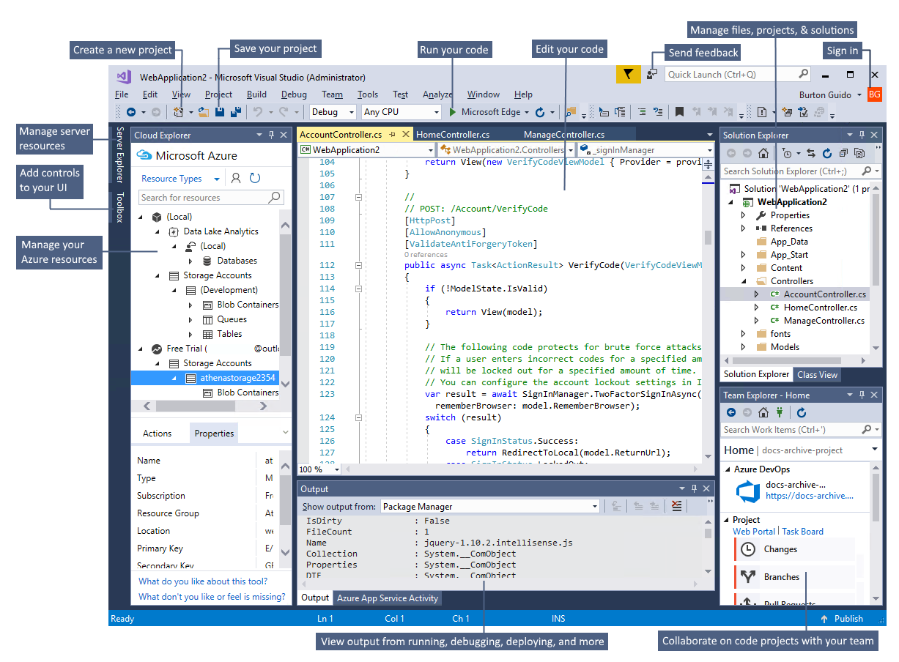
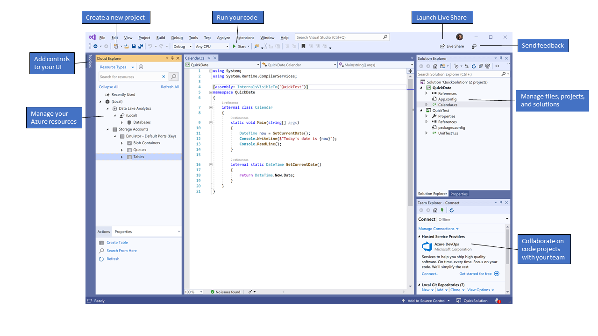

The Visual Studio *integrated development environment* is a creative launching pad that you can use to edit, debug, and build code, and then publish an app. An integrated development environment (IDE) is a feature-rich program that can be used for many aspects of software development. Over and above the standard editor and debugger that most IDEs provide, Visual Studio includes compilers, code completion tools, graphical designers, and many more features to ease the software development process.

::: moniker range="vs-2017"

::: moniker-end

::: moniker range="vs-2019"

::: moniker-end

This image shows Visual Studio with an open project and several key tool windows you'll likely use:

- [**Solution Explorer**](../../ide/solutions-and-projects-in-visual-studio.md) (top right) lets you view, navigate, and manage your code files. **Solution Explorer** can help organize your code by grouping the files into [solutions and projects](../tutorial-projects-solutions.md).

- The [editor window](../../ide/writing-code-in-the-code-and-text-editor.md) (center), where you'll likely spend a majority of your time, displays file contents. This is where you can edit code or design a user interface such as a window with buttons and text boxes.

::: moniker range="vs-2017"

- The [Output window](../../ide/reference/output-window.md) (bottom center) is where Visual Studio sends notifications such as debugging and error messages, compiler warnings, publishing status messages, and more. Each message source has its own tab.

::: moniker-end

- [Team Explorer](/azure/devops/user-guide/work-team-explorer?view=vsts) (bottom right) lets you track work items and share code with others using version control technologies such as [Git](https://git-scm.com/) and [Team Foundation Version Control (TFVC)](/azure/devops/repos/tfvc/overview?view=vsts).

## Editions

::: moniker range="vs-2017"

Visual Studio is available for Windows and Mac. [Visual Studio for Mac](/visualstudio/mac/) has many of the same features as Visual Studio 2017, and is optimized for developing cross-platform and mobile apps. This article focuses on the Windows version of Visual Studio 2017.

There are three editions of Visual Studio 2017: Community, Professional, and Enterprise. See [Compare Visual Studio 2017 IDEs](https://visualstudio.microsoft.com/vs/compare/) to learn about which features are supported in each edition.

::: moniker-end

::: moniker range="vs-2019"

Visual Studio is available for Windows and Mac. [Visual Studio for Mac](/visualstudio/mac/) has many of the same features as Visual Studio 2019, and is optimized for developing cross-platform and mobile apps. This article focuses on the Windows version of Visual Studio 2019.

There are three editions of Visual Studio 2019: Community, Professional, and Enterprise. See [Compare Visual Studio IDEs](https://visualstudio.microsoft.com/vs/compare/) to learn about which features are supported in each edition.

::: moniker-end

## Popular productivity features

Some of the popular features in Visual Studio that help you to be more productive as you develop software include:

- Squiggles and [Quick Actions](../../ide/quick-actions.md)

   Squiggles are wavy underlines that alert you to errors or potential problems in your code as you type. These visual clues enable you to fix problems immediately without waiting for the error to be discovered during build or when you run the program. If you hover over a squiggle, you see additional information about the error. A light bulb may also appear in the left margin with actions, known as Quick Actions, to fix the error.

   

::: moniker range=">=vs-2019"

- Code Cleanup

   With the click of a button, format your code and apply any code fixes suggested by your [code style settings](../../ide/reference/options-text-editor-csharp-formatting.md), [.editorconfig conventions](../../ide/create-portable-custom-editor-options.md), and [Roslyn analyzers](../../code-quality/roslyn-analyzers-overview.md). **Code Cleanup** helps you resolve issues in your code before it goes to code review. (Currently available for C# code only.)

   

::: moniker-end

- [Refactoring](../../ide/refactoring-in-visual-studio.md)

   Refactoring includes operations such as intelligent renaming of variables, extracting one or more lines of code into a new method, changing the order of method parameters, and more.

   

- [IntelliSense](../../ide/using-intellisense.md)

   IntelliSense is a term for a set of features that displays information about your code directly in the editor and, in some cases, write small bits of code for you. It's like having basic documentation inline in the editor, which saves you from having to look up type information elsewhere. IntelliSense features vary by language. For more information, see [C# IntelliSense](../../ide/visual-csharp-intellisense.md), [Visual C++ IntelliSense](../../ide/visual-cpp-intellisense.md), [JavaScript IntelliSense](../../ide/javascript-intellisense.md), and [Visual Basic IntelliSense](../../ide/visual-basic-specific-intellisense.md). The following illustration shows how IntelliSense displays a member list for a type:

   

- [Quick Launch](../../ide/reference/quick-launch-environment-options-dialog-box.md)

   Visual Studio can seem overwhelming at times with so many menus, options, and properties. The **Quick Launch** search box is a great way to rapidly find what you need in Visual Studio. When you start typing the name of something you're looking for, Visual Studio lists results that take you exactly where you need to go. If you need to add functionality to Visual Studio, for example to add support for an additional programming language, **Quick Launch** provides results that open Visual Studio Installer to install a workload or individual component.

   ::: moniker range="vs-2017"

   

   ::: moniker-end

   ::: moniker range="vs-2019"

   

   ::: moniker-end

- [Live Share](/visualstudio/liveshare/)

   Collaboratively edit and debug with others in real time, regardless of what your app type or programming language. You can instantly and securely share your project and, as needed, debugging sessions, terminal instances, localhost web apps, voice calls, and more.

- [Call Hierarchy](../../ide/reference/call-hierarchy.md)

   The **Call Hierarchy** window shows the methods that call a selected method. This can be useful information when you're thinking about changing or removing the method, or when you're trying to track down a bug.

   

- [CodeLens](../../ide/find-code-changes-and-other-history-with-codelens.md)

   CodeLens helps you find references to your code, changes to your code, linked bugs, work items, code reviews, and unit tests, all without leaving the editor.

   

- [Go To Definition](../../ide/go-to-and-peek-definition.md)

   The Go To Definition feature takes you directly to the location where a function or type is defined.

   

- [Peek Definition](../../ide/how-to-view-and-edit-code-by-using-peek-definition-alt-plus-f12.md)

   The **Peek Definition** window shows the definition of a method or type without actually opening a separate file.

   

## Install the Visual Studio IDE

In this section, you'll create a simple project to try out some of the things you can do with Visual Studio. You'll use [IntelliSense](../../ide/using-intellisense.md) as a coding aid, debug an app to see the value of a variable during the program's execution, and change the color theme.

::: moniker range="vs-2017"

To get started, [download Visual Studio](https://visualstudio.microsoft.com/downloads/?utm_medium=microsoft&utm_source=docs.microsoft.com&utm_campaign=inline+link&utm_content=download+vs2017) and install it on your system. The modular installer enables you to choose and install *workloads*, which are groups of features needed for the programming language or platform you prefer. To follow the steps for [creating a program](#create-a-program), be sure to select the **.NET Core cross-platform development** workload during installation.

::: moniker-end

::: moniker range=">=vs-2019"

To get started, [download Visual Studio](https://visualstudio.microsoft.com/downloads/?utm_medium=microsoft&utm_source=docs.microsoft.com&utm_campaign=inline+link&utm_content=download+vs2019) and install it on your system. The modular installer enables you to choose and install *workloads*, which are groups of features needed for the programming language or platform you prefer. To follow the steps for [creating a program](#create-a-program), be sure to select the **.NET Core cross-platform development** workload during installation.

::: moniker-end

When you start Visual Studio for the first time, you can optionally [sign in](../../ide/signing-in-to-visual-studio.md) using your Microsoft account or your work or school account.