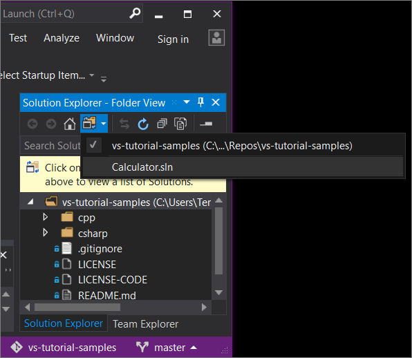
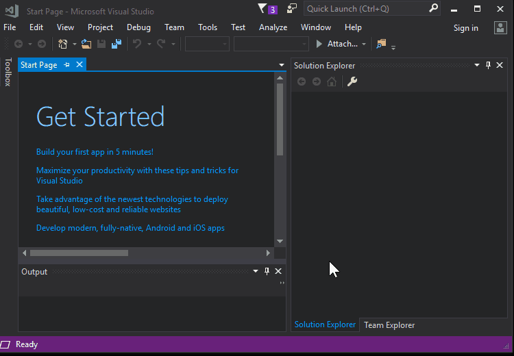

# Tutorial: Open a project from a repo

In this tutorial, you'll use Visual Studio to connect to a Git or Azure DevOps repository and then open a project.

> [!NOTE]
> If you've already connected to a repository by using Visual Studio, the user interface (UI) might look different than what appears in this tutorial.

## Open a project from GitHub

1. Open Visual Studio 2017.

1. From the top menu bar, choose **File** > **Open** > **Open from Source Control**.

   The **Team Explorer - Connect** pane opens.

    

1. In the **Local Git Repositories** section, choose **Clone**.

    

1. In the box that says ***Enter the URL of a Git repo to clone***, type or paste the URL for your repo, and then press **Enter**. (You might receive a prompt to log in to your Git repo; if so, do so.)

   After Visual Studio clones your repo, Team Explorer closes and Solution Explorer opens. A message appears that says *Click on Solutions and Folders above to view a list of Solutions*.

   

1. Choose **Solutions and Folders**. Then, make your selection from the drop-down list that appears.

   

   If you have a solution file available, it will appear here. Choose it, and Visual Studio opens your solution. (Alternatively, you can use the folder structure within Solution Explorer to navigate to and then open your solution file.)

1. To view your code in the Visual Studio code editor, choose Choose **Program.cs**.

### Review your work

View the following animation to see an example of what it looks like when you open a project from a GitHub repo in Visual Studio 2017:

   

## Open a project from Azure DevOps

1. Open Visual Studio 2017.

1. From the top menu bar, choose **File** > **Open** > **Open from Source Control**.

   The **Team Explorer - Connect** pane opens.

    

1. In the **Hosted Service Providers** section, choose **Connect...**.

   If you are logged in to the account that you use 

1. In the box that says ***Enter the URL of a Git repo to clone***, type or paste the URL for your repo.

   Visual Studio opens your project.

## Next steps

If you're ready to code with Visual Studio, dive into any of the following language-specific tutorials:

- [Visual Studio tutorials | **C#**](./csharp/index.yml)
- [Visual Studio tutorials | **Visual Basic**](./visual-basic/index.yml)
- [Visual Studio tutorials | **C++**](/cpp/get-started/)
- [Visual Studio tutorials | **Python**](/visualstudio/python/)
- [Visual Studio tutorials | **JavaScript**, **TypeScript**, **Node.js**](/visualstudio/javascript/)

## See also

- [Visual Studio: Connect to projects by using Team Explorer](./ide/connect-team-project)
- [Azure DevOps Services: Connect to a project in Azure DevOps](/azure/devops/organizations/projects/connect-to-projects/)
- [Azure DevOps Services: Connect Azure Boards to GitHub](/azure/devops/boards/github/connect-to-github/)
