# Welcome to the Visual Studio IDE | Visual Basic

The Visual Studio *integrated development environment* is a creative launching pad that you can use to edit, debug, and build code, and then publish an app. An integrated development environment (IDE) is a feature-rich program that can be used for many aspects of software development. Over and above the standard editor and debugger that most IDEs provide, Visual Studio includes compilers, code completion tools, graphical designers, and many more features to ease the software development process.

::: moniker range="vs-2017"


::: moniker-end

::: moniker range=">=vs-2019"

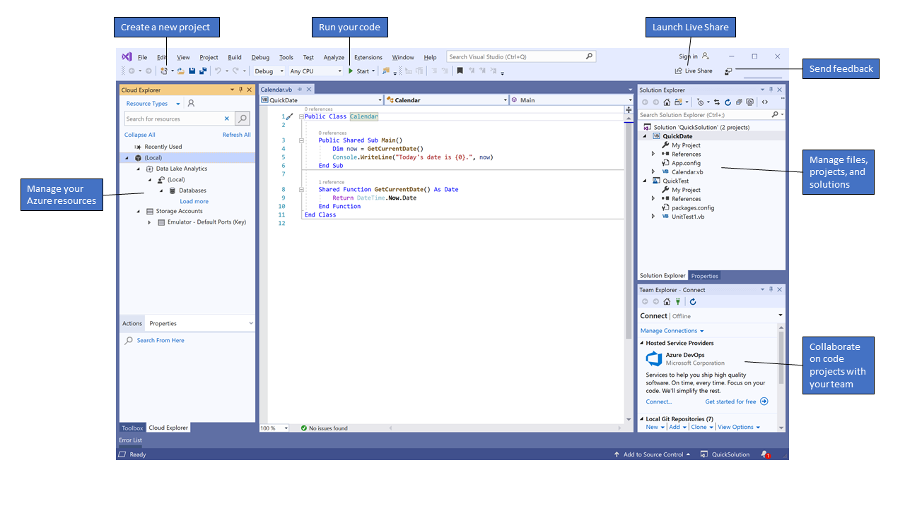

::: moniker-end

This image shows Visual Studio with an open project and several key tool windows you'll likely use:

- [**Solution Explorer**](../../ide/solutions-and-projects-in-visual-studio.md) (top right) lets you view, navigate, and manage your code files. **Solution Explorer** can help organize your code by grouping the files into [solutions and projects](tutorial-projects-solutions.md).

- The [editor window](../../ide/writing-code-in-the-code-and-text-editor.md) (center), where you'll likely spend a majority of your time, displays file contents. This is where you can edit code or design a user interface such as a window with buttons and text boxes.

- The [Output window](../../ide/reference/output-window.md) (bottom center) is where Visual Studio sends notifications such as debugging and error messages, compiler warnings, publishing status messages, and more. Each message source has its own tab.

- [Team Explorer](/azure/devops/user-guide/work-team-explorer?view=vsts) (bottom right) lets you track work items and share code with others using version control technologies such as [Git](https://git-scm.com/) and [Team Foundation Version Control (TFVC)](/azure/devops/repos/tfvc/overview?view=vsts).

## Editions

Visual Studio is available for Windows and Mac. [Visual Studio for Mac](/visualstudio/mac/) has many of the same features as Visual Studio 2017, and is optimized for developing cross-platform and mobile apps. This article focuses on the Windows version of Visual Studio 2017.

There are three editions of Visual Studio 2017: Community, Professional, and Enterprise. See [Compare Visual Studio 2017 IDEs](https://visualstudio.microsoft.com/vs/compare/) to learn about which features are supported in each edition.

## Popular productivity features

Some of the popular features in Visual Studio that help you to be more productive as you develop software include:

- Squiggles and [Quick Actions](../../ide/quick-actions.md)

   Squiggles are wavy underlines that alert you to errors or potential problems in your code as you type. These visual clues enable you to fix problems immediately without waiting for the error to be discovered during build or when you run the program. If you hover over a squiggle, you see additional information about the error. A light bulb may also appear in the left margin with actions, known as Quick Actions, to fix the error.

   

::: moniker range=">=vs-2019"

- Code Cleanup

   With the click of a button, format your code and apply any code fixes suggested by your [code style settings](../../ide/reference/options-text-editor-csharp-formatting.md), [.editorconfig conventions](../../ide/create-portable-custom-editor-options.md), and [Roslyn analyzers](../../code-quality/roslyn-analyzers-overview.md). **Code Cleanup** helps you resolve issues in your code before it goes to code review.

   

::: moniker-end

- [Refactoring](../../ide/refactoring-in-visual-studio.md)

   Refactoring includes operations such as intelligent renaming of variables, extracting one or more lines of code into a new method, changing the order of method parameters, and more.

   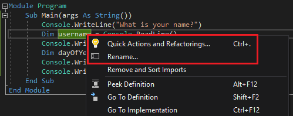

- [IntelliSense](../../ide/using-intellisense.md)

   IntelliSense is a term for a set of features that displays information about your code directly in the editor and, in some cases, write small bits of code for you. It's like having basic documentation inline in the editor, which saves you from having to look up type information elsewhere. IntelliSense features vary by language. For more information, see [C# IntelliSense](../../ide/visual-csharp-intellisense.md), [Visual C++ IntelliSense](../../ide/visual-cpp-intellisense.md), [JavaScript IntelliSense](../../ide/javascript-intellisense.md), and [Visual Basic IntelliSense](../../ide/visual-basic-specific-intellisense.md). The following illustration shows how IntelliSense displays a member list for a type:

   

- [Quick Launch](../../ide/reference/quick-launch-environment-options-dialog-box.md)

   Visual Studio can seem overwhelming at times with so many menus, options, and properties. The **Quick Launch** search box is a great way to rapidly find what you need in Visual Studio. When you start typing the name of something you're looking for, Visual Studio lists results that take you exactly where you need to go. If you need to add functionality to Visual Studio, for example to add support for an additional programming language, **Quick Launch** provides results that open Visual Studio Installer to install a workload or individual component.

   ::: moniker range="vs-2017"

   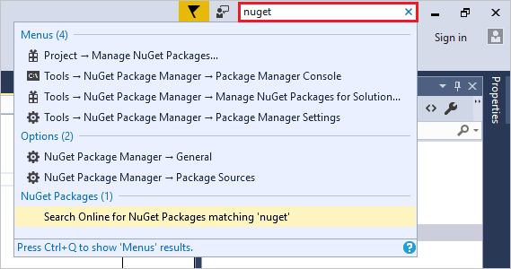

   ::: moniker-end

   ::: moniker range="vs-2019"

   

   ::: moniker-end

- [Live Share](/visualstudio/liveshare/)

   Collaboratively edit and debug with others in real time, regardless of what your app type or programming language. You can instantly and securely share your project and, as needed, debugging sessions, terminal instances, localhost web apps, voice calls, and more.

- [Call Hierarchy](../../ide/reference/call-hierarchy.md)

   The **Call Hierarchy** window shows the methods that call a selected method. This can be useful information when you're thinking about changing or removing the method, or when you're trying to track down a bug.

   

- [CodeLens](../../ide/find-code-changes-and-other-history-with-codelens.md)

   CodeLens helps you find references to your code, changes to your code, linked bugs, work items, code reviews, and unit tests, all without leaving the editor.

   

- [Go To Definition](../../ide/go-to-and-peek-definition.md)

   The Go To Definition feature takes you directly to the location where a function or type is defined.

   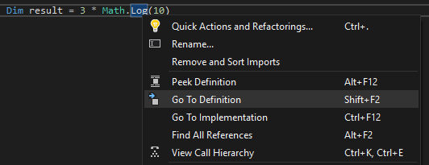

- [Peek Definition](../../ide/how-to-view-and-edit-code-by-using-peek-definition-alt-plus-f12.md)

   The **Peek Definition** window shows the definition of a method or type without actually opening a separate file.

   

## Install the Visual Studio IDE

In this section, you'll create a simple project to try out some of the things you can do with Visual Studio. You'll  change the color theme, use [IntelliSense](../../ide/using-intellisense.md) as a coding aid, and debug an app to see the value of a variable during the program's execution.

::: moniker range="vs-2017"

To get started, [download Visual Studio](https://visualstudio.microsoft.com/downloads/?utm_medium=microsoft&utm_source=docs.microsoft.com&utm_campaign=inline+link&utm_content=download+vs2017) and install it on your system. The modular installer enables you to choose and install *workloads*, which are groups of features needed for the programming language or platform you prefer. To follow the steps for [creating a program](#create-a-program), be sure to select the **.NET Core cross-platform development** workload during installation.

::: moniker-end

::: moniker range=">=vs-2019"

To get started, [download Visual Studio](https://visualstudio.microsoft.com/downloads/?utm_medium=microsoft&utm_source=docs.microsoft.com&utm_campaign=inline+link&utm_content=download+vs2019) and install it on your system. The modular installer enables you to choose and install *workloads*, which are groups of features needed for the programming language or platform you prefer. To follow the steps for [creating a program](#create-a-program), be sure to select the **.NET Core cross-platform development** workload during installation.

::: moniker-end


When you start Visual Studio for the first time, you can optionally [sign in](../../ide/signing-in-to-visual-studio.md) using your Microsoft account or your work or school account.

## Customize Visual Studio

You can personalize the Visual Studio user interface, including change the default color theme.

### Change the color theme

To change to the **Dark** theme:

1. Open Visual Studio.

::: moniker range=">=vs-2019"

1. On the Start window, choose **Continue without code**.

   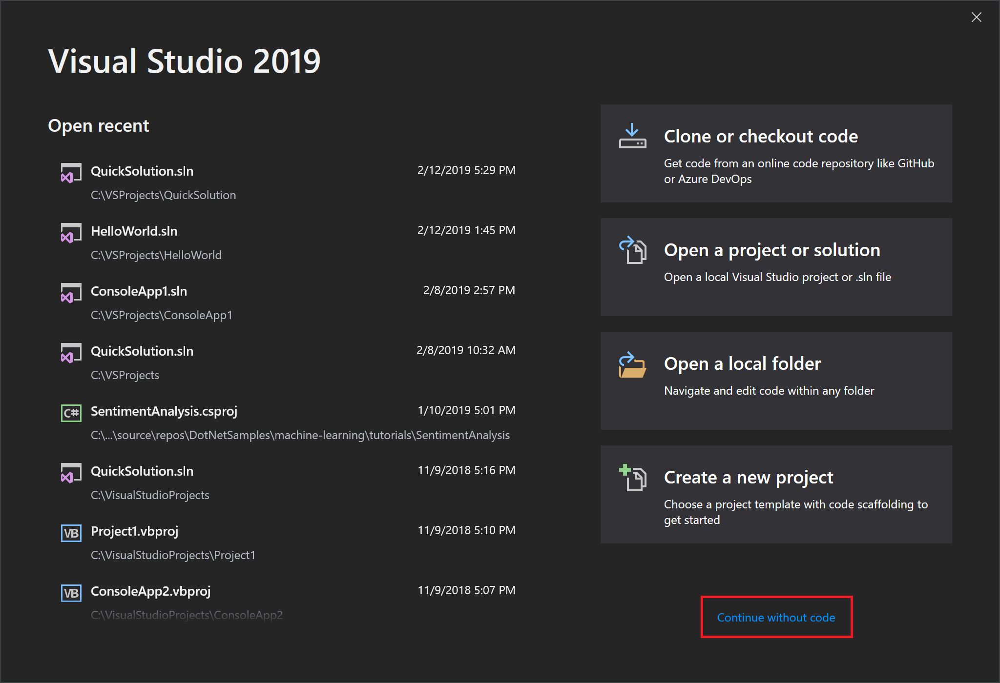

   The IDE opens.

::: moniker-end

1. On the menu bar, choose **Tools** > **Options** to open the **Options** dialog.

::: moniker range="vs-2017"

1. On the **Environment** > **General** options page, change the **Color theme** selection to **Dark**, and then choose **OK**.

   

   The color theme for the entire IDE changes to **Dark**.

   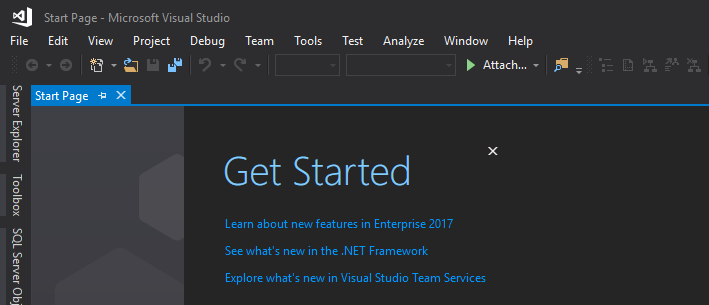

::: moniker-end

::: moniker range=">=vs-2019"

1. On the **Environment** > **General** options page, change the **Color theme** selection to **Dark**, and then choose **OK**.

   

   The color theme for the entire IDE changes to **Dark**.

   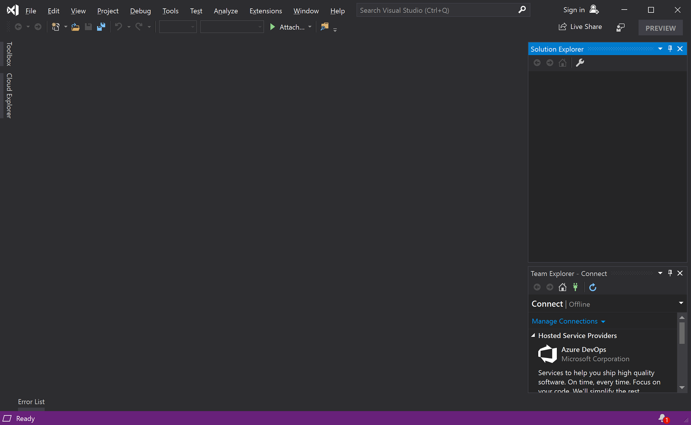

::: moniker-end

### Select environment settings

Next we'll configure Visual Studio to use environment settings tailored to Visual Basic developers.

1. On the menu bar, choose **Tools** > **Import and Export Settings**.

2. In the **Import and Export Settings Wizard**, select **Reset all settings** on the first page, and then choose **Next**.

3. On the **Save Current Settings** page, select an option to save your current settings or not, and then choose **Next**. (If you haven't customized any settings, select **No, just reset settings, overwriting my current settings**.)

4. On the **Choose a Default Collection of Settings** page, choose **Visual Basic**, and then choose **Finish**.

5. On the **Reset Complete** page, choose **Close**.

To learn about other ways you can personalize the IDE, see [Personalize Visual Studio](../../ide/personalizing-the-visual-studio-ide.md).

## Create a program

Let's dive in and create a simple program.

1. Open Visual Studio. On the menu bar, choose **File** > **New Project**.

   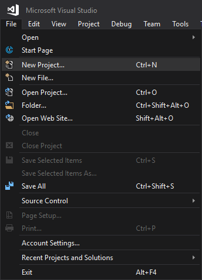

::: moniker range="vs-2017"

2. The **New Project** dialog box shows several project *templates*. A template contains the basic files and settings needed for a given project type. Choose the **.NET Core** category under **Visual Basic**, and then choose the **Console App (.NET Core)** template. In the **Name** text box, type **HelloWorld**, and then select the **OK** button.

   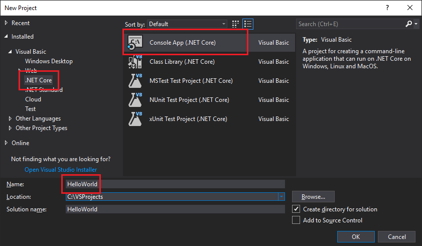

   > [!NOTE]
   > If you don't see the **.NET Core** category, you need to install the **.NET Core cross-platform development** workload. To do this, choose the **Open Visual Studio Installer** link on the bottom left of the **New Project** dialog. After Visual Studio Installer opens, scroll down and select the **.NET Core cross-platform development** workload, and then select **Modify**.

::: moniker-end

::: moniker range=">=vs-2019"

2. The **Create a new project** window opens and shows several project *templates*. A template contains the basic files and settings needed for a given project type. To find the template we want, type or enter **.net core console** in the search box. The list of available templates is automatically filtered based on the keywords you entered. You can further filter the template results by choosing **Visual Basic** from the **Language** drop-down list. Select the **Console App (.NET Core)** template, and then choose **Next**.

    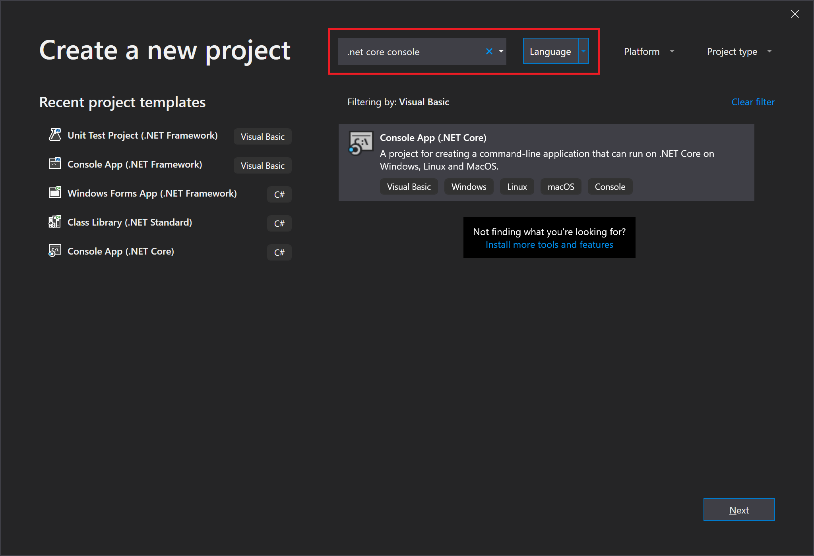

3. In the **Configure your new project** window, enter **HelloWorld** in the **Project name** box, optionally change the directory location for your project files, and then choose **Create**.

   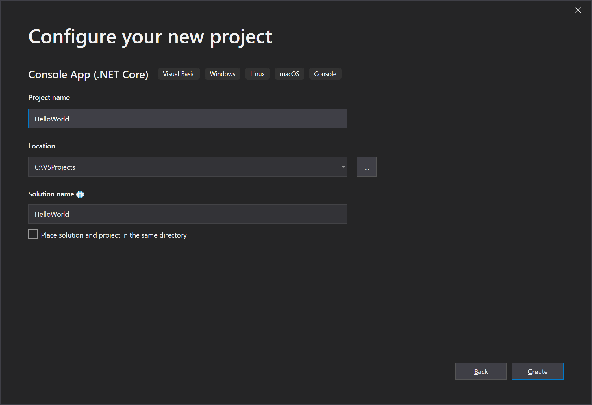

::: moniker-end

   Visual Studio creates the project. It's a simple "Hello World" application that calls the <xref:System.Console.WriteLine?displayProperty=nameWithType> method to display the literal string "Hello World!" in the console (program output) window.

   Shortly, you should see something like the following:

   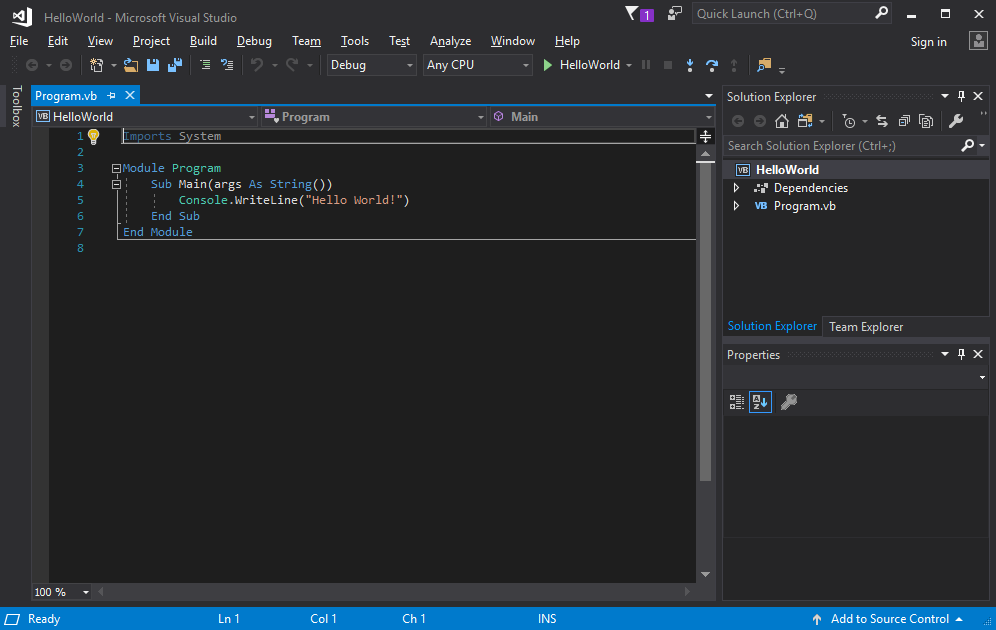

   The Visual Basic code for the app appears in the editor window, which takes up most of the space. Notice that the text is automatically colorized to indicate different parts of the code, such as keywords and types. In addition, small, vertical dashed lines in the code indicate which braces match one another, and line numbers help you locate code later. You can choose the small, boxed minus signs to collapse or expand blocks of code. This code outlining feature lets you hide code you don't need, helping to minimize onscreen clutter. The project files are listed on the right side in a window called **Solution Explorer**.

   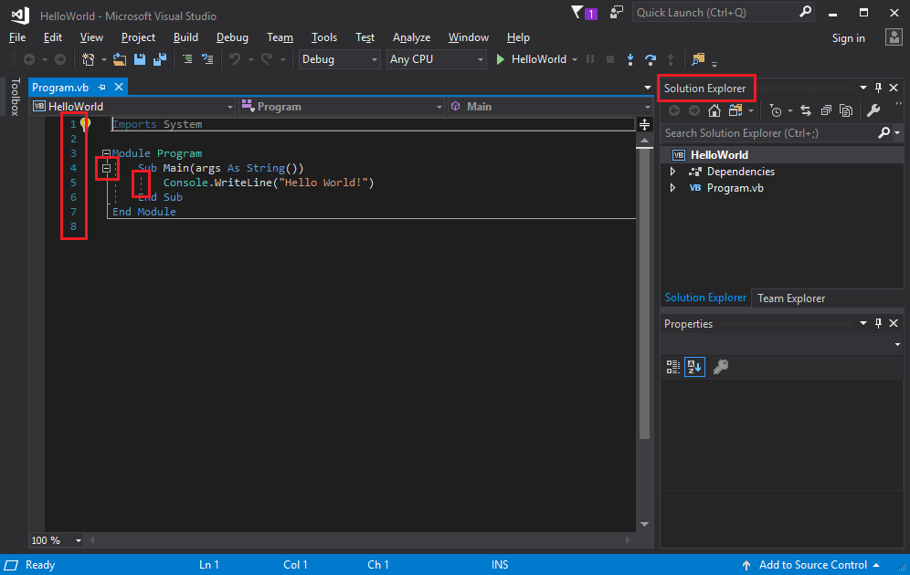

   There are other menus and tool windows available, but let's move on for now.

::: moniker range="vs-2017"

3. Now, start the app. You can do this by choosing **Start Without Debugging** from the **Debug** menu on the menu bar. You can also press **Ctrl**+**F5**.

   

   Visual Studio builds the app, and a console window opens with the message **Hello World!**. You now have a running app!

   

::: moniker-end

::: moniker range=">=vs-2019"

3. Now, start the app. You can do this by choosing **Start Without Debugging** from the **Debug** menu on the menu bar. You can also press **Ctrl**+**F5**.

   

   Visual Studio builds the app, and a console window opens with the message **Hello World!**. You now have a running app!

   

::: moniker-end

4. To close the console window, press any key on your keyboard.

5. Let's add some additional code to the app. Add the following Visual Basic code before the line that says `Console.WriteLine("Hello World!")`:

   ```vb
   Console.WriteLine("What is your name?")
   Dim name = Console.ReadLine()
   ```

   This code displays **What is your name?** in the console window, and then waits until the user enters some text followed by the **Enter** key.

6. Change the line that says `Console.WriteLine("Hello World!")` to the following code:

   ```vb
   Console.WriteLine("Hello " + name + "!")
   ```

7. Run the app again by pressing **Ctrl**+**F5**.

   Visual Studio rebuilds the app, and a console window opens and prompts you for your name.

::: moniker range="vs-2017"

8. Enter your name in the console window and press **Enter**.

   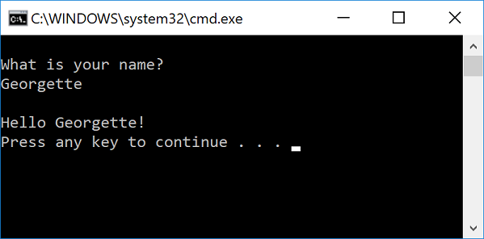

::: moniker-end

::: moniker range=">=vs-2019"

8. Enter your name in the console window and press **Enter**.

   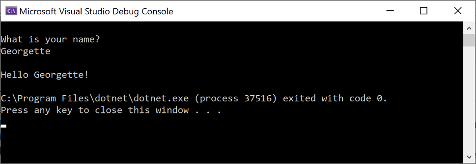

::: moniker-end

9. Press any key to close the console window and stop the running program.

## Use refactoring and IntelliSense

Let's look at a couple of the ways that [refactoring](../../ide/refactoring-in-visual-studio.md) and [IntelliSense](../../ide/using-intellisense.md) can help you code more efficiently.

First, let's rename the `name` variable:

1. Double-click the `name` variable to select it.

2. Type in the new name for the variable, **username**.

   Notice that a gray box appears around the variable, and a light bulb appears in the margin.

3. Select the light bulb icon to show the available [Quick Actions](../../ide/quick-actions.md). Select **Rename 'name' to 'username'**.

   

   The variable is renamed across the project, which in our case is only two places.

4. Now let's take a look at IntelliSense. Below the line that says `Console.WriteLine("Hello " + username + "!")`, type the following code fragment:

    ```vb
   Dim now = Date.
   ```

   A box displays the members of the <xref:System.DateTime> class. In addition, the description of the currently selected member displays in a separate box.

   

5. Select the member named **Now**, which is a property of the class, by double-clicking on it or selecting it using the up or down arrow keys and then pressing **Tab**.

6. Below that, type in or paste the following lines of code:

   ```vb
   Dim dayOfYear = now.DayOfYear
   Console.Write("Day of year: ")
   Console.WriteLine(dayOfYear)
   ```

   > [!TIP]
   > <xref:System.Console.Write%2A?displayProperty=nameWithType> is a little different to <xref:System.Console.WriteLine%2A?displayProperty=nameWithType> in that it doesn't add a line terminator after it prints. That means that the next piece of text that's sent to the output will print on the same line. You can hover over each of these methods in your code to see their description.

7. Next, we'll use refactoring again to make the code a little more concise. Click on the variable `now` in the line `Dim now = Date.Now`.

   Notice that a little screwdriver icon appears in the margin on that line.

8. Click the screwdriver icon to see what suggestions Visual Studio has available. In this case, it's showing the [Inline temporary variable](../../ide/reference/inline-temporary-variable.md) refactoring to remove a line of code without changing the overall behavior of the code:

   

9. Click **Inline temporary variable** to refactor the code.

::: moniker range="vs-2017"

10. Run the program again by pressing **Ctrl**+**F5**. The output looks something like this:

   

::: moniker-end

::: moniker range=">=vs-2019"

10. Run the program again by pressing **Ctrl**+**F5**. The output looks something like this:

   

::: moniker-end

## Debug code

When you write code, you need to run it and test it for bugs. Visual Studio's debugging system lets you step through code one statement at a time and inspect variables as you go. You can set *breakpoints* that stop execution of the code at a particular line. You can observe how the value of a variable changes as the code runs, and more.

Let's set a breakpoint to see the value of the `username` variable while the program is "in flight".

1. Find the line of code that says `Console.WriteLine("Hello " + username + "!")`. To set a breakpoint on this line of code, that is, to make the program pause execution at this line, click in the far left margin of the editor. You can also click anywhere on the line of code and then press **F9**.

   A red circle appears in the far left margin, and the code is highlighted in red.

   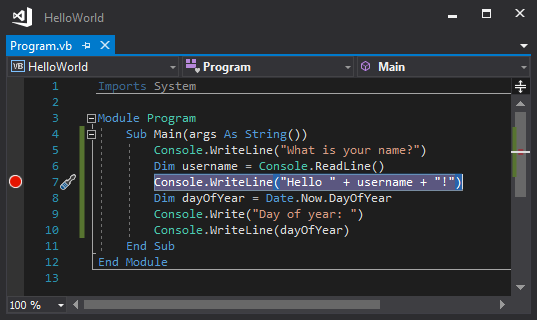

1. Start debugging by selecting **Debug** > **Start Debugging** or by pressing **F5**.

1. When the console window appears and asks for your name, type it in and press **Enter**.

   The focus returns to the Visual Studio code editor and the line of code with the breakpoint is highlighted in yellow. This signifies that it's the next line of code that the program will execute.

1. Hover your mouse over the `username` variable to see its value. Alternatively, you can right-click on `username` and select **Add Watch** to add the variable to the **Watch** window, where you can also see its value.

   

1. To let the program run to completion, press **F5** again.

To get more details about debugging in Visual Studio, see [Debugger feature tour](../../debugger/debugger-feature-tour.md).

## Next steps

Explore Visual Studio further by following along with one of these introductory articles:

> [!div class="nextstepaction"]
> [Learn to use the code editor](tutorial-editor.md)

> [!div class="nextstepaction"]
> [Learn about projects and solutions](tutorial-projects-solutions.md)

## See also

- Discover [more Visual Studio features](../../ide/advanced-feature-overview.md)
- Visit [visualstudio.microsoft.com](https://visualstudio.microsoft.com/vs/)
- Read [The Visual Studio blog](https://blogs.msdn.microsoft.com/visualstudio/)