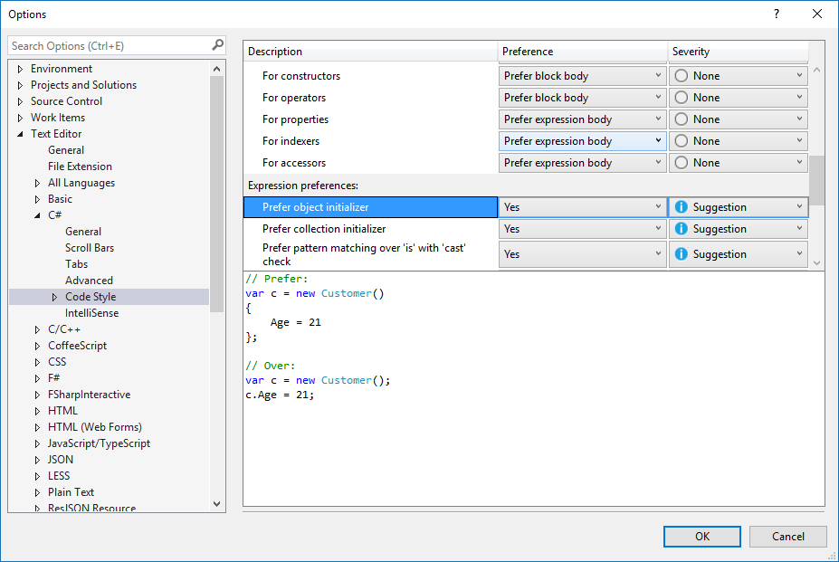

# Code style preferences

Code style preferences can be set for your C# and Visual Basic projects by opening the **Options** dialog box from the **Tools** menu. Select **Text Editor** > **C#** or  **Basic** > **Code Style** > **General**. Options set in this window are applicable to the local machine. Each item in the list will show a preview of the preference when selected, as shown below.

For each item, you can set the **Preference** and **Severity** values using the drop downs on each line. Severity can be set to **None**, **Suggestion**, **Warning**, or **Error**. If you want to enable [Quick Actions](../ide/quick-actions.md) for a code style, ensure that the **Severity** setting is set to something other than **None**. The Quick Actions light bulb icon  will appear when a non-preferred style is used, and you can choose an option on the Quick Actions list to automatically rewrite code to the preferred style.

Code style settings for .NET can also be managed with an [EditorConfig](../ide/editorconfig-code-style-settings-reference.md) file. In this case, the settings in the EditorConfig file take precedence over options selected in the **Options** dialog box. You can use an EditorConfig file to enforce and configure the coding style for your entire repo or project.

### See also

[Quick Actions](../ide/quick-actions.md)  
[.NET coding convention settings for EditorConfig](../ide/editorconfig-code-style-settings-reference.md)