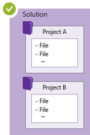
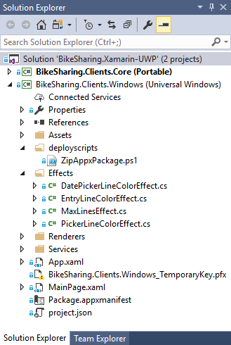
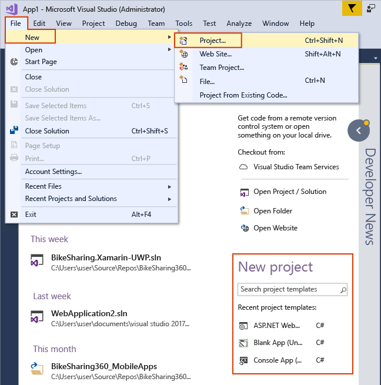
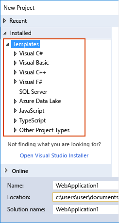
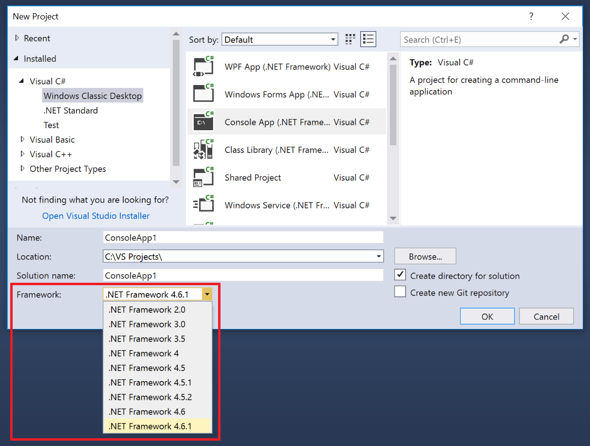

# Create solutions and projects

*Projects* are logical containers in Visual Studio that hold the items needed to build your app, such as source code files, bitmaps, icons, and component and service references. When you create a new project, Visual Studio creates a *solution* to contain the project. You can then add other new or existing projects to the solution if you want. Solutions can also contain files that aren't connected to any specific project.

You can view your solutions and projects in a tool window called **Solution Explorer**. The following screenshot shows an example solution in Solution Explorer (BikeSharing.Xamarin-UWP) that contains two projects: BikeSharing.Clients.Core and BikeSharing.Clients.Windows. Each project contains multiple files, folders, and references. The project name in bold is the *startup project*; that is, the project that starts when you run the app. You can specify which project is the startup project.

While you can construct a project yourself by adding the necessary files to it, Visual Studio offers a selection of project templates to give you a head start. Creating a new project from a template gives you a project with the essentials for that project type, and you can rename the files or add new or existing code and other resources to it as needed.

That being said, solutions and projects are not required to develop apps in Visual Studio. You can also just open code that you have cloned from Git or downloaded elsewhere. For more information, see [Develop code in Visual Studio without projects or solutions](../ide/develop-code-in-visual-studio-without-projects-or-solutions.md).

> [!NOTE]
> The descriptions in this topic are based on the Visual Studio Community edition. The dialog boxes and menu commands you see might differ from those described here, depending on your settings or Visual Studio edition. To change your settings, for example to **General** or **Visual C++** settings, choose **Tools**, **Import and Export Settings**, and then choose **Reset all settings**.

## To create a project from a project template

1. There are multiple ways to create a new project in Visual Studio. On the Start Page, enter the name of a project template in the **Search project templates** box, or choose the **Create new project** link to open the **New Project** dialog box. You can also choose **File**, **New**, **Project...** on the menu bar, or choose the **New Project** button on the toolbar.

  

  In the **New Project** dialog box, available project templates appear in a list under the **Templates** category. Templates are organized by programming language and project type, such as Visual C#, JavaScript, and Azure Data Lake.

  

  > [!NOTE]
  > The list of available languages and project templates that appears depends on the version of Visual Studio you are running and the workloads that are installed. To learn about how to install additional workloads, see [Modify Visual Studio 2017 by adding or removing workloads and components](../install/modify-visual-studio.md).

1. Show the list of templates for the programming language you want to use by choosing the triangle next to the language name, and then choose a project type.

  The following example shows the project templates available for Visual C# web projects.

  

1. Enter a name for the new project in the **Name** box. You can choose to save the project in the default location on your system, or choose the **Browse** button to find another location.

  You can also optionally choose to change the solution name, or add the new project to a Git repository by choosing **Add to Source Control**.

1. Choose the **OK** button to create the solution and project.

1. If you want to add an additional project to the solution, choose the solution node in Solution Explorer, and then on the menu bar, choose **Project**, **Add New Item**.

## Create a project from existing code files

If you have a collection of code source files, you can easily add them to a project.

1. On the menu, choose **File**, **New**, **Project From Existing Code**.

1. In the **Create Project from Existing Code Files** wizard, choose the project type you want in the **What type of project would you like to create?** drop-down list box, and then choose the **Next** button.

1. In the wizard, browse to the location of the files and then enter a name for the new project in the **Name** box. When you are done, choose the **Finish** button.

> [!NOTE]
> This option works best for a relatively simple collections of files. Currently, only Visual C++, Apache Cordova, Visual Basic, and Visual C# project types are supported.

## Add files to a solution

If you have a file that applies to multiple projects, such as a readme file for the solution, or other files that logically belong at the solution level rather than under a specific project, then you can add them to the solution itself. To add an item to a solution, on the context (right-click) menu of the solution node in **Solution Explorer**, choose **Add**, **New Item**, or **Add**, **Existing Item**.

## Create a .NET project that targets a specific version of the .NET Framework

When you create a project, you can specify a specific version of the .NET Framework that you want the project to use. To specify a .NET framework version, choose the **.NET Framework** version drop-down menu in the **New Project** dialog box.

> [!NOTE]
> If you are creating a project from a .NET Core template, the .NET Framework version you select in the drop-down is ignored.

> [!TIP]
> If you set the .NET Framework version before selecting a project template, then Visual Studio will only show templates that are compatible with that .NET Framework version.

You must have .NET Framework 3.5 installed on your system to access .NET Framework versions earlier than .NET Framework 4.

## Create empty solutions

You can also create empty solutions that have no projects. This might be preferable in cases where you want to construct your solution and projects from scratch.

### To create an empty solution

1. On the menu, choose **File**, **New**, **Project...**.

1. In the left (**Templates**) pane, choose **Other Project Types**, **Visual Studio Solutions** in the expanded list.

1. In the middle pane, choose **Blank Solution**.

1. Enter **Name** and **Location** values for your solution, then choose **OK**.

After you create an empty solution, you can add new or existing projects or items to it by choosing **Add New Item** or **Add Existing Item** on the **Project** menu.

As mentioned earlier, you can also open code files without needing a project or solution. To learn about developing code in this way, see [Develop code in Visual Studio without projects or solutions](../ide/develop-code-in-visual-studio-without-projects-or-solutions.md).

## Create a temporary project (C# and Visual Basic)

If you create a .NET-based project without specifying a disk location, it is a temporary project. Temporary projects enable you to experiment with .NET projects. At any time while you are working with a temporary project, you can choose to save it or discard it.

To create a temporary project, first go to **Tools**, **Options**, **Projects and Solutions**, **General**, and uncheck the **Save new projects when created** checkbox. Then open the **New Project** dialog box as usual.

## Delete a solution, project, or item

You can delete solutions and their contents permanently, but not by using the Visual Studio IDE. Deleting items within Visual Studio only removes them from the current solution or project. To permanently delete a solution or other component from your system, use File Explorer to delete the folder that contains the .sln and .suo solution files. However, before permanently deleting a solution, it's recommended that you back up any projects or files in case you need them again.

> [!NOTE]
> The .suo file is a hidden file that is not displayed under the default File Explorer settings. To show hidden files, on the **View** menu in File Explorer, select the **Hidden Items** checkbox.

### To permanently delete a solution

1. In **Solution Explorer**, on the context menu of the solution you want to delete, choose **Open folder in File Explorer**.

1. In File Explorer, navigate up one level.

1. Choose the folder containing the solution and then choose the **Delete** key.

## See also

[Solutions and Projects](../ide/solutions-and-projects-in-visual-studio.md)  
[Microsoft's open source repositories on GitHub](https://github.com/Microsoft)  
[Visual Studio Samples](../ide/visual-studio-samples.md)  
[Developer code samples](https://code.msdn.microsoft.com/)  
