# Get started with C++ in Visual Studio

Complete this quickstart to become familiar with many of the tools and dialog boxes that you can use when you develop applications in C++ with Visual Studio. Create a "Hello, World"-style console application while you learn more about working in the integrated development environment (IDE).

## Prerequisites

You don't need to be familiar with C++ to complete this quickstart, but you should be familiar with some general programming and debugging concepts. The Visual Studio documentation doesn't teach you how to program in C++. A good guide to C++ learning resources is the [Get started](https://isocpp.org/get-started) page on the ISO C++ website.

To follow along, you need a copy of Visual Studio 2017 version 15.3 or later, with the **Desktop development with C++** workload installed. For a fast guide to installation, see [Install C++ support in Visual Studio](/cpp/build/vscpp-step-0-installation).

## Create a console app

If it's not running yet, start Visual Studio.

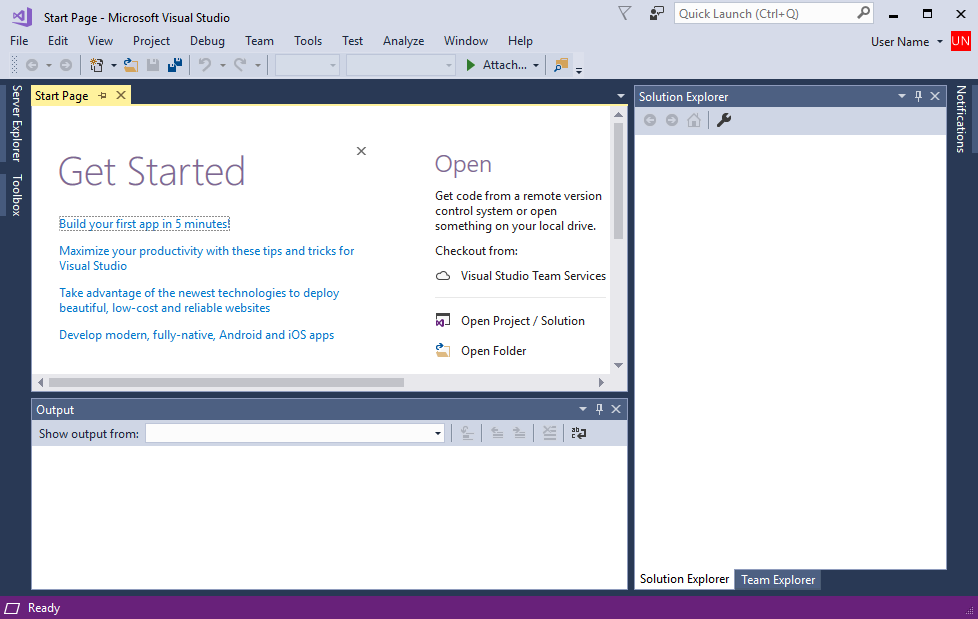

After you open Visual Studio, you can see the three basic parts of the IDE: tool windows, menus and toolbars, and the main window space. Tool windows are docked on the left and right sides of the app window. The **Quick Launch** box, the menu bar, and the standard toolbar are found at the top. The center of the window contains the **Start Page**. When you open a solution or project, editors and designers appear in this space. When you develop an app, most of your time is spent in this central area.

Visual Studio uses *projects* to organize the code for an app, and *solutions* to organize your projects. A project contains all the options, configurations, and rules used to build your apps. It also manages the relationship between all the project's files and any external files. To create your app, first, you create a new project and solution.

### To create a console app project

1. On the menu bar, choose **File > New > Project** to open the **New Project** dialog box.

   

1. In the **New Project** dialog, select **Installed > Visual C++** if it isn't selected already. In the center pane, select the **Windows Console Application** template. In the **Name** edit box, enter *HelloApp*.

   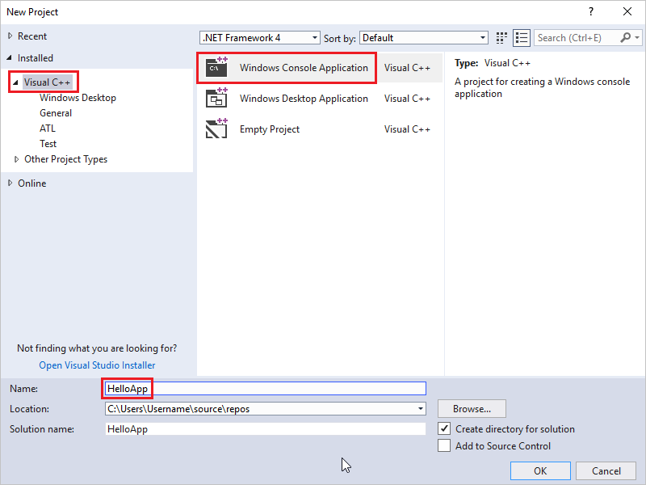

   Your dialog box may have different choices, depending on the Visual Studio workloads and components you've installed. If you don't see Visual C++ project templates, you need to run the Visual Studio installer again and install the **Desktop development with C++** workload. You can do this directly from the **New Project** dialog. To launch the installer, choose the **Open Visual Studio Installer** link on the dialog.

1. Choose the **OK** button to create your app project and solution.

   The HelloApp project and solution, with the basic files for a Windows console app, are created and automatically loaded into **Solution Explorer**. The *HelloApp.cpp* file is opened in the code editor. These items appear in **Solution Explorer**:

   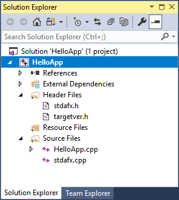

## Add code to the app

Next, add code to display the word "Hello" in the console window.

### To edit code in the editor

1. In the *HelloApp.cpp* file, enter a blank line before the line `return 0;` and then enter this code:

   ```cpp
   cout << "Hello\n";
   ```

   A red squiggly line appears under `cout`. If you hover the pointer over it, an error message appears.

   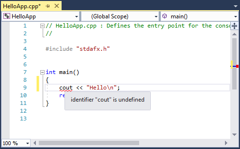

   The error message also appears in the **Error List** window. You can display this window by choosing **View > Error List** on the menu bar.

   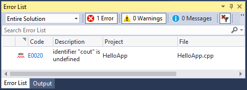

   Your code is missing a declaration for [std::cout](/cpp/standard-library/iostream), which is found in the *\<iostream>* header file.

1. To include the *iostream* header, enter this code after `#include "stdafx.h"`:

   ```cpp
   #include <iostream>
   using namespace std;
   ```

   You probably noticed that a box appeared as you entered code. This box contains auto-completion suggestions for the characters that you enter. It's part of C++ IntelliSense, which provides coding prompts, including class or interface members and parameter information. You can also use code snippets, which are pre-defined blocks of code. For more information, see [Using IntelliSense](../ide/using-intellisense.md) and [Code snippets](../ide/code-snippets.md).

   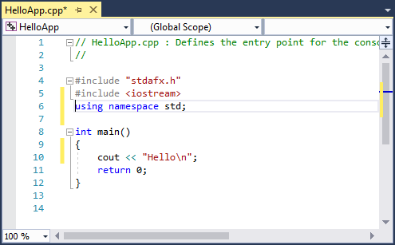

   The red squiggly line under `cout` disappears when you fix the error.

1. To save the changes to the file, press **Ctrl+S**.

## Build the app

It's easy to build your code. On the menu bar, choose **Build > Build Solution**. Visual Studio builds the HelloApp solution, and reports progress in the **Output** window.

   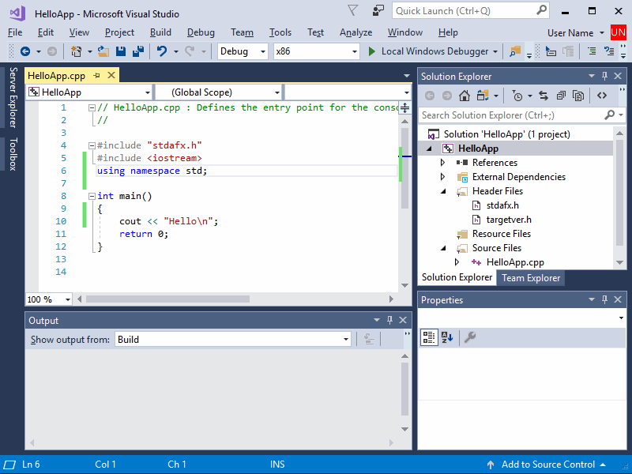

## Debug and test the app

You can debug HelloApp to see whether the word "Hello" appears in the console window.

### To debug the app

To start the debugger, choose **Debug > Start Debugging** on the menu bar.

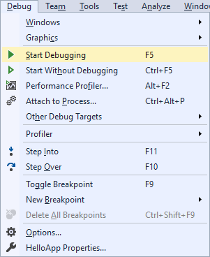

The debugger starts and runs the code. The console window (a separate window that looks like a command prompt) appears for a few seconds but closes quickly when the debugger stops running. To see the text, you need to set a breakpoint to stop program execution.

### To add a breakpoint

1. In the editor, put the cursor on the line `return 0;`. On the menu bar, choose **Debug > Toggle Breakpoint**. You can also click in the left margin to set a breakpoint.

     

     A red circle appears next to the line of code in the far left margin of the editor window.

     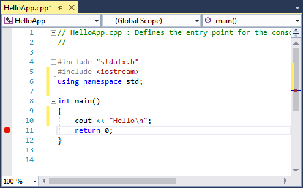

1. To start debugging, press **F5**.

   The debugger starts, and a console window appears showing the word **Hello**.

   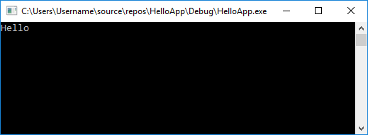

1. To stop debugging, press **Shift+F5**.

For more information about console project debugging, see [Console projects](../debugger/debugging-preparation-console-projects.md).

## Build a release version of the app

Now that you've verified that everything works, you can prepare a release build of the application. Release builds leave out the debugging information, and use compiler optimization options to create smaller, faster code.

### To clean the solution files and build a release version

1. On the menu bar, choose **Build > Clean Solution** to delete intermediate files and output files that were created during previous builds.

   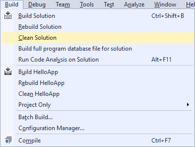

1. To change the solution configuration for HelloApp from **Debug** to **Release**, in the toolbar, select the dropdown on the Solution Configurations control and then choose **Release**.

   

1. Build the solution. On the menu bar, choose **Build > Build Solution**.

When this build completes, you've created an app that you can copy and run in any command prompt window. It may not do much, but it's the gateway to greater things.

Congratulations on completing this quickstart! If you want to explore more examples, see [Visual Studio samples](../ide/visual-studio-samples.md).

## See also

[Using the Visual Studio IDE for C++ desktop development](/cpp/ide/using-the-visual-studio-ide-for-cpp-desktop-development)  
[Walkthrough: Create a simple application with C# or Visual Basic](../ide/walkthrough-create-a-simple-application-with-visual-csharp-or-visual-basic.md)  
[Productivity tips for Visual Studio](../ide/productivity-tips-for-visual-studio.md)  
[Visual Studio samples](../ide/visual-studio-samples.md)  
[Get started developing with Visual Studio](../ide/get-started-developing-with-visual-studio.md)
