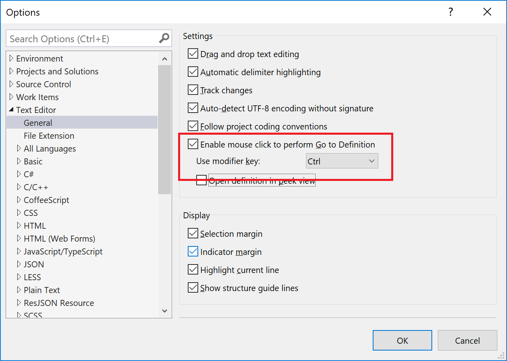
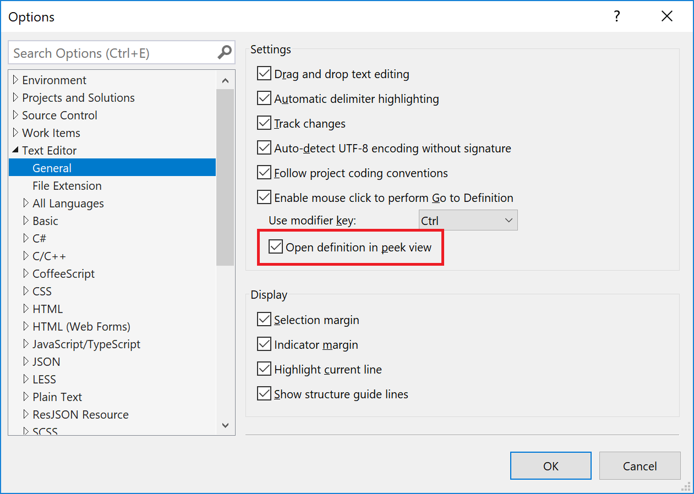
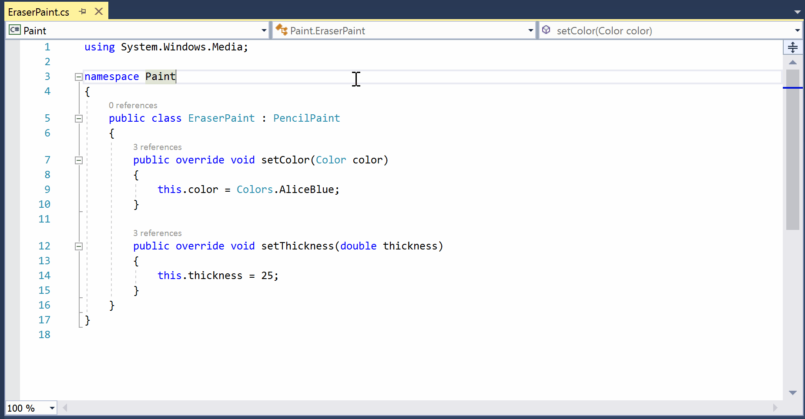

# Go To Definition and Peek Definition  
The Go To Definition and Peek Definition features enable you to easily view the definition of a type or member.

## Go To Definition  
The Go To Definition feature navigates to the source of a type or member, and opens the result in a new tab. If you are a keyboard user, place your text cursor somewhere inside the symbol name and press **F12**. If you are a mouse user, either select **Go To Definition** from the context menu or use the **Ctrl-click** functionality described below.  

### Ctrl-click Go To Definition  
In Visual Studio 2017 version 15.4, there's an easier way for mouse users to quickly access Go To Definition. Symbols become clickable when you press **Ctrl** and hover over the type or member. To quickly navigate to the definition of a symbol, press the **Ctrl** key and then click on it. It's that easy!

You can change the modifier key for mouse-click **Go To Definition** by going to **Tools**, **Options**, **Text Editor**, **General**, and selecting either **Alt** or **Ctrl+Alt** from the **Use modifier key** drop-down. You can also disable mouse-click **Go To Definition** by unchecking the **Enable mouse click to perform Go To Definition** checkbox.  

  

## Peek Definition
The Peek Definition feature lets you preview the definition of a type without leaving your current location in the editor. If you are a keyboard user, place your text cursor somewhere inside the type or member name and press **Alt + F12**. If you are a mouse user, you can select **Peek Definition** from the context menu. In Visual Studio 2017 version 15.4 and later, there is a new way to peek view a definition by using the mouse. First, go to **Tools**, **Options**, **Text Editor**, **General**. Select the option **Open definition in peek view** and click **OK** to close the **Options** dialog box.  

  

Then, press **Ctrl** (or whichever modifier key is selected in **Options**), and click on the type or member.  

If you peek another definition from the popup window, you will start a breadcrumb path which you can navigate using the circles and arrows which appear above the popup.  

For more information, see [How to: View and Edit Code by Using Peek Definition (Alt+F12)](how-to-view-and-edit-code-by-using-peek-definition-alt-plus-f12.md).  

## See Also  
[Navigating Code](../ide/navigating-code.md)  
[How to: View and Edit Code by Using Peek Definition (Alt+F12)](how-to-view-and-edit-code-by-using-peek-definition-alt-plus-f12.md)  
