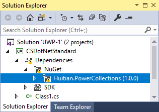
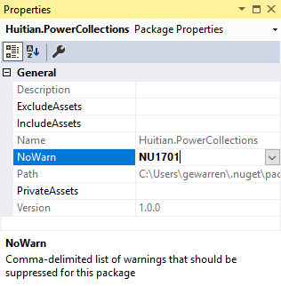

# How to: Suppress compiler warnings

You can declutter a build log by filtering out one or more kinds of compiler warnings. For example, you might want to review only some of the output that's generated when you set the build log verbosity to Normal, Detailed, or Diagnostic. For more information about verbosity, see [How to: View, save, and configure build log files](../ide/how-to-view-save-and-configure-build-log-files.md).

## Suppressing specific warnings for Visual C# or F# #

Use the **Build** property page to suppress specific warnings for C# and F# projects.

1. In **Solution Explorer**, choose the project in which you want to suppress warnings.

1. On the menu bar, choose **View** > **Property Pages**.

1. Choose the **Build** page.

1. In the **Suppress warnings** box, specify the error codes of the warnings that you want to suppress, separated by semicolons.

1. Rebuild the solution.

## Suppressing specific warnings for Visual C++

Use the **Configuration Properties** property page to suppress specific warnings for C++ projects.

1. In **Solution Explorer**, choose the project or source file in which you want to suppress warnings.

1. On the menu bar, choose **View** > **Property Pages**.

1. Choose the **Configuration Properties** category, choose the **C/C++** category, and then choose the **Advanced** page.

1. Perform one of the following steps:

    - In the **Disable Specific Warnings** box, specify the error codes of the warnings that you want to suppress, separated by a semicolon.

    - In the **Disable Specific Warnings** box, choose **Edit** to display more options.

1. Choose the **OK** button, and then rebuild the solution.

## Suppressing warnings for Visual Basic

You can hide specific compiler warnings for Visual Basic by editing the *.vbproj* file for the project. To suppress warnings by *category*, you can use the [Compile property page](../ide/reference/compile-page-project-designer-visual-basic.md). For more information, see [Configuring warnings in Visual Basic](../ide/configuring-warnings-in-visual-basic.md).

### To suppress specific warnings for Visual Basic

This example shows you how to edit the *.vbproj* file to suppress specific compiler warnings.

1. In **Solution Explorer**, choose the project in which you want to suppress warnings.

1. On the menu bar, choose **Project** > **Unload Project**.

1. In **Solution Explorer**, open the right-click or shortcut menu for the project, and then choose **Edit** *ProjectName* **.vbproj**.

    The XML project file opens in the code editor.

1. Locate the `<NoWarn>` element for the build configuration you're building with, and add one or more warning numbers as the value of the `<NoWarn>` element. If you specify multiple warning numbers, separate them with a comma.

     The following example shows the `<NoWarn>` element for the *Debug* build configuration on an x86 platform, with two compiler warnings suppressed:

    ```xml
    <PropertyGroup Condition=" '$(Configuration)|$(Platform)' == 'Debug|x86' ">
        <PlatformTarget>x86</PlatformTarget>
        <DebugSymbols>true</DebugSymbols>
        <DebugType>full</DebugType>
        <Optimize>false</Optimize>
        <OutputPath>bin\Debug\</OutputPath>
        <DefineDebug>true</DefineDebug>
        <DefineTrace>true</DefineTrace>
        <ErrorReport>prompt</ErrorReport>
        <NoWarn>40059,42024</NoWarn>
        <WarningLevel>1</WarningLevel>
      </PropertyGroup>
    ```

   > [!NOTE]
   > .NET Core projects do not contain build configuration property groups by default. To suppress warnings in a .NET Core project, add the build configuration section to the file manually. For example:
   >
   > ```xml
   > <Project Sdk="Microsoft.NET.Sdk">
   >   <PropertyGroup>
   >     <OutputType>Exe</OutputType>
   >     <TargetFramework>netcoreapp2.0</TargetFramework>
   >     <RootNamespace>VBDotNetCore_1</RootNamespace>
   >   </PropertyGroup>
   >   <PropertyGroup Condition=" '$(Configuration)|$(Platform)' == 'Debug|AnyCPU' ">
   >     <NoWarn>42016,41999,42017</NoWarn>
   >   </PropertyGroup>
   > </Project>
   > ```

1. Save the changes to the *.vbproj* file.

1. On the menu bar, choose **Project** > **Reload Project**.

1. On the menu bar, choose **Build** > **Rebuild Solution**.

    The **Output** window no longer shows the warnings that you specified.

For more information, see the [/nowarn compiler option](/dotnet/visual-basic/reference/command-line-compiler/nowarn) for the Visual Basic command-line compiler.

## Suppressing warnings for NuGet packages

In some cases, you may want to suppress NuGet compiler warnings for a single NuGet package, instead of for an entire project. The warning serves a purpose, so you don't want to suppress it at the project level. For example, one of the NuGet warnings tells you that the package may not be fully compatible with your project. If you suppress it at the project level and later add an additional NuGet package, you would never know if it was producing the compatibility warning.

### To suppress a specific warning for a single NuGet package

1. In **Solution Explorer**, select the NuGet package you want to suppress compiler warnings for.

   

1. From the right-click or context menu, select **Properties**.

1. In the **NoWarn** box of the package's properties, enter the warning number you want to suppress for this package. If you want to suppress more than one warning, use a comma to separate the warning numbers.

   

   The warning disappears from **Solution Explorer** and the **Error List**.

## See also

[Walkthrough: Building an Application](../ide/walkthrough-building-an-application.md)  
[How to: View, Save, and Configure Build Log Files](../ide/how-to-view-save-and-configure-build-log-files.md)  
[Compiling and Building](../ide/compiling-and-building-in-visual-studio.md)
