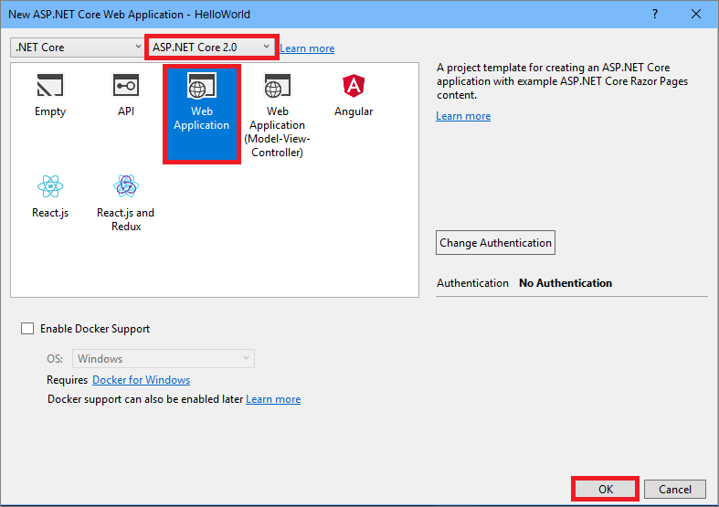

# Quickstart: Use Visual Studio to create your first ASP.NET Core web app

In this 5-10 minute introduction to the Visual Studio integrated development environment (IDE), you'll create a simple C# ASP.NET Core web application.

If you haven't already installed Visual Studio, go to the [Visual Studio downloads](https://visualstudio.microsoft.com/downloads/?utm_medium=microsoft&utm_source=docs.microsoft.com&utm_campaign=button+cta&utm_content=download+vs2017) page to install it for free.

## Create a project

First, you'll create an ASP.NET Core web application project. The project type comes with template files that constitute a functional web application, before you've even added anything!

1. Open Visual Studio 2017.

1. From the top menu bar, choose **File** > **New** > **Project**.

1. In the **New Project** dialog box, in the left pane, expand **Visual C#**, then choose **.NET Core**. In the middle pane, choose **ASP.NET Core Web Application**, then choose **OK**.

     If you don't see the **.NET Core** project template category, choose the **Open Visual Studio Installer** link in the left pane. The Visual Studio Installer launches. Choose the **ASP.NET and web development** workload, then choose **Modify**.

     

1. In the **New ASP.NET Core Web Application** dialog box, select **ASP.NET Core 2.0** from the top drop-down menu. (If you don't see **ASP.NET Core 2.0** in the list, install it by following the **Download** link that should appear in a yellow bar near the top of the dialog box.) Choose **OK**.

   

## Explore the IDE

1. In the **Solution Explorer** toolbar, expand the **Pages** folder, then choose **About.cshtml** to open it in the editor. This file corresponds to a page called **About** in the web application.

1. In the editor, choose `AboutModel` and then press **F12** or choose **Go To Definition** from the context (right-click) menu. This command takes you to the definition of the `AboutModel` C# class.

   

1. Next, clean up the `using` directives at the top of the file using a simple shortcut. Choose any of the grayed-out using directives and a [Quick Actions](../ide/quick-actions.md) light bulb will appear just below the caret or in the left margin. Choose the light bulb, and then choose **Remove Unnecessary Usings**.

     The unnecessary usings are deleted from the file.

1. In the `OnGet()` method, change the body to the following code:

 ```csharp
 public void OnGet()
 {
     string directory = Environment.CurrentDirectory;
     Message = String.Format("Your directory is {0}.", directory);
 }
 ```

1. You'll see two wavy underlines appear under **Environment** and **String**, because these types are not in scope. Open the **Error List** toolbar to see the same errors listed there. (If you don't see the **Error List** toolbar, choose **View** > **Error List** from the top menu bar.)

   

1. In the editor window, place your cursor on either line that contains the error, then choose the Quick Actions light bulb in the left margin. From the drop-down menu, choose **using System;** to add this directive to the top of your file and resolve the errors.

## Run the application

1. Press **Ctrl**+**F5** to run the application and open it in a web browser.

1. At the top of the web site, choose **About** to see the directory message you added in the `OnGet()` method for the **About** page.

1. Close the web browser.

> [!NOTE]
> If you get an error message that says **Unable to connect to web server 'IIS Express'**, close Visual Studio and then open it using the **Run as administrator** option from the right-click or context menu. Then, run the application again.

Congratulations on completing this Quickstart! We hope you learned a little bit about the Visual Studio IDE. If you'd like to delve deeper into its capabilities, please continue with a tutorial in the **Tutorials** section of the table of contents.

## Next steps

Congratulations on completing this Quickstart! We hope you learned a little bit about C#, ASP.NET Core, and the Visual Studio IDE. To see the app running on a public server, select the following button.

> [!div class="nextstepaction"]
> [Deploy the app to Azure App Service](..//deployment/quickstart-deploy-to-azure.md)

To learn more, continue with the tutorials, [Get started with C# and ASP.NET in Visual Studio](tutorial-csharp-aspnet-core.md) and [Get started with ASP.NET Core MVC and Visual Studio](/aspnet/core/tutorials/first-mvc-app/start-mvc?tabs=aspnetcore2x).
