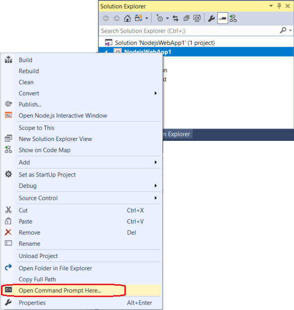

# Quickstart: Use Visual Studio to create your first Node.js app

In this 5-10 minute introduction to the Visual Studio integrated development environment (IDE), you'll create a simple Node.js web application. If you haven't already installed Visual Studio 2017, go to the [Visual Studio downloads](https://aka.ms/vsdownload?utm_source=mscom&utm_campaign=msdocs) page to install it for free.

## Create a project
First, you'll create an Node.js web application project.

1. If you don't have the Node.js runtime already installed, install the LTS version from the [Node.js](https://nodejs.org/en/download/) website.

    In general, Visual Studio automatically detects the installed Node.js runtime. If it does not detect an installed runtime, you can configure your project to reference the installed runtime in the properties page (after you create a project, right-click the project node and choose **Properties**).

1. Open Visual Studio 2017.

1. From the top menu bar, choose **File** > **New** > **Project**.

1. In the **New Project** dialog box, in the left pane, expand **JavaScript**, then choose **Node.js**. In the middle pane, choose **Blank Node.js Web application**, then choose **OK**.

     If you don't see the **Blank Node.js Web application** project template, click the **Open Visual Studio Installer** link in the left pane of the **New Project** dialog box. The Visual Studio Installer launches. Choose the **Node.js development** workload, then choose **Modify**.

     

    After you choose the **Blank Node.js Web Application** template and click **OK**, Visual Studio creates and the new solution and opens the project. *server.js* opens in the editor in the left pane.

## Explore the IDE

1. Take a look at **Solution Explorer** in the right pane.

   

  - Highlighted in bold is your project, using the name you gave in the **New Project** dialog box. On disk, this project is represented by a *.njsproj* file in your project folder.

  - At the top level is a solution, which by default has the same name as your project. A solution, represented by a *.sln* file on disk, is a container for one or more related projects.

  - The npm node shows any installed npm packages. You can right-click the npm node to search for and install npm packages using a dialog box.

1. If you want to install npm packages or node.js commands from a command prompt, right-click the project node and choose **Open Command Prompt Here**.

   

1. In the *server.js* file in the editor (left pane), choose `http.createServer` and then press **F12** or choose **Go To Definition** from the context (right-click) menu. This command takes you to the definition of the `createServer` function in *index.d.ts*.

   

1. Got back to *server.js*, then put your cursor at the end of the string in this line of code, `res.end('Hello World\n');`, and modify it so that it looks like this:

    `res.end('Hello World\n' + res.connection.`

    Where you type `connection.`, IntelliSense provides options to auto-complete the code entry.

   

1. Choose **localPort**, and then type `);` to complete the statement so that it looks like this:

    `res.end('Hello World\n' + res.connection.localPort);`

## Run the application

1. Press **Ctrl**+**F5** (or **Debug > Start Without Debugging**) to run the application. The app opens in a browser.

1. In the browser window, you will see "Hello World" plus the local port number.

1. Close the web browser.

Congratulations on completing this Quickstart! We hope you learned a little bit about the Visual Studio IDE. If you'd like to delve deeper into its capabilities, please continue with a tutorial in the **Tutorials** section of the table of contents.

## Next steps

- Go through the [Tutorial for Node.js and Express](../nodejs/tutorial-nodejs.md)
- Go through the [Tutorial for Node.js and React](../nodejs/tutorial-nodejs-with-react-and-jsx.md)