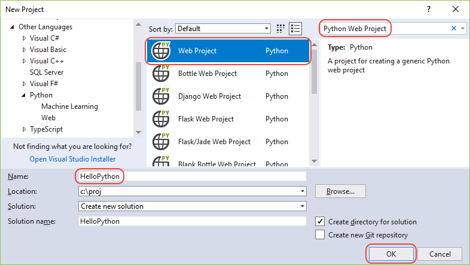
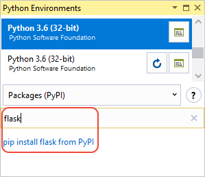
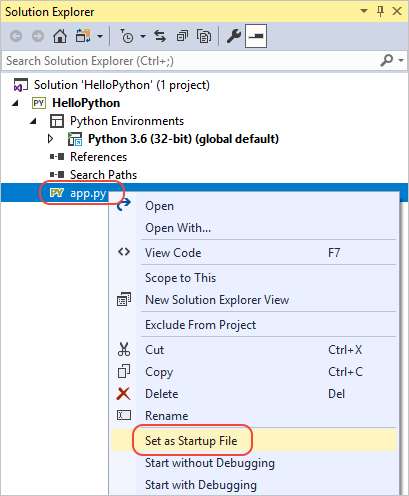

# Quickstart: Use Visual Studio to create your first Python web app

In this 5-10 minute introduction to Visual Studio as a Python IDE, you create a simple Python web application based on the Flask framework. You create the project through discrete steps that help you learn about Visual Studio's basic features.

If you haven't already installed Visual Studio, go to [Visual Studio downloads](https://aka.ms/vsdownload?utm_source=mscom&utm_campaign=msdocs) to install it for free. In the installer, make sure to select the **Python development** workload.

## Create the project

The following steps create an empty project that serves as a container for the application:

1. Open Visual Studio 2017.

1. From the top menu bar, choose **File > New > Project**.

1. In the **New Project** dialog box, enter "Python Web Project" in the search field on the upper right, choose **Web project** in the middle list, give the project a name like "HelloPython", then choose **OK**.

    

    If you don't see the Python project templates, cancel out of the **New Project** dialog box and from the top menu bar, choose **Tools > Get Tools and Features** to open the **Visual Studio Installer**. Choose the **Python development** workload, then choose **Modify**.

    

1. The new project opens in **Solution Explorer** in the right pane. The project is empty at this point because it contains no other files.

    

**Question: What's the advantage of creating a project in Visual Studio for a Python application?**

**Answer**: Python applications are typically defined using only folders and files, but this simple structure can become burdensome as applications become larger and perhaps involve auto-generated files, JavaScript for web applications, and so on. A Visual Studio project helps manage this complexity. The project (a *.pyproj* file) identifies all the source and content files associated with your project, contains build information for each file, maintains the information to integrate with source-control systems, and helps you organize your application into logical components.

**Question: What is the "solution" shown in Solution Explorer?**

**Answer**: A Visual Studio solution is a container that helps you manage for one or more related projects as a group, and stores configuration settings that aren't specific to a project. Projects in a solution can also reference one another, such that running one project (a Python app) automatically builds a second project (such as a C++ extension used in the Python app).

## Install the Flask library

Web apps in Python almost always use one of the many available Python libraries to handle low-level details like routing web requests and shaping responses. For this purpose, Visual Studio provides a variety of templates for web apps, one of which you use later in this Quickstart.

Here, you use the following steps to install the Flask library into the default "global environment" that Visual Studio uses for this project.

1. Expand the **Python Environments** node in the project to see the default environment for the project.

    

1. Right-click the environment and select **Install Python Package**. This command opens the **Python Environments** window on the **Packages** tab.

1. Enter "flask" in the search field and select **pip install flask from PyPI**. Accept any prompts for administrator privileges and observe the **Output** window in Visual Studio for progress. (A prompt for elevation happens when the packages folder for the global environment is located within a protected area like *C:\Program Files*.)

    

1. Once installed, the library appears in the environment in **Solution Explorer**, which means that you can make use of it in Python code.

    

> [!Note]
> Instead of installing libraries in the global environment, developers typically create a "virtual environment" in which to install libraries for a specific project. Visual Studio templates typically offer this option, as discussed in [Quickstart - Create a Python project using a template](../python/quickstart-02-python-in-visual-studio-project-from-template.md).

**Question: Where do I learn more about other available Python packages?**

**Answer**: Visit the [Python Package Index](https://pypi.python.org/pypi).

## Add a code file

You're now ready to add a bit of Python code to implement a minimal web app.

1. Right-click the project in **Solution Explorer** and select **Add > New Item**.

1. In the dialog that appears, select **Empty Python File**, name it *app.py*, and select **Add**. Visual Studio automatically opens the file in an editor window.

1. Copy the following code and paste it into *app.py*:

    ```python
    from flask import Flask

    # Create an instance of the Flask class that is the WSGI application.
    # The first argument is the name of the application module or package,
    # typically __name__ when using a single module.
    app = Flask(__name__)

    # Flask route decorators map / and /hello to the hello function.
    # To add other resources, create functions that generate the page contents
    # and add decorators to define the appropriate resource locators for them.

    @app.route('/')
    @app.route('/hello')
    def hello():
        # Render the page
        return "Hello Python!"

    if __name__ == '__main__':
        # Run the app server on localhost:4449
        app.run('localhost', 4449)
    ```

1. You may have noticed that the **Add > New Item** dialog box displays many other types of files you can add to a Python project, including a Python class, a Python package, a Python unit test, *web.config* files, and more. In general, these item templates, as they're called, are a great way to quickly create files with useful boilerplate code.

**Question: Where can I learn more about Flask?**

**Answer**: Refer to the Flask documentation, starting with the [Flask Quickstart](http://flask.pocoo.org/docs/0.12/quickstart/#quickstart).

## Run the application

1. Right-click *app.py* in **Solution Explorer** and select **Set as startup file**. This command identifies the code file to launch in Python when running the app.

    

1. Right-click the project in **Solution Explorer** and select **Properties**. Then select the **Debug** tab and set the **Port Number** property to `4449`. This step ensures that Visual Studio launches a browser with `localhost:4449` to match the `app.run` arguments in the code.

1. Select **Debug > Start Without Debugging** (**Ctrl**+**F5**), which saves changes to files and runs the app.

1. A command window appears with the message "* Running in https://localhost:4449/", and a browser window should open to `localhost:4449` where you see the message, "Hello, Python!" The GET request also appears in the command window with a status of 200.

    If a browser does not open automatically, start the browser of your choice and navigate to `localhost:4449`.

    If you see only the Python interactive shell in the command window, or if that window flashes on the screen briefly, ensure that you set *app.py* as the startup file in step 1 above.

1. Navigate to `localhost:4449/hello` to test that the decorator for the `/hello` resource also works. Again, the GET request appears in the command window with a status of 200. Feel free to try some other URL as well to see that they show 404 status codes in the command window.

1. Close the command window to stop the app, then close the browser window.

**Question: What's the difference between the Start Without Debugging command and Start Debugging?**

**Answer**: You use **Start Debugging** to run the app in the context of the [Visual Studio debugger](../python/debugging-python-in-visual-studio.md), allowing you to set breakpoints, examine variables, and step through your code line by line. Apps may run slower in the debugger because of the various hooks that make debugging possible. **Start Without Debugging**, in contrast, runs the app directly as if you ran it from the command line, with no debugging context, and also automatically launches a browser and navigates to the URL specified in the project properties' **Debug** tab.

## Next steps

Congratulations on running your first Python app from Visual Studio, in which you've learned a little about using Visual Studio as a Python IDE!

Because the steps you followed in this Quickstart are fairly generic, you've probably guessed that they can and should be automated. Such automation is the role of Visual Studio project templates. Select the button below for a demonstration that creates a web app similar to the one you created in this article, but with fewer steps.

> [!div class="nextstepaction"]
> [Quickstart - Create a Python project using a template](../python/quickstart-02-python-in-visual-studio-project-from-template.md)

To continue with a fuller tutorial on Python in Visual Studio, including using the interactive window, debugging, data visualization, and working with Git, select the button below.

> [!div class="nextstepaction"]
> [Tutorial: Get started with Python in Visual Studio](../python/tutorial-working-with-python-in-visual-studio-step-01-create-project.md)

To explore more that Visual Studio has to offer, select the links below.

- Learn about [Python web app templates in Visual Studio](../python/python-web-application-project-templates.md).
- Learn about [Python debugging](../python/debugging-python-in-visual-studio.md)
- Learn more about the [Visual Studio IDE](../ide/visual-studio-ide.md) in general.
