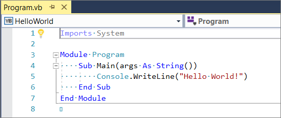
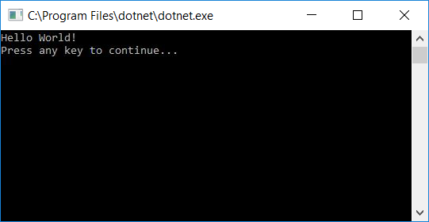

# Quickstart: Create a console app in Visual Studio with Visual Basic
In this 5-10 minute introduction to the Visual Studio integrated development environment (IDE), you'll create a simple Visual Basic application that runs on the console.

If you haven't already installed Visual Studio, go to the [Visual Studio Downloads](https://aka.ms/vsdownload?utm_source=mscom&utm_campaign=msdocs) page to install it for free.

## Create a project
First, you'll create a Visual Basic application project. The project type comes with all the template files you'll need, before you've even added anything!

1. Open Visual Studio 2017.

2. From the top menu bar, choose **File** > **New** > **Project...**.

3. In the **New Project** dialog box in the left pane, expand **Visual Basic**, and then choose **.NET Core**. In the middle pane, choose **Console App (.NET Core)**. Then name the file *HelloWorld*.

 

     If you don't see the **Console App (.NET Core)** project template, cancel out of the **New Project** dialog box and from the top menu bar, choose **Tools** > **Get Tools and Features...**. The Visual Studio Installer launches. Choose the **.NET Core cross-platform development** workload, and then choose **Modify**.  

       

## Create the application
After you select your Visual Basic project template and name your file, Visual Studio creates a simple "Hello World" application for you. It calls the [Console.WriteLine(System.String)](../../dotnet/api/system.console.writeline?view=netframework-4.7.1#System_Console_WriteLine_System_String_) method to display the literal string "Hello World!" in the console window.



If you click the **HelloWorld** button in the IDE, you can run the program in Debug mode.

  

When you do this, the console window is visible for only a moment before it closes. This happens because the `Main` method terminates after its single statement executes, and so the application ends.

### Add some code
Let's add some code to pause the application and then ask for user input.

1. Add the following code immediately after the call to the [Console.WriteLine(System.String)](../../dotnet/api/system.console.writeline?view=netframework-4.7.1#System_Console_WriteLine_System_String_) method:

   ```vb
   Console.Write("Press any key to continue...")
   Console.ReadKey(true)
   ```
  This pauses the program until you press a key.

2. On the menu bar, select **Build** > **Build Solution**.

 This compiles your program into an intermediate language (IL) that's converted into binary code by a just-in-time (JIT) compiler.

## Run the application
1. Click the **HelloWorld** button on the toolbar.

  

2. Press any key to close the console window.

   

Congratulations on completing this quickstart! We hope you learned a little bit about Visual Basic and the Visual Studio IDE. If you'd like to delve deeper, please continue with a tutorial in the **Tutorials** section of the table of contents.  

## See also   
* [Enhance the "Hello World" console app with Visual Basic in Visual Studio](https://docs.microsoft.com/en-us/dotnet/core/tutorials/vb-with-visual-studio#enhancing-the-hello-world-application)
* [Quickstart: Create a Windows Forms app in Visual Studio with Visual Basic](quickstart-visual-basic-winforms.md)
* [Learn more about Visual Basic IntelliSense](visual-basic-specific-intellisense.md)  
