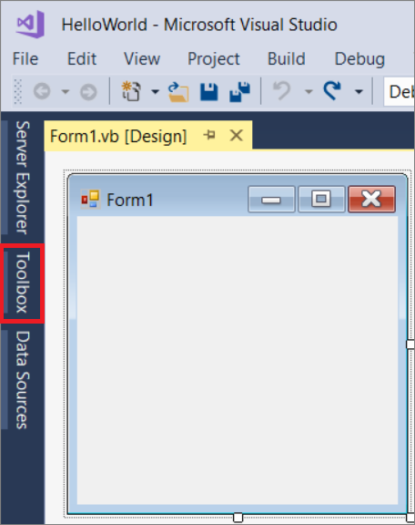

# Quickstart: Use Visual Studio to create your first Visual Basic app
In this 5-10 minute introduction to the Visual Studio integrated development environment (IDE), you'll create a simple Visual Basic application. If you haven't already installed Visual Studio, go to the [Visual Studio Downloads](https://aka.ms/vsdownload?utm_source=mscom&utm_campaign=msdocs) page to install it for free:

## Create a project
First, you'll create a Visual Basic application project. The project type comes with all the template files you'll need, before you've even added anything!  

1. Open Visual Studio 2017.  

2. From the top menu bar, choose **File** > **New** > **Project...**.  

3. In the **New Project** dialog box in the left pane, expand **Visual Basic**, and then choose **Windows Classic Desktop**. In the middle pane, choose **Windows Forms App (.NET Framework)**. Then, name the file `HelloWorld`.  

     If you don't see the **Windows Forms App (.NET Framework)** project template, cancel out of the **New Project** dialog box and from the top menu bar, choose **Tools** > **Get Tools and Features...**. The Visual Studio Installer launches. Choose the **.NET desktop development** workload, then choose **Modify**.  

       

## Create the application
We'll start our "Hello World! application by designing a form. A form is any interface in Windows. First, we'll use GUI controls to complete the form. Next, we'll examine the code behind the form. And then finally, we'll run the application.   

### Change the name of the form

1. In the **Properties** window, type `My VB App` in the **Text** field, and then press **Enter**.

     

2. Notice that the form name changes from "Form1" to "My VB App".


### Add a button to the form  
After you select your Visual Basic project template and name your file, Visual Studio opens a form for you. Let's add some controls to it.

1. Click **Toolbox**. It's on left side of the IDE.

       

> [!TIP]
> When you click **Toolbox**, the Toolbox window covers the form. It's easier to drag-and-drop controls from the Toolbox window onto your form if you dock the Toolbox window. To do so, click the title bar of the Toolbox window, and then on the menu bar, click **Window** > **Dock**.


2.  Click the **Button** control and then drag it onto the form where you want it.

(Alternatively, you can double-click the button control and it will appear in the upper-left corner of the form, and then you can drag it to where you want it.)

3. Type "Click here!" in the button control.


### Add a label to the form
Now that we've added a button control, which will create the action we want to happen, let's add a label control to send output text to.

1. Click the  label Lorem ipsum dolor sit amet, consectetur adipiscing elit. Sed fermentum purus eget augue sagittis pellentesque. Vestibulum ante ipsum primis in faucibus orci luctus et ultrices posuere cubilia Curae; Nullam feugiat efficitur sem a pharetra. Proin condimentum mi elit, id euismod tellus placerat a. Nulla scelerisque sem eu efficitur lobortis. Suspendisse potenti.

## View the code behind the form

 ```vb
 Private Sub Form1_load(sender As Object, e As EventArgs) Handles MyBase.Load
     MessageBox.Show("Hello World!")
 End Sub
 ```  


## Run the application
1. Click **Start** to run the application.  
2. Notice that the label control in your form says "Hello World!"

Congratulations on completing this quickstart! We hope you learned a little bit about Visual Basic and the Visual Studio IDE. If you'd like to delve deeper, please continue with a tutorial in the **Tutorials** section of the table of contents.  

## See also   
* [Getting Started with C# and Visual Basic using Visual Studio](getting-started-with-visual-csharp-and-visual-basic.md)
* [Visual Basic IntelliSense](visual-basic-specific-intellisense.md)  
