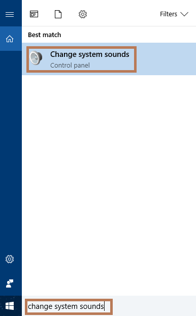
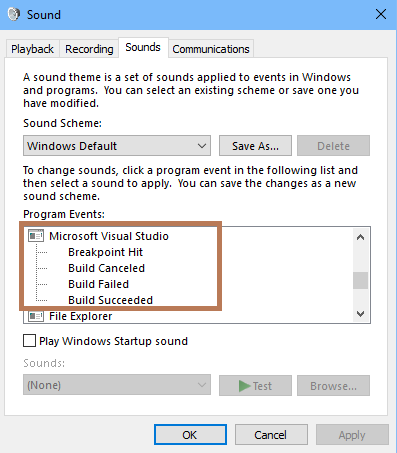

# Accessibility tips and tricks
> [!TIP]
> To learn more about recent accessibility updates, see the [Accessibility improvements in Visual Studio 2017 version 15.3](https://blogs.msdn.microsoft.com/visualstudio/2017/08/14/accessibility-improvements-in-visual-studio-2017-version-15-3/) blog post.

Visual Studio includes built-in accessibility features so you can easily work from the keyboard and use screen readers, or other assistive technologies and devices. The topic includes some suggestions for optimizing Visual Studio for accessibility as well as some useful shortcut key combinations. Use shortcut key combinations enable you to perform tasks in Visual Studio by using the keyboard, and sound cues in Windows to let you know when you have a breakpoint in your debugging process.

## Save your IDE settings  
 You can customize your IDE experience by saving your window layout, keyboard mapping scheme, and other preferences. For more information, see [Personalize the Visual Studio IDE](../../ide/personalizing-the-visual-studio-ide.md).  

## Access toolbars by using shortcut key combinations
The Visual Studio IDE has toolbars as do many tool windows. The following shortcut key combinations help you access them.

|Feature|Description|Key Combination|  
|-------------|-----------------|---------------------|  
|IDE toolbars|Select the first button on the Standard toolbar.|**ALT**, **CTRL** + **TAB**|  
|Tool window toolbars|Move focus to the toolbars in a tool window.     **NOTE:** This works for most tool windows, but only when the focus is in a tool window. Also, you must choose the SHIFT key before the ALT key. In some tool windows, such as Team Explorer, you must hold the SHIFT key for a moment before choosing the ALT key.|**SHIFT** + **ALT**|
|Toolbars|Go to the first item in the next toolbar (when a toolbar has focus).|**CTRL** + **TAB**|

### Other useful shortcut key combinations  
Some other useful shortcut key combinations include the following.

|Feature|Description|Key Combination|  
|-------------|-----------------|---------------------|  
|IDE|Switch High Contrast on and off.     **NOTE:** Standard Windows shortcut|**Left ALT + Left SHIFT + PRINT SCREEN**|  
|Dialog box|Select or clear the check box option in a dialog box.     **NOTE:** Standard Windows shortcut|**SPACEBAR**|  
|Context menus|Open a context (right-click) menu.     **NOTE:** Standard Windows shortcut|**SHIFT** + **F10**|
|Menus|Quickly access a menu item by using its accelerator keys. Choose the **ALT** key followed by the underlined letters in a menu to activate the command. For example, to view the Open Project dialog box in Visual Studio, you would choose **ALT** + **F** + **O** + **P**.     **NOTE:** Standard Windows shortcut|**ALT** + **[letter]**|
|Toolbox window|Move among Toolbox tabs.|**CTRL** + **UPARROW**   and   **CTRL** + **DOWNARROW**|  
|Toolbox window|Add a control from the Toolbox to a form or designer.|**ENTER**|  
|Keyboard, Environment, Options dialog box|Delete a key combination entered in the **Press shortcut keys** option.|**BACKSPACE**|  

> [!NOTE]
>  The dialog boxes and menu commands you see might differ from those described in Help depending on your active settings or edition.  

## Use the Sound applet to set build and breakpoint cues
You can use the Sound applet in Windows to assign a sound event to Visual Studio. Specifically, you can assign sounds to the following program events:

 * Breakpoint hit
 * Build canceled
 * Build failed
 * Build succeeded

Here's how.

1. In the **Search** box on a computer running Windows 10, type **Change system sounds**.

  

  (Alternatively, if you have Cortana enabled, say "Hey Cortana" and then say "Change system sounds.")

2. Double-click **Change system sounds**.

  

3. In the **Sound** dialog box, click the **Sounds** tab.   
 Then, in **Program Events**, scroll to **Microsoft Visual Studio**, and select the sounds that you want to apply to the events that you choose.

  

4. Click **OK**, and you're all set.

## See also  
* [Accessibility Features of Visual Studio](../../ide/reference/accessibility-features-of-visual-studio.md)
  * [How to: Customize Menus and Toolbars in Visual Studio](../../ide/how-to-customize-menus-and-toolbars-in-visual-studio.md)
* [Personalize the Visual Studio IDE](../../ide/personalizing-the-visual-studio-ide.md)
* [Microsoft Accessibility](https://www.microsoft.com/Accessibility)
