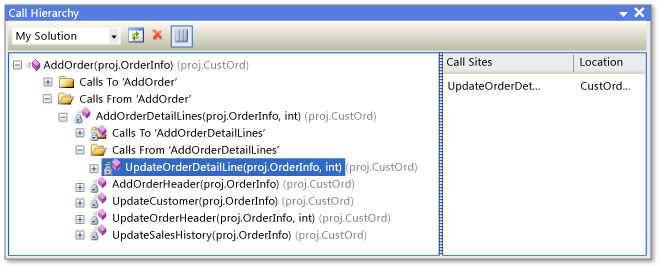

# View call hierarchy

By viewing the call hierarchy for your code, you can navigate all calls to and from a selected method, property, or constructor. This enables you to better understand how code flows, and to evaluate the effects of changes to code. You can examine several levels of code to view complex chains of method calls and additional entry points to the code. This enables you to explore all possible execution paths.

In Visual Studio, you can view a call hierarchy at design time. This means you don't have to set a breakpoint and start the debugger to view the run time call stack.

## Use the Call Hierarchy window

To display the **Call Hierarchy** window, right-click the name of a method, property, or constructor call, and then click **View Call Hierarchy**.

The member name appears in a tree view pane in the **Call Hierarchy** window. If you expand the member node, **Calls To** *member name* and **Calls From** *member name* subnodes appear. The following illustration shows these nodes in the **Call Hierarchy** window.

- If you expand the **Calls To** node, all members that call the selected member are displayed.

- If you expand the **Calls From** node, all members that are called by the selected member are displayed.

You can then expand each of these subnode members into **Calls To** and **Calls From** nodes. This enables you to navigate into the stack of callers, as shown in the following illustration.

For members that are defined as either virtual or abstract, an **Overrides method name** node appears. For interface members, an **Implements method name** node appears. These expandable nodes appear at the same level as the **Calls To** and **Calls From** nodes.

The **Search Scope** box on the toolbar contains choices for **My Solution**, **Current Project**, and **Current Document**.

When you select a child member in the **Call Hierarchy** tree view pane:

- The **Call Hierarchy** details pane displays all lines of code in which that child member is called from the parent member.

- The **Code Definition Window**, if open, displays the code for the selected member (C++ only). For more information about this window, see [Viewing the Structure of Code](../../ide/viewing-the-structure-of-code.md).

> [!NOTE]
> The Call Hierarchy feature does not find method group references, which includes places where a method is added as an event handler or is assigned to a delegate. To find all references to a method, you can use the **Find All References** command.

### Shortcut menu items

The following table describes several shortcut menu options that are available when you right-click a node in the tree view pane.

|Context Menu Item|Description|
|-----------------------|-----------------|
|**Add As New Root**|Adds the selected node to the tree view pane as a new root node. This enables you to focus your attention on a specific subtree.|
|**Remove Root**|Removes the selected root node from the tree view pane. This option is available only from a root node.   You can also use the **Remove Root** toolbar button to remove the selected root node.|
|**Go To Definition**|Runs the Go To Definition command on the selected node. This navigates to the original definition for a member call or variable definition.   To run the Go To Definition command, you can also double-click the selected node or press F12 on the selected node.|
|**Find All References**|Runs the Find All References command on the selected node. This finds all the lines of code in your project that reference a class or member.   You can also use SHIFT+F12 to run the Find All References command on the selected node.|
|**Copy**|Copies the contents of the selected node (but not its subnodes).|
|**Refresh**|Collapses the selected node so that re-expanding it displays current information.|