# Generate a constructor in Visual Studio

This code generation applies to:

- C#

- Visual Basic

**What:** Lets you immediately generate the code for a new constructor on a class.

**When:** You introduce a new constructor and want to properly declare it automatically, or you modify an existing constructor.

**Why:** You could declare the constructor before using it, however this feature will generate it, with the proper parameters, automatically. Furthermore, modifying an existing constructor requires updating all the callsites unless you use this feature to update them automatically.

**How:** There are several ways to generate a constructor:

   - [Generate constructor and pick members](#pick)
   - [Generate constructor from selected fields](#selection)
   - [Generate constructor from new usage](#usage)
   - [Add parameter to existing constructor](#addparameter)
   - [Create and initialize field/property from a constructor parameter](#create)

##  Generate constructor and pick members (C# only)

1. Place your cursor in any empty line in a class:

   

1. Next, do one of the following:

   - **Keyboard**
      - Press **Ctrl**+**.** to trigger the **Quick Actions and Refactorings** menu.
   - **Mouse**
      - Right-click and select the **Quick Actions and Refactorings** menu.
      - Click the  icon which appears in the left margin if the text cursor is already on the empty line in the class.

   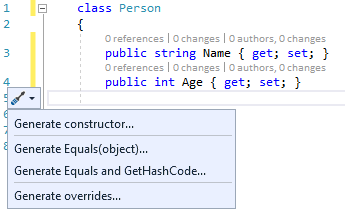

1. Select **Generate constructor** from the drop-down menu.

   The **Pick members** dialog box opens.

1. Pick the members you want to include as constructor parameters. You can order them using the up and down arrows. Choose **OK**.

   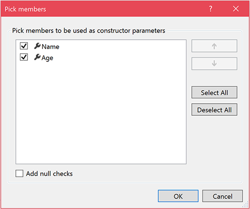

   > [!TIP]
   > You can check the **Add null checks** checkbox to automatically generate null checks for your constructor parameters.

   The constructor is created with the specified parameters.

   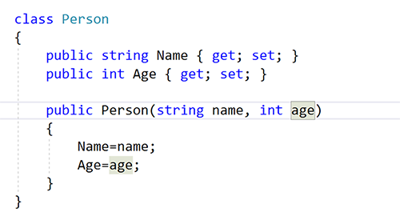

##  Generate constructor from selected fields (C# only)

1. Highlight the members you wish to have in your generated constructor:

   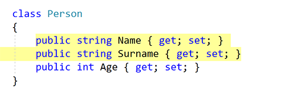

1. Next, do one of the following:

   - **Keyboard**
      - Press **Ctrl**+**.** to trigger the **Quick Actions and Refactorings** menu.
   - **Mouse**
      - Right-click and select the **Quick Actions and Refactorings** menu.
      - Click the  icon which appears in the left margin if the text cursor is already on the line with the selection.

      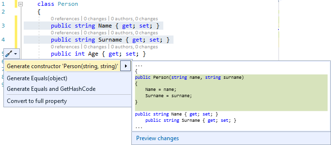

1. Select **Generate constructor 'TypeName(...)'** from the drop-down menu.

   The constructor is created with the selected parameters.

   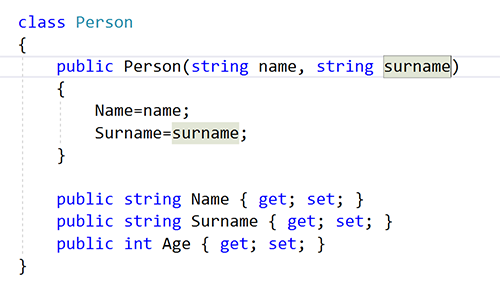

##  Generate constructor from new usage (C# and Visual Basic)

1. Place your cursor on the line where there is a red squiggle. The red squiggle indicates a call to a constructor that doesn't yet exist.

   - C#:

       

   - Visual Basic:

       

2. Next, do one of the following:

   - **Keyboard**
      - Press **Ctrl**+**.** to trigger the **Quick Actions and Refactorings** menu.
   - **Mouse**
      - Right-click and select the **Quick Actions and Refactorings** menu.
      - Hover over the red squiggle and click the  icon which appears.
      - Click the  icon which appears in the left margin if the text cursor is already on the line with the red squiggle.

      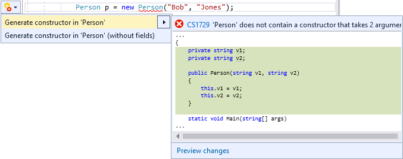

3. Select **Generate constructor in '*TypeName*'** from the drop-down menu.

   > [!TIP]
   > Use the **Preview changes** link at the bottom of the preview window [to see all of the changes](../../ide/preview-changes.md) that will be made before making your selection.

   The constructor is created, with any parameters inferred from its usage.

   - C#:

       

   - Visual Basic:

       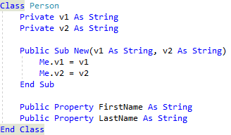

##  Add parameter to existing constructor (C# only)

1. Add a parameter to an existing constructor call.

2. Place your cursor on the line where there is a red squiggle indicating you've used a constructor that doesn't yet exist.

    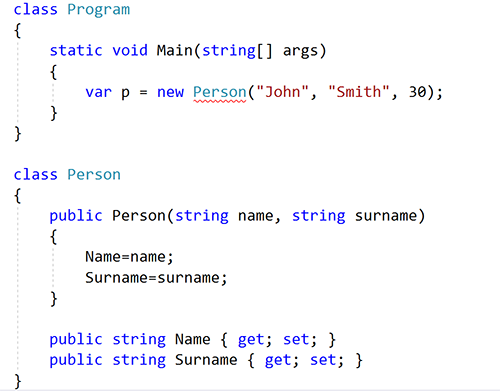

3. Next, do one of the following:

   - **Keyboard**
      - Press **Ctrl**+**.** to trigger the **Quick Actions and Refactorings** menu.
   - **Mouse**
      - Right-click and select the **Quick Actions and Refactorings** menu.
      - Hover over the red squiggle and click the  icon which appears.
      - Click the  icon which appears in the left margin if the text cursor is already on the line with the red squiggle.

      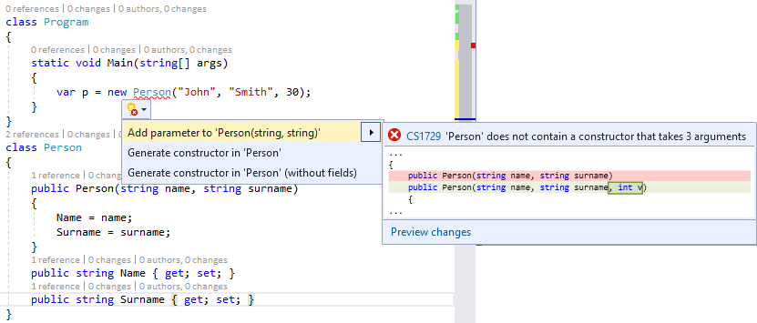

4. Select **Add parameter to 'TypeName(...)'** from the drop-down menu.

   The parameter is added to the constructor, with its type inferred from its usage.

   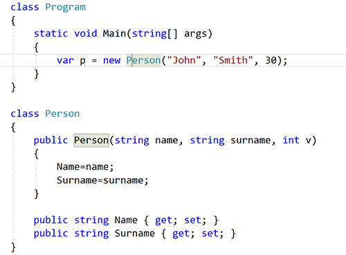

You can also add a parameter to an existing method. For more information, see [Add parameter to a method](add-parameter.md).

##  Create and initialize a field or property from a constructor parameter (C# only)

1. Find an existing constructor, and add a parameter:

   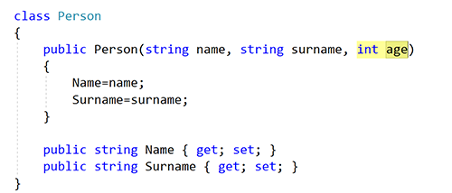

1. Place your cursor inside the newly added parameter.

1. Next, do one of the following:

   - **Keyboard**
      - Press **Ctrl**+**.** to trigger the **Quick Actions and Refactorings** menu.
   - **Mouse**
      - Right-click and select the **Quick Actions and Refactorings** menu.
      - Click the  icon which appears in the left margin if the text cursor is already on the line with the added parameter.

   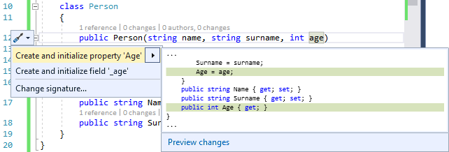

1. Select **Create and initialize property** or **Create and initialize field** from the drop-down menu.

   The field or property is declared and automatically named to match your types. A line of code is also added to initialize the field or property in the constructor body.

   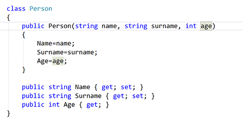

## See also

- [Code Generation](../code-generation-in-visual-studio.md)
- [Preview Changes](../../ide/preview-changes.md)