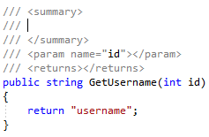
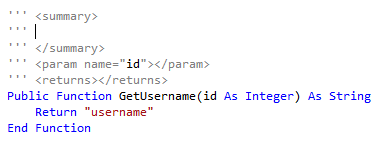

# How to: Insert XML comments for documentation generation

The **Insert Comment** command applies to:

- C#

- Visual Basic

Visual Studio can help you document code elements such as classes and methods, by automatically generating the standard XML comment structure. XML comments can be processed into reference documentation by tools like [Sandcastle](https://www.microsoft.com/download/details.aspx?id=10526). You can also manually craft the comment block yourself, however this will take additional time and have lower accuracy.

## To insert XML comments for a code element

1. Place your text cursor above the element you want to document, for example, a method.

1. Do one of the following:

   - Type `///` in C#, or `'''` in Visual Basic

   - From the **Edit** menu, choose **IntelliSense** > **Insert Comment**

   - From the right-click or context menu on or just above the code element, choose **Snippet** > **Insert Comment**

   The XML template is immediately generated above the code element. For example, when commenting a method, it generates the **\<summary\>** element, a **\<param\>** element for each parameter, and a **\<returns\>** element to document the return value.

   

   

1. Enter descriptions for each XML element to fully document the code element.

   

## See also

[Code Generation](../code-generation-in-visual-studio.md)  
[XML Documentation Comments (C# Programming Guide)](/dotnet/csharp/programming-guide/xmldoc/xml-documentation-comments)
