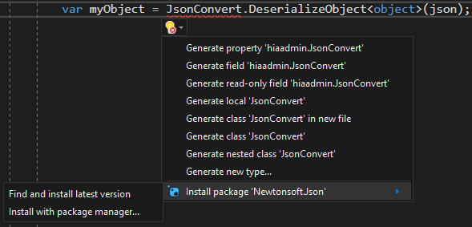

# Options, Text Editor, C#, Advanced

Use the **Advanced** options page to modify the settings for editor formatting, code refactoring, and XML documentation comments for C#. To access this options page, choose **Tools** > **Options**, and then choose **Text Editor** > **C#** > **Advanced**.

> [!NOTE]
> Not all options may be listed here.

## Analysis

- Enable full solution analysis

   Enables code analysis on all files in the solution, not just open code files. For more information, see [Full solution analysis](../../code-quality/how-to-enable-and-disable-full-solution-analysis-for-managed-code.md).

## Using Directives

- Place 'System' directives first when sorting usings

   When selected, the **Remove and Sort Usings** command in the right-click menu sorts the `using` directives and places the 'System' namespaces at the top of the list.

   Before sorting:

   ```csharp
   using AutoMapper;
   using FluentValidation;
   using System.Collections.Generic;
   using System.Linq;
   using Newtonsoft.Json;
   using System;
   ```
   
   After sorting:

   ```csharp
   using System;
   using System.Collections.Generic;
   using System.Linq;
   using AutoMapper;
   using FluentValidation;
   using Newtonsoft.Json;
   ```
   
- Separate using directive groups

   When selected, the **Remove and Sort Usings** command in the right-click menu separates `using` directives by inserting an empty line between groups of directives that have the same root namespace.

   Before sorting:

   ```csharp
   using AutoMapper;
   using FluentValidation;
   using System.Collections.Generic;
   using System.Linq;
   using Newtonsoft.Json;
   using System;
   ```
   
   After sorting:
   
   ```csharp
   using AutoMapper;
   
   using FluentValidation;
   
   using Newtonsoft.Json;
   
   using System;
   using System.Collections.Generic;
   using System.Linq;
   ```
   
- Suggest usings for types in reference assemblies 
- Suggest usings for types in NuGet packages 

   When these options are selected, a [Quick Action](../quick-actions.md) is available to install a NuGet package and add a `using` directive for unreferenced types.

   
  
## Highlighting

- Highlight references to symbol under cursor

   When the cursor is positioned inside a symbol, or when you click a symbol, all the instances of that symbol in the code file are highlighted.

## Outlining

- Enter outlining mode when files open

   When selected, automatically outlines the code file, which creates collapsible blocks of code. The first time a file is opened, #regions blocks and inactive code blocks collapse.

- Show procedure line separators

   The text editor indicates visual scope of procedures. A line is drawn in the *.vb* source files of your project at locations listed in the following table:

   |Location in .vb Source File|Example of Line Location|
   |---------------------------------|------------------------------|
   |After the close of a block declaration construct|-   At the end of a class, structure, module, interface, or enum<br />-   After a property, function, or sub<br />-   Not between the get and set clauses in a property|
   |After a set of single line constructs|-   After the import statements, before a type definition in a class file<br />-   After variables declared in a class, before any procedures|
   |After single line declarations (non-block level declarations)|-   Following import statements, inherits statements, variable declarations, event declarations, delegate declarations, and DLL declare statements|

## Block Structure Guides

Select these check boxes to display dotted vertical lines between the curly brackets (**{}**) in your code. You can then easily see individual blocks of code for your declaration level and code level constructs.

## Editor Help

- Generate XML documentation comments for ///

   When selected, inserts the XML elements for XML documentation comments after you type the `///` comment introduction. For more information about XML documentation, see [XML Documentation Comments (C# Programming Guide)](/dotnet/csharp/programming-guide/xmldoc/xml-documentation-comments).

## See also

- [How to: Insert XML comments for documentation generation](../../ide/reference/generate-xml-documentation-comments.md)
- [XML Documentation Comments (C# Programming Guide)](/dotnet/csharp/programming-guide/xmldoc/xml-documentation-comments)
- [Document your code with XML comments (C# Guide)](/dotnet/csharp/codedoc)
- [Set language-specific editor options](../../ide/reference/setting-language-specific-editor-options.md)
- [C# IntelliSense](../../ide/visual-csharp-intellisense.md)
