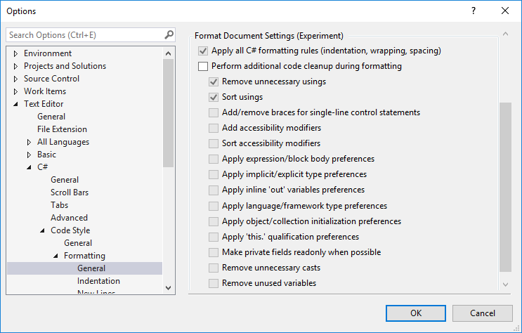

# Options, Text Editor, C#, Code Style

Use the **Formatting** options page to set options for formatting code in the code editor. To access this options page, choose **Tools** > **Options**. In the **Options** dialog box, choose **Text Editor** > **C#** > **Code Style** > **Formatting**.

## General page

### General settings

These settings affect *when* the code editor applies formatting options to code.

|Label|Description|
|-----------|-----------------|
|**Automatically format when typing**|When deselected, the **format statement on ;** and **format block  on }** options are disabled.|
|**Automatically format statement on ;**|When selected, formats statements at completion according to the formatting options selected for the editor.|
|**Automatically format block on }**|When selected, formats code blocks according to the formatting options selected for the editor as soon as you complete the code block.|
|**Automatically format on return**|When selected, formats text when **Enter** is pressed, to fit the formatting options selected for the editor.|
|**Automatically format on paste**|When selected, formats text that is pasted into the editor to fit the formatting options selected for the editor.|

### Format Document settings

These settings configure the **Format Document** command to perform additional code cleanup on a file. For more information about how these settings are applied, see [Format Document command](../code-styles-and-quick-actions.md#format-document-command).

|Label|Description|Corresponding EditorConfig and Tools > Options rules|
|-----------|-----------------|-----------------|-----------------|
|**Apply all C# formatting rules (indentation, wrapping, spacing)**|The **Format Document** command always fixes formatting issues. This setting can't be changed.| [Core EditorConfig options](../../ide/create-portable-custom-editor-options.md) [.NET EditorConfig formatting options](../../ide/editorconfig-code-style-settings-reference.md#formatting-conventions)  **Tools** > **Options** > **Text Editor** > **C#** > **Formatting** > [**Indentation** or **New Lines** or **Spacing** or **Wrapping**]|
|**Perform addition code cleanup during formatting**|When selected, applies fixes for the rules specified below on the **Edit.FormatDocument** command.| N/A |
|**Remove unnecessary usings**|When selected, removes unnecessary `using` directives when **Edit.FormatDocument** is triggered.| N/A |
|**Sort usings**|When selected, sorts `using` directives when **Edit.FormatDocument** is triggered.| dotnet_sort_system_directives_first  **Tools** > **Options** > **Text Editor** > **C#** > **Advanced** > **Place 'System' directives first when sorting usings** |
|**Add/remove braces for single-line control statements**|When selected, adds or removes braces from single-line control statements when **Edit.FormatDocument** is triggered.| csharp_prefer_braces  **Tools** > **Options** > **Text Editor** > **C#** > **Code Style** > **Code block preferences** > **Prefer braces** |
|**Add accessibility modifiers**|When selected, adds missing accessibility modifiers when **Edit.FormatDocument** is triggered.| dotnet_style_require_accessibility_modifiers |
|**Sort accessibility modifiers**|When selected, sorts accessibility modifiers when **Edit.FormatDocument** is triggered.| csharp_preferred_modifier_order visual_basic_preferred_modifier_order |
|**Apply expression/block body preferences**|When selected, converts expression-bodied members to block bodies, or vice versa, when **Edit.FormatDocument** is triggered.| [Expression-bodied member EditorConfig options](../../ide/editorconfig-code-style-settings-reference.md#expression_bodied_members)  **Tools** > **Options** > **Text Editor** > **C#** > **Code Style** > **Expression preferences** > **Use expression body for methods, constructors, etc.** |
|**Apply implicit/explicit type preferences**|When selected, converts `var` to the explicit type, or vice versa, when **Edit.FormatDocument** is triggered.| [Explicit type EditorConfig options](../../ide/editorconfig-code-style-settings-reference.md#implicit-and-explicit-types)  **Tools** > **Options** > **Text Editor** > **C#** > **Code Style** > **'var' preferences** |
|**Apply inline 'out' variables preferences**|When selected, inlines `out` variables where possible when **Edit.FormatDocument** is triggered.| csharp_style_inlined_variable_declaration  **Tools** > **Options** > **Text Editor** > **C#** > **Code Style** > **Variable preferences** > **Prefer inlined variable declaration** |
|**Apply language/framework type preferences**|When selected, converts language types to framework types, or vice versa, when **Edit.FormatDocument** is triggered.| dotnet_style_predefined_type_for_locals_parameters_members dotnet_style_predefined_type_for_member_access  **Tools** > **Options** > **Text Editor** > **C#** > **Code Style** > **predefined type preferences** |
|**Apply object/collection initialization preferences**|When selected, uses object and collection initializers where possible when **Edit.FormatDocument** is triggered.| dotnet_style_object_initializer dotnet_style_collection_initializer  **Tools** > **Options** > **Text Editor** > **C#** > **Code Style** > **Expression preferences** > **Prefer object initializer** or **Prefer collection initializer** |
|**Apply 'this.' qualification preferences**|When selected, applies `this.` preferences when **Edit.FormatDocument** is triggered.| [this. qualification EditorConfig options](../../ide/editorconfig-code-style-settings-reference.md#this_and_me)  **Tools** > **Options** > **Text Editor** > **C#** > **Code Style** > **'this.' preferences** |
|**Make private fields readonly when possible**|When selected, makes private fields `readonly` where possible when **Edit.FormatDocument** is triggered.| dotnet_style_readonly_field  **Tools** > **Options** > **Text Editor** > **C#** > **Code Style** > **Field preferences** > **Prefer readonly** |
|**Remove unnecessary casts**|When selected, removes unnecessary casts where possible when **Edit.FormatDocument** is triggered.| N/A |
|**Remove unused variables**|When selected, removes variables that are unused when **Edit.FormatDocument** is triggered.| N/A |

## Preview windows

The **Indentation**, **New Lines**, **Spacing**, and **Wrapping** subpages each display a preview window at the bottom. The preview window shows the effect of each option. To use the preview window, select a formatting option. The preview window shows an example of the selected option. When you change a setting by selecting a radio button or check box, the preview window updates to show the effect of the new setting.

## Indentation remarks

Indentation options on the **Tabs** pages for each language only determine where the code editor places the cursor when you press **Enter** at the end of a line. Indentation options under **Formatting** apply when code is formatted automatically, for example, when you paste code into the file while **Automatically format on paste** is selected, and when the block being formatted is typed manually.

## See also

- [General, Environment, Options dialog box](../../ide/reference/general-environment-options-dialog-box.md)