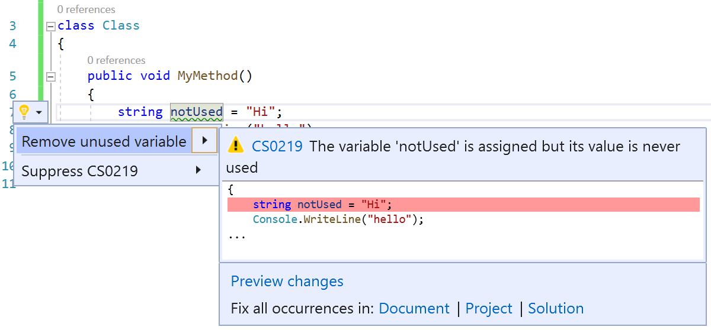
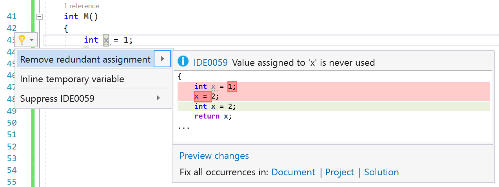

# Unused value assignments, variables, and parameters

This refactoring applies to:

- C#
- Visual Basic

**What:** Fades out unused parameters and generates a warning for unused expression values. The compiler also does a flow analysis to find any unused value assignments. Unused value assingments fade out and have a codefix to remove the redundant assignment.

**When:** You have value assignments, parameters, or expression values that are never used.

**Why:** Sometimes it's difficult to tell if a value assignment, variable, or parameter is no longer being used. By fading out these values or giving a warning, you get a visual cue of what code you can delete.

## Unused expression values and parameters diagnostic

1. Have any value assignment, variable, or parameter that isn't used.
2. The unused value assignment or parameter appears faded out. The unused expression value receives a warning.

  
  
  

## See also

- [Refactoring](../refactoring-in-visual-studio.md)
- [Tips for .NET Developers](../../ide/visual-studio-2017-for-dotnet-developers.md)
