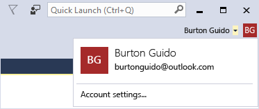

# Sign in to Visual Studio

You can personalize and optimize your development experience in Visual Studio if you set your Personalization account by signing in to the IDE.

## Why should I sign in to Visual Studio?

When you sign in, you enrich your Visual Studio experience. For example, after you sign in, you can synchronize your settings across devices, extend a trial, and automatically connect to an Azure service, to name a few.

Here's a full list of what you can expect and what you can do after you sign in:

- **Access to the Visual Studio Dev Essentials program** - This program includes free software offerings, training, support, and more. See [Visual Studio Dev Essentials](http://aka.ms/vsdevhelp) for more information.

- **Synchronize your Visual Studio settings** - Settings that you customize, such as key bindings, window layout, and color theme, apply immediately when you sign in to Visual Studio on any device. See [Synchronized settings in Visual Studio](../ide/synchronized-settings-in-visual-studio.md).

- **Unlock the Visual Studio Community edition** - If your Community edition installation prompts you for a license, sign in to the IDE to unblock yourself.

- **Extend the Visual Studio trial period** - You can use Visual Studio Professional or Visual Studio Enterprise for an additional 90 days, instead of being limited to the trial period of 30 days.

- **Unlock Visual Studio if you use an account that's associated with an MSDN or Visual Studio Team Services subscription**. See [How to unlock Visual Studio](../ide/how-to-unlock-visual-studio.md).

- **Automatically connect to services such as Azure and Visual Studio Team Services** in the IDE without prompting again for credentials for the same account.

## How to sign in to Visual Studio

When you start Visual studio for the first time, you're asked to sign in and provide some basic registration information. You should choose a Microsoft account or a work or school account that best represents you. If you don't have any of these accounts, you can create a Microsoft account for free. See [How do I sign up for a Microsoft account?](http://windows.microsoft.com/windows-live/sign-up-create-account-how)

Next, choose the UI settings and color theme that you want to use in Visual Studio. Visual Studio remembers these settings and synchronizes them across all Visual Studio environments you have signed in to. For a list of the settings that are synchronized, see [Synchronized settings](../ide/synchronized-settings-in-visual-studio.md). You can change the settings later if you open the **Tools** > **Options** menu in Visual Studio.

After you provide the settings, Visual Studio starts, and you're signed in and ready to get started. To verify whether you're signed in, look for your name in the upper-right corner of the Visual Studio environment.

Unless you sign out, you're automatically signed in to Visual Studio whenever you start it, and any changes to synchronized settings are automatically applied. To sign out, choose the down arrow next to your profile name in the upper-right corner of the Visual Studio environment, choose the **Account settings** command, and then choose the **Sign out** link. To sign in again, choose the **Sign in** command in the upper-right corner of the Visual Studio environment.

## To change your profile information

1. Go to **File** > **Account Settings** and choose the **Manage Visual Studio profile** link.

1. In the browser window, choose **Edit profile** and change the settings that you want.

1. When you're done, choose **Save changes**.

## Troubleshooting

If you encounter any problems while signing in, please see the [Accounts support](https://visualstudio.microsoft.com/subscriptions/support/) page to get help.

## See also

* [How to Unlock Visual Studio](../ide/how-to-unlock-visual-studio.md)
* [Visual Studio IDE Overview](../ide/visual-studio-ide.md)
