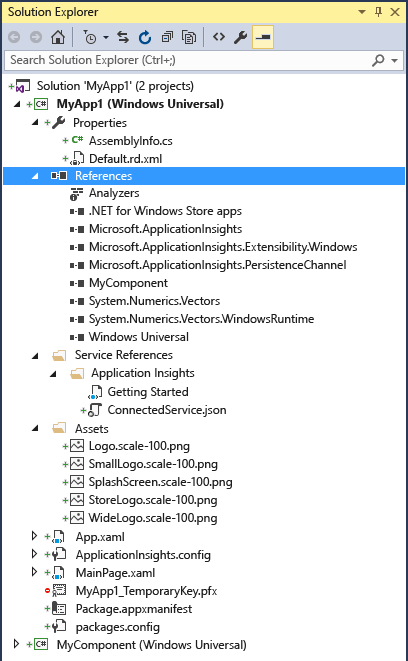

# Solutions and projects in Visual Studio

## Projects

When you create an app, website, plug-in, etc. in Visual Studio, you start with a *project*. In a logical sense, a project contains all the source code files, icons, images, data files, etc. that are compiled into an executable, library, or website. A project also contains compiler settings and other configuration files that might be needed by various services or components that your program communicates with.

> [!NOTE]
> You don't have to use solutions or projects in Visual Studio to edit, build and debug code. You can simply open the folder that contains your source files in Visual Studio and start editing. For more information, see [Develop code in Visual Studio without projects or solutions](../ide/develop-code-in-visual-studio-without-projects-or-solutions.md).

A project is defined in an XML file with an extension such as *.vbproj*, *.csproj*, or *.vcxproj*. This file contains a virtual folder hierarchy, and paths to all the items in the project. It also contains the build settings.

> [!TIP]
> To look at the contents of a project file in Visual Studio, first unload the project by selecting the project name in **Solution Explorer** and choosing **Unload Project** from the context or right-click menu. Then, open the context menu again and choose **Edit \<projectname\>**.

In Visual Studio, the project file is used by **Solution Explorer** to display the project contents and settings. When you compile your project, the MSBuild engine consumes the project file to create the executable. You can also customize projects to produce other kinds of output.

## Solutions

A project is contained within a *solution*. A solution contains one or more related projects, along with build information, Visual Studio window settings, and any miscellaneous files that aren't associated with a particular project. A solution is described by a text file (extension *.sln*) with its own unique format; it is not intended to be edited by hand.

Visual Studio uses two file types (*.sln* and *.suo*) to store settings for solutions:

|Extension|Name|Description|
|---------------|----------|-----------------|
|.sln|Visual Studio Solution|Organizes projects, project items, and solution items in the solution.|
|.suo|Solution User Options|Stores user-level settings and customizations, such as breakpoints.|

## Create new projects

The easiest way to create a new project is to start from a project template for a particular type of application or website. A project template consists of a basic set of pre-generated code files, config files, assets, and settings. These templates are what you see in the **New Project** or **New Web Site** dialog box when you choose **File** > **New** > **Project** or **File** > **New** > **Web Site**. For more information, see [Create solutions and projects](../ide/creating-solutions-and-projects.md).

You can also create custom project and item templates. For more information, see [Create project and item templates](../ide/creating-project-and-item-templates.md).

## Manage projects in Solution Explorer

After you create a new project, you can use **Solution Explorer** to view and manage the project and solution, and their associated items. The following illustration shows **Solution Explorer** with a C# solution that contains two projects:

## See also

- [Visual Studio IDE](../ide/visual-studio-ide.md)