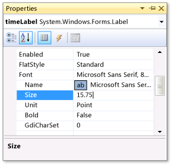
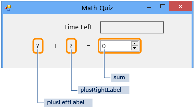
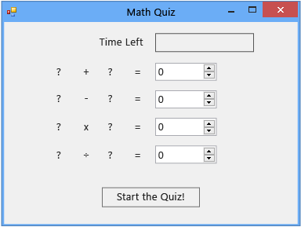

# Step 1: Create a Project and Add Labels to Your Form
As the first steps in developing this quiz, you create the project, and you add labels, a button, and other controls to a form. You also set properties for each control that you add. The project will contain the form, the controls, and (later in the tutorial) code. The button starts the quiz, the labels show the quiz problems, and the other controls show the quiz answers and the time that remains to finish the quiz.  

> [!NOTE]
>  This topic is part of a tutorial series about basic coding concepts. For an overview of the tutorial, see [Tutorial 2: Create a Timed Math Quiz](../ide/tutorial-2-create-a-timed-math-quiz.md).  

### To create a project and and set properties for a form  

1.  On the menu bar, choose **File**, **New**, **Project**.  

2.  In the **Installed Templates** list, choose either **C#** or **Visual Basic**.  

3.  In the list of templates, choose the **Windows Forms Application** template, name it **Math Quiz**, and then choose the **OK** button.  

     A form that's named **Form1.cs** or **Form1.vb** appears, depending on the programming language that you chose.  

4.  Choose the form, and then change its **Text** property to **Math Quiz**.  

     The **Properties** window contains properties for the form.  

5.  Change the size of the form to 500 pixels wide by 400 pixels tall.  

     You can resize the form by dragging its edges until the correct size appears in the lower-left corner of the integrated development environment (IDE). As an alternative, you can change the values of the **Size** property.  

6.  Change the value of the **FormBorderStyle** property to **Fixed3D**, and set the **MaximizeBox** property to **False**.  

     These values prevent quiz takers from resizing the form.  

### To create the Time Remaining box  

1.  Add a **Label** control from the Toolbox, and then set the value of its **(Name)** property to `timeLabel`.  

     This label will become a box in the upper-right corner that shows the number of seconds that remain in the quiz.  

2.  Change the **AutoSize** property to **False** so that you can resize the box.  

3.  Change the **BorderStyle** property to **FixedSingle** to draw a line around the box.  

4.  Set the **Size** property to **200, 30**.  

5.  Move the label to the upper-right corner of the form, where blue spacer lines will appear.  

     These lines help you align controls on the form.  

6.  In the **Properties** window, choose the **Text** property, and then choose the Backspace key to clear its value.  

7.  Choose the plus sign (+) next to the **Font** property, and then change the value of the **Size** property to **15.75**.  

     You can change several font properties, as the following picture shows.  

       
Properties window showing font size  

8.  Add another **Label** control from the Toolbox, and then set its font size to **15.75**.  

9. Set the **Text** property to **Time Left**.  

10. Move the label so that it lines up just to the left of the **timeLabel** label.  

### To add controls for the addition problems  

1.  Add a **Label** control from the Toolbox, and then set its **Text** property to **?** (question mark).  

2.  Set the **AutoSize** property to **False**.  

3.  Set the **Size** property to **60, 50**.  

4.  Set the font size to **18**.  

5.  Set the **TextAlign** property to **MiddleCenter**.  

6.  Set the **Location** property to **50, 75** to position the control on the form.  

7.  Set the **(Name)** property to **plusLeftLabel**.  

8.  Choose the **plusLeftLabel** label, and then choose either the Ctrl+C keys or **Copy** on the **Edit** menu.  

9. Paste the label three times by choosing either the Ctrl+V keys or **Paste** on the **Edit** menu.  

10. Arrange the three new labels so that they are in a row to the right of the **plusLeftLabel** label.  

     You can use the spacer lines to space them out and line them up.  

11. Set the value of the second label's **Text** property to **+** (plus sign).  

12. Set the value of the third label's **(Name)** property to **plusRightLabel**.  

13. Set the value of the fourth label's **Text** property to **=** (equal sign).  

14. Add a **NumericUpDown** control from the Toolbox, set its font size to **18**, and set its width to **100**.  

     You'll learn more about this kind of control later.  

15. Line up the **NumericUpDown** control with the label controls for the addition problem.  

16. Change the value of the **(Name)** property for the **NumericUpDown** control to **sum**.  

     You've created the first row, as the following picture shows.  

       
First row of math quiz  

### To add controls for the subtraction, multiplication, and division problems  

1.  Copy all five controls for the addition problem (the four Label controls and the NumericUpDown control), and then paste them.  

     The form contains five new controls, which are still selected.  

2.  Move all of the controls into place so that they line up below the addition controls.  

     You can use the spacer lines to give enough distance between the two rows.  

3.  Change the value of the **Text** property for the second label to **-** (minus sign).  

4.  Name the first question-mark label **minusLeftLabel**.  

5.  Name the second question-mark label **minusRightLabel**.  

6.  Name the **NumericUpDown** control **difference**.  

7.  Paste the five controls two more times.  

8.  For the third row, name the first label **timesLeftLabel**, change the second label's **Text** property to **×** (multiplication sign), name the third label **timesRightLabel**, and name the NumericUpDown control **product**.  

9. For the fourth row, name the first label **dividedLeftLabel**, change the second label's **Text** property to **÷** (division sign), name the third label **dividedRightLabel**, and name the NumericUpDown control **quotient**.  

    > [!NOTE]
    >  You can copy the multiplication sign × and the division sign ÷ from this tutorial and paste them onto the form.  

### To add a start button and set the tab-index order  

1.  Add a **Button** control from the Toolbox, and then set its **(Name)** property to **startButton**.  

2.  Set the **Text** property to **Start the quiz**.  

3.  Set the font size to **14**.  

4.  Set the **AutoSize** property to **True**, which causes the button to automatically resize to fit the text.  

5.  Center the button near the bottom of the form.  

6.  Set the value of the **TabIndex** property for the **startButton** control to **1**.  

    > [!NOTE]
    >  The **TabIndex** property sets the order of the controls when the quiz taker chooses the Tab key. To see how it works, open any dialog box (for example, on the menu bar, choose **File**, **Open**), and then choose the Tab key a few times. Watch how your cursor moves from control to control each time that you choose the Tab key. A programmer decided the order when creating that form.  

7.  Set the value of the **TabIndex** property for the NumericUpDown sum control to **2**, for the difference control to **3**, for the product control to **4**, and for the quotient control to **5**.  

     The form should look like the following illustration.  

       
Initial math quiz form  

8.  To verify whether the **TabIndex** property works as you expect, save and run your program by choosing the F5 key, or by choosing **Debug**, **Start Debugging** on the menu bar, and then choose the Tab key a few times.  

### To continue or review  

-   To go to the next tutorial step, see [Step 2: Create a Random Addition Problem](../ide/step-2-create-a-random-addition-problem.md).  

-   To return to the overview topic, see [Tutorial 2: Create a Timed Math Quiz](../ide/tutorial-2-create-a-timed-math-quiz.md).
