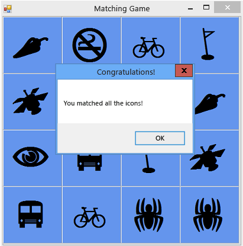

# Step 8: Add a method to verify whether the player won
You've created a fun game, but it needs an additional item to finish it. The game should end when the player wins, so you need to add a `CheckForWinner()` method to verify whether the player won.

## To add a method to verify whether the player won

1.  Add a `CheckForWinner()` method to the bottom of your code, below the `timer1_Tick()` event handler, as shown in the following code.

     [!code-csharp[VbExpressTutorial4Step8#10](../ide/codesnippet/CSharp/step-8-add-a-method-to-verify-whether-the-player-won_1.cs)]
     [!code-vb[VbExpressTutorial4Step8#10](../ide/codesnippet/VisualBasic/step-8-add-a-method-to-verify-whether-the-player-won_1.vb)]

     The method uses another `foreach` loop in Visual C# or `For Each` loop in Visual Basic to go through each label in the <xref:System.Windows.Forms.TableLayoutPanel>. It uses the equality operator (`==` in Visual C# and `=` in Visual Basic) to check each label's icon color to verify whether it matches the background. If the colors match, the icon remains invisible, and the player hasn't matched all of the icons remaining. In that case, the program uses a `return` statement to skip the rest of the method. If the loop gets through all of the labels without executing the `return` statement, that means that all of the icons on the form were matched. The program shows a MessageBox to congratulate the player on winning, and then calls the form's `Close()` method to end the game.

2.  Next, have the label's <xref:System.Windows.Forms.Control.Click> event handler call the new `CheckForWinner()` method. Be sure that your program checks for a winner immediately after it shows the second icon that the player chooses. Look for the line where you set the second chosen icon's color, and then call the `CheckForWinner()` method right after that, as shown in the following code.

     [!code-csharp[VbExpressTutorial4Step8#11](../ide/codesnippet/CSharp/step-8-add-a-method-to-verify-whether-the-player-won_2.cs)]
     [!code-vb[VbExpressTutorial4Step8#11](../ide/codesnippet/VisualBasic/step-8-add-a-method-to-verify-whether-the-player-won_2.vb)]

3.  Save and run the program. Play the game and match all of the icons. When you win, the program displays a congratulatory **MessageBox** (as shown in the following picture), and then closes the box.

     
**Matching game** with **MessageBox**

## To continue or review

-   To go to the next tutorial step, see [Step 9: Try other features](../ide/step-9-try-other-features.md).

-   To return to the previous tutorial step, see [Step 7: Keep pairs visible](../ide/step-7-keep-pairs-visible.md).
