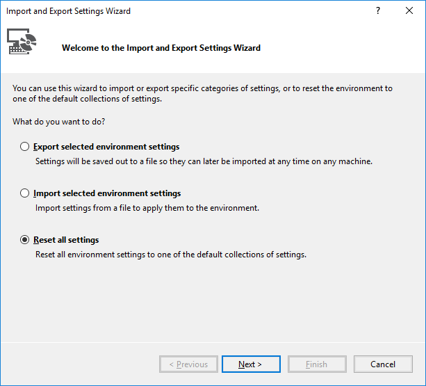
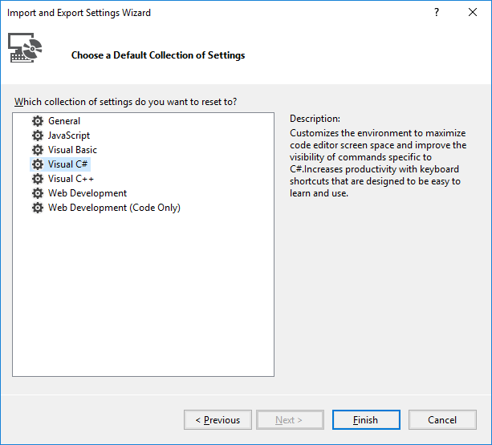

# Synchronize Visual Studio settings across multiple computers

When you sign in to Visual Studio on multiple computers using the same personalization account, your settings can be synchronized across the computers.

## Synchronized settings

By default, the following settings are synchronized:

- Development settings. You have to select a set of settings the first time you run Visual Studio, but you can change the selection anytime. For more information, see [Personalize the Visual Studio IDE](../ide/personalizing-the-visual-studio-ide.md).

- User-defined command aliases. For more information about how to define command aliases, see [Visual Studio command aliases](../ide/reference/visual-studio-command-aliases.md).

- User-defined window layouts in **Window** > **Manage Window Layouts** page.

- The following options in the **Tools** > **Options** pages:

   - Theme and menu bar casing settings on the **Environment** > **General** options page.

   - All settings on the **Environment** > **Fonts and Colors** options page.

   - All keyboard shortcuts on the **Environment** > **Keyboard** options page.

   - All settings on the **Environment** > **Tabs and Windows** options page.

   - All settings on the **Environment** > **StartUp** options page.

   - All settings on the **Text Editor** options pages.

   - All settings on the **XAML Designer** options pages.

## Turn off synchronized settings on a particular computer

Synchronized settings for Visual Studio are turned on by default. You can turn off synchronized settings on a computer by going to the **Tools** > **Options** > **Environment** > **Accounts** page and unchecking **Synchronize settings across devices when signed into Visual Studio**. For example, if you decide not to synchronize Visual Studio's settings on computer "A", any setting changes made on computer "A" do not appear on computer "B" or computer "C". Computers "B" and "C" will continue to synchronize with each other, but not with computer "A".

## Reset settings

You can reset all settings to a collection of default settings by following these steps:

1. In Visual Studio, select **Tools** > **Import and Export Settings** to open the **Import and Export Settings Wizard**.

1. In the **Import and Export Settings Wizard**, select **Reset all settings** and then select **Next**.

   

1. On the **Save Current Settings** page, select either **Yes** or **No** and then select **Next**.

1. On the **Choose a Default Collection of Settings** page, choose a collection and then select **Finish**.

   

1. On the **Reset Complete** page, select **Close**.

## Synchronize settings across Visual Studio family products and editions

Settings can be synchronized across any edition of Visual Studio, including Community edition. Settings are also synchronized across Visual Studio family products. However, each of these family products may have its own settings that aren't shared with Visual Studio. For example, settings specific to one product on computer "A" are shared with another product on computer "B", but not with Visual Studio on computers "A" or "B".

## Side-by-side synchronized settings

In Visual Studio 2017 version 15.3 and later, certain settings like tool window layout aren't shared between different side-by-side installations of Visual Studio 2017. The *CurrentSettings.vssettings* file in *%userprofile%\Documents\Visual Studio 2017\Settings* is in an installation-specific folder that is similar to *%localappdata%\Microsoft\VisualStudio\15.0_xxxxxxxx\Settings*.

> [!NOTE]
> To use the new installation-specific settings, do a fresh installation. When you perform an upgrade of an existing Visual Studio 2017 installation to the most current update, it uses the existing shared location.

If you currently have side-by-side installations of Visual Studio 2017 and want to use the new installation-specific settings file location, follow these steps:

1. Upgrade to Visual Studio 2017 version 15.3 or later.

1. Use the **Import\Export settings** wizard to export all your existing settings to some location outside of the *%localappdata%\Microsoft\VisualStudio\15.0_xxxxxxxx* folder.

1. Open the **Developer Command Prompt for VS 2017** of the upgraded Visual Studio installation and run `devenv /resetuserdata`.

1. Launch Visual Studio and import the saved settings from the exported settings file.

## See also

[Personalize the IDE](../ide/personalizing-the-visual-studio-ide.md)
