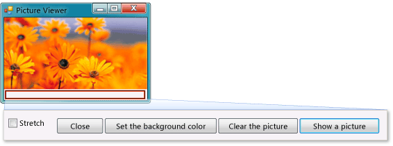

# Tutorial 1: Create a Picture Viewer
In this tutorial, you build a program that loads a picture from a file and displays it in a window. You learn how to drag controls like buttons and picture boxes on your form, set their properties, and use containers to smoothly resize the form. You also get started writing code. You learn how to:  
  
-   Create a new project.  
  
-   Test (debug) an application.  
  
-   Add basic controls like check boxes and buttons to a form.  
  
-   Position controls on a form using layouts.  
  
-   Add **Open File** and **Color** dialog boxes to a form.  
  
-   Write code using IntelliSense and code snippets.  
  
-   Write event handler methods.  
  
 When you finish, your program will look like the following picture.  
  
   
Picture that you create in this tutorial  
  
 To download a completed version of the sample, see [Complete Picture Viewer tutorial sample](http://code.msdn.microsoft.com/Complete-Picture-Viewer-7d91d3a8).  
  
 For a video version of this topic, see [How Do I: Create a Picture Viewer in Visual Basic?](http://go.microsoft.com/fwlink/?LinkId=205207) or [How Do I: Create a Picture Viewer in C#?](http://go.microsoft.com/fwlink/?LinkId=205198).  
  
> [!NOTE]
>  These videos use an earlier version of Visual Studio, so there are slight differences in some menu commands and other user interface elements. However, the concepts and procedures work similarly in the current version of Visual Studio. Visual C# and Visual Basic are both covered in this tutorial, so focus on information specific to the programming language that you're using.  
>   
>  To see code for Visual Basic, choose the **VB** tab at the top of code blocks, and to see code for Visual C#, choose the **C#** tab. If you're interested in learning about Visual C++, see [Getting Started](../ide/getting-started-with-cpp-in-visual-studio.md) and [C++ Language Tutorial](http://www.cplusplus.com/doc/tutorial/).  
>   
>  If you're interested in learning how to write Visual C# or Visual Basic apps for the Windows Store, see [Create your first Windows Store app using C# or Visual Basic](http://msdn.microsoft.com/library/windows/apps/hh974581.aspx). For information about creating JavaScript apps for the Windows Store, see [Create your first Windows Store app using JavaScript](http://msdn.microsoft.com/library/windows/apps/br211385.aspx).  
  
## Related Topics  
  
|Title|Description|  
|-----------|-----------------|  
|[Step 1: Create a Windows Forms Application Project](../ide/step-1-create-a-windows-forms-application-project.md)|Begin by creating a Windows Forms application project.|  
|[Step 2: Run Your Program](../ide/step-2-run-your-program.md)|Run the Windows Forms application program that you created in the previous step.|  
|[Step 3: Set Your Form Properties](../ide/step-3-set-your-form-properties.md)|Change the way your form looks using the **Properties** window.|  
|[Step 4: Lay Out Your Form with a TableLayoutPanel Control](../ide/step-4-lay-out-your-form-with-a-tablelayoutpanel-control.md)|Add a `TableLayoutPanel` control to your form.|  
|[Step 5: Add Controls to Your Form](../ide/step-5-add-controls-to-your-form.md)|Add controls, such as a `PictureBox` control and a `CheckBox` control, to your form. Add buttons to your form.|  
|[Step 6: Name Your Button Controls](../ide/step-6-name-your-button-controls.md)|Rename your buttons to something more meaningful.|  
|[Step 7: Add Dialog Components to Your Form](../ide/step-7-add-dialog-components-to-your-form.md)|Add an **OpenFileDialog** component and a **ColorDialog** component to your form.|  
|[Step 8: Write Code for the Show a Picture Button Event Handler](../ide/step-8-write-code-for-the-show-a-picture-button-event-handler.md)|Write code using the IntelliSense tool.|  
|[Step 9: Review, Comment, and Test Your Code](../ide/step-9-review-comment-and-test-your-code.md)|Review and test your code. Add comments as needed.|  
|[Step 10: Write Code for Additional Buttons and a Check Box](../ide/step-10-write-code-for-additional-buttons-and-a-check-box.md)|Write code to make other buttons and a check box work using IntelliSense.|  
|[Step 11: Run Your Program and Try Other Features](../ide/step-11-run-your-program-and-try-other-features.md)|Run your program and set the background color. Try other features, such as changing colors, fonts, and borders.|