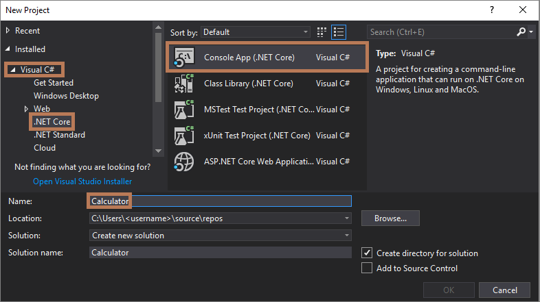
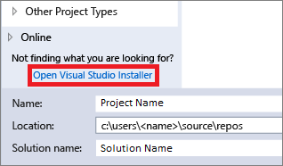
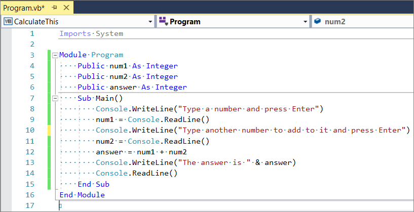
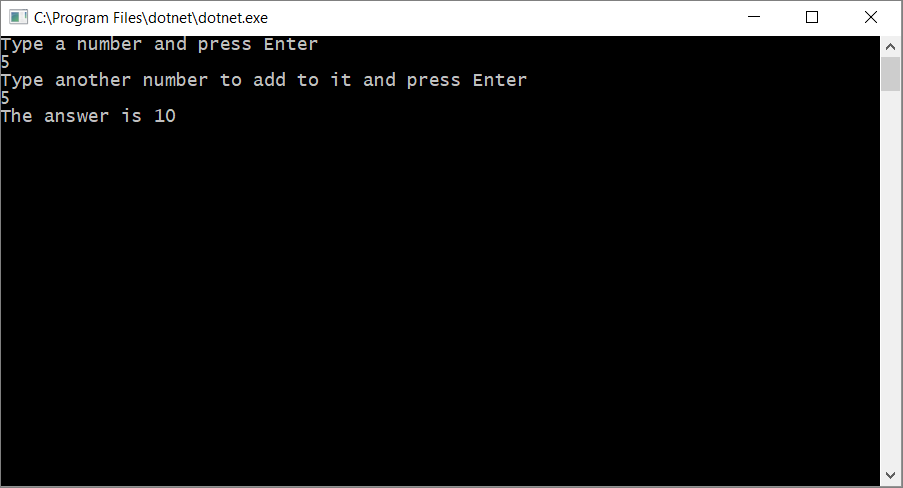

# Tutorial: Get started with a C# console app in Visual Studio

In this tutorial for C#, you'll use Visual Studio to create and run a console app and explore some features of the [Visual Studio integrated development environment (IDE)](visual-studio-ide.md) while you do so.

If you haven't already installed Visual Studio, go to the [Visual Studio downloads](https://visualstudio.microsoft.com/downloads/?utm_medium=microsoft&utm_source=docs.microsoft.com&utm_campaign=button+cta&utm_content=download+vs2017) page to install it for free.

## Create a project

First, we'll create a C# application project. The project type comes with all the template files you'll need, before you've even added anything!

1. Open Visual Studio 2017.

2. From the top menu bar, choose **File** > **New** > **Project**.

3. In the **New Project** dialog box in the left pane, expand **C#**, and then choose **.NET Core**. In the middle pane, choose **Console App (.NET Core)**. Then name the file *HelloWorld*.

   

### Add a workgroup (optional)

If you don't see the **Console App (.NET Core)** project template, you can get it by adding the **.NET Core cross-platform development** workload. You can add this workload in one of the two following ways, depending on which Visual Studio 2017 updates are installed on your machine.

#### Option 1: Use the New Project dialog box

1. Choose the **Open Visual Studio Installer** link in the left pane of the **New Project** dialog box.

   

1. The Visual Studio Installer launches. Choose the **.NET Core cross-platform development** workload, and then choose **Modify**.

   

#### Option 2: Use the Tools menu bar

1. Cancel out of the **New Project** dialog box and from the top menu bar, choose **Tools** > **Get Tools and Features**.

1. The Visual Studio Installer launches. Choose the **.NET Core cross-platform development** workload, and then choose **Modify**.

## Create a "Calculate This" application

1. Open Visual Studio 2017, and then from the top menu bar, choose **File** > **New** > **Project**.

1. In the **New Project** dialog box in the left pane, expand **C#**, and then choose **.NET Core**. In the middle pane, choose **Console App (.NET Core)**. Then name the file *Calculator*.

1. Enter the following code after the curly brace that appears beneath the `static void Main(string[] args)` line:

   ```C#
       double num1;
       double num2;
       double answer;
       string ops;

       Console.WriteLine("Console Calculator in C#"\r)
       Console.WriteLine("------------------------"\r)
       Console.WriteLine("Please enter the operation to perform"\r)
       num1 = Console.ReadLine()
       Console.WriteLine("Type another number to add to it and press Enter")
       num2 = Console.ReadLine()
       answer = num1 + num2
       Console.WriteLine("The answer is " & answer)
       Console.ReadLine()
   End Sub
   ```

   Your code window should look like the following screenshot:

   

1. Choose **Calculator** to run your program, or press **F5**. Your console window should look similar to the following screenshot:

    

## Quick answers FAQ

Here's a quick FAQ to highlight some key concepts.

### What is C#?

C# is a type-safe programming language that's designed to be easy to learn. With C#, you can create apps that run on the .NET Framework, to include Windows client applications, XML Web services, distributed components, client-server applications, database applications, and more.

### What is Visual Studio?

Visual Studio is an integrated development suite of productivity tools for developers. Think of it as a program you can use to create programs and applications.

### What is a console app?

A console app takes input and displays output in a command-line window, a.k.a. a console.

### What is .NET Core?

.NET Core is the evolutionary next step of the .NET Framework. Where the .NET Framework allowed you to share code across programming languages, .NET Core adds the ability to share code across platforms. Even better, it's open source. (Both the .NET Framework and .NET Core include libraries of prebuilt functionality as well as a common language runtime (CLR), which acts as a virtual machine in which to run your code.)

## Next steps

Congratulations on completing this tutorial! To learn even more, continue with the following tutorials.

> [!div class="nextstepaction"]
> [C# Tutorials](/dotnet/csharp/tutorials/)

## See also

* [C# Fundamentals for Absolute Beginners video course](https://mva.microsoft.com/en-us/training-courses/c-fundamentals-for-absolute-beginners-16169)
