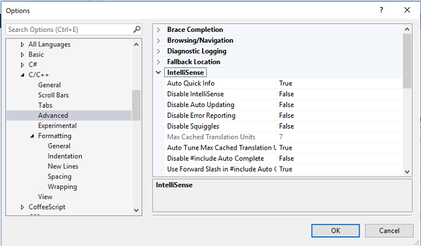
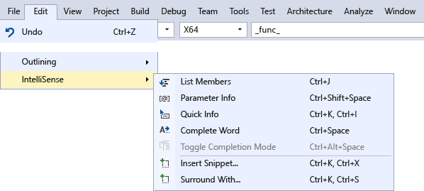
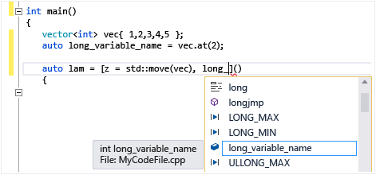
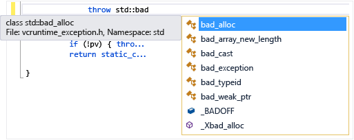
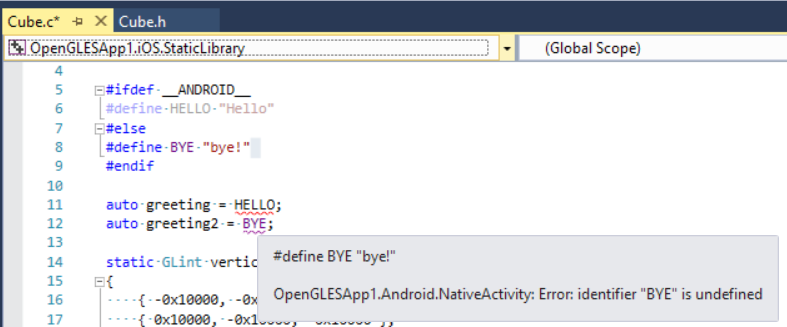
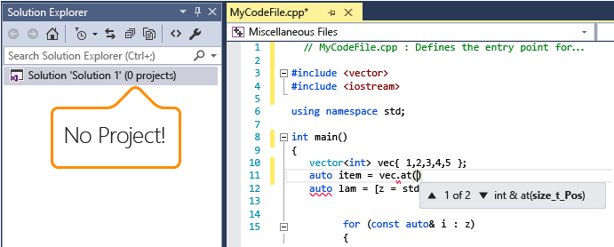
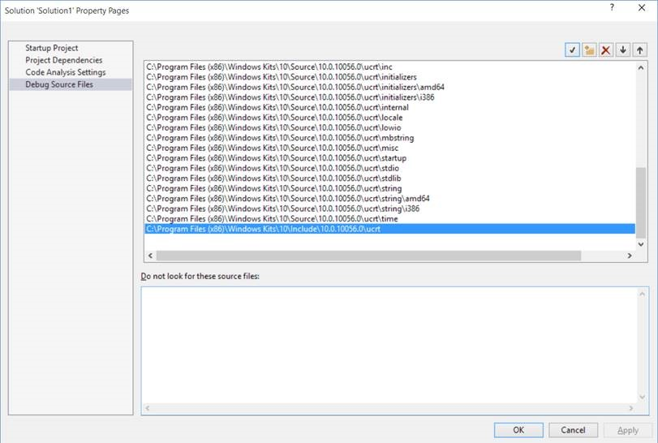

# Visual C++ IntelliSense

IntelliSense for C++ is available for stand-alone files as well as for files that are part of a C++ project. In cross-platform projects, some IntelliSense features are available in .cpp and .c files in the shared code project, even when you are in an Android or iOS context.

This article provides an overview of C++ IntelliSense features. For information on how to configure your project for IntelliSense and how to troubleshoot problems, see [Configure a C++ project for IntelliSense](visual-cpp-intellisense-configuration.md).

## IntelliSense features in C++

IntelliSense is a name given to a set of features that make coding more convenient. Since different people have different ideas about what is convenient, virtually all of the IntelliSense features can be enabled or disabled in the **Options** dialog box, under **Text Editor** > **C/C++** > **Advanced**. The **Options** dialog box is available from the **Tools** menu on the menu bar.

You can use the menu items and keyboard shortcuts shown in the following image to access IntelliSense.

### Statement completion and member list

When you start typing a keyword, type, function, variable name, or other program element that the compiler recognizes, the editor offers to complete the word for you.

For a list of the icons and their meanings, see [Class View and Object Browser Icons](../ide/class-view-and-object-browser-icons.md).

The first time that you invoke member list, it only shows members that are accessible for the current context. If you press **Ctrl**+**J** after that, it shows all members regardless of accessibility. If you invoke it a third time, an even wider list of program elements is shown. You can turn off member list in the **Options** dialog box, under **Text Editor** > **C/C++** > **General** > **Auto list members**.

### Parameter help

When you type an opening brace of a function call, or angle bracket on a class template variable declaration, the editor shows a small window with the parameter types for each overload of the function or constructor. The "current" parameter&mdash;based on the cursor location&mdash;is in bold. You can turn off parameter information in the **Options** dialog box, under **Text Editor** > **C/C++** > **General** > **Parameter information**.

### Quick Info

When you hover the mouse cursor over a variable, a small window appears inline that shows the type information and the header in which the type is defined. Hover over a function call to see the function's signature. You can turn off Quick Info in the **Options** dialog box, under **Text Editor** > **C/C++** > **Advanced** > **Auto Quick Info**.

### Error squiggles

Squiggles under a program element (variable, keyword, brace, type name, and so on) call your attention to an error or potential error in the code. A green squiggle appears when you write a forward declaration, to remind you that you still need to write the implementation. A purple squiggle appears in a shared project when there is an error in code that is not currently active, for example when you are working in the Windows context but enter something that would be an error in an Android context. A red squiggle indicates a compiler error or warning in active code that you need to deal with.

### Code colorization and fonts

The default colors and fonts can be changed in the **Options** dialog box, under **Environment** > **Fonts and Colors**. You can change the fonts for many UI windows here, not just the editor. The settings that are specific to C++ begin with "C++"; the other settings are for all languages.

### Cross-platform IntelliSense

In a shared code project, some IntelliSense features such as squiggles are available even when you are working in an Android context. If you write some code that would result in an error in an inactive project, IntelliSense still shows squiggles, but they are in a different color than squiggles for errors in the current context.

Here's an OpenGLES Application that is configured to build for Android and iOS. The illustration shows shared code being edited. In the first image, Android is the active project:

Notice the following:

- The #else branch on line 8 is grayed out to indicate inactive region, because __ANDROID\_\_ is defined for Android project.

- The greeting variable at line 11 is initialized with identifier HELLO, which has a purple squiggle. This is because no identifier HELLO is defined in the currently inactive iOS project. While in Android project line 11 would compile, it won't in iOS. Since this is shared code, that is something you should change even though it compiles in the currently active configuration.

- Line 12 has red squiggle on identifier BYE; this identifier is not defined in the currently selected active project.

Now, change the active project to iOS.StaticLibrary and notice how the squiggles change.

Notice the following:

- The #ifdef branch on line 6 is grayed out to indicate inactive region, because __ANDROID\_\_ is not defined for iOS project.

- The greeting variable at line 11 is initialized with identifier HELLO, which now has red squiggle. This is because no identifier HELLO is defined in the currently active iOS project.

- Line 12 has purple squiggle on identifier BYE; this identifier is not defined in currently inactive Android.NativeActivity project.

### IntelliSense for stand-alone files

When you open a single file outside of any project, you still get IntelliSense. You can enable or disable particular IntelliSense features in the **Options** dialog box, under **Text Editor** > **C/C++** > **Advanced**. To configure IntelliSense for single files that aren't part of a project, look for the **IntelliSense and Browsing for Non-Project Files** section.

By default, single file IntelliSense only uses standard include directories to find header files. To add additional directories, open the shortcut menu on the Solution node, and add your directory to **Debug Source Code** list, as the following illustration shows:

## See also

- [Using IntelliSense](../ide/using-intellisense.md)
- [Configure a C++ project for IntelliSense](visual-cpp-intellisense-configuration.md)