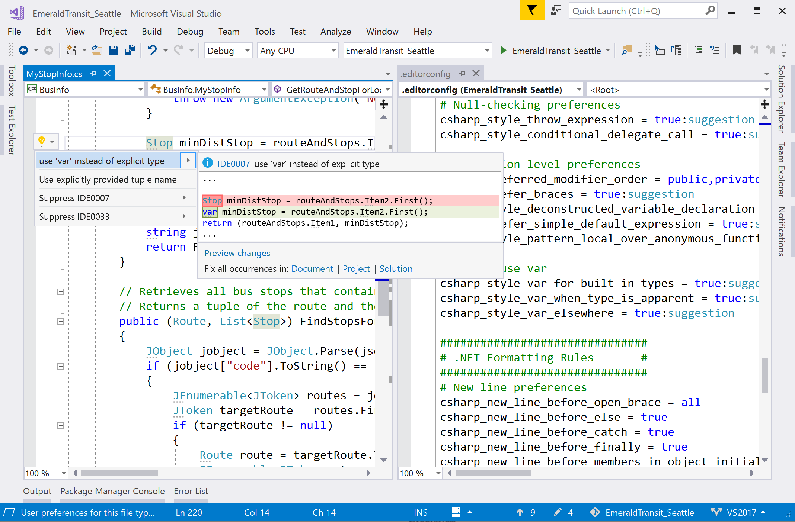
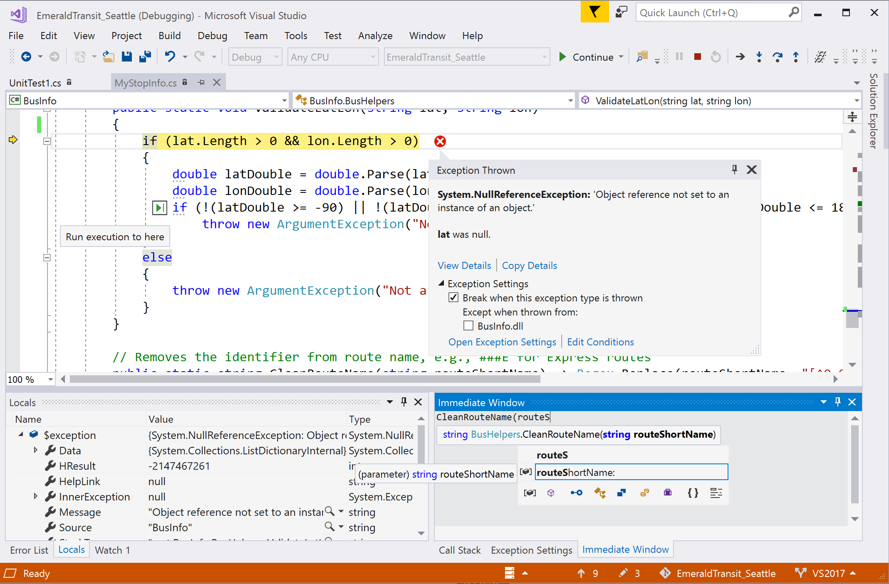

# Visual Studio 2017 Productivity Guide for .NET Developers

[Visual Studio 2017](https://www.visualstudio.com/downloads/) makes developers more productive than ever! We improved performance and reliability for solution startup and load, test discovery, and typing latency. We’ve also added and enhanced features to help you write better code faster. Some of these features include: navigation to decompiled assemblies, variable name suggestions as you type, a hierarchy-view in the Test Explorer, Go To All (**Ctrl+T**) to navigate to file/type/member/symbol declarations, an intelligent Exception Helper, code style configuration and enforcement, and many refactorings and code fixes. 

Follow this guide to optimize your productivity.

##  I'm used to my keyboard shortcuts from a different extension/editor/IDE.

If you are coming from another IDE or coding environment, you may find installing one of these extensions helpful:

- [Emacs Emulation](https://marketplace.visualstudio.com/items?itemName=JustinClareburtMSFT.EmacsEmulation)
- [HotKeys for Visual Studio (ReSharper/IntelliJ)](https://marketplace.visualstudio.com/items?itemName=JustinClareburtMSFT.HotKeys)
- [VSVim](https://marketplace.visualstudio.com/items?itemName=JaredParMSFT.VsVim)

The following are popular Visual Studio shortcuts. 

> [!NOTE]
> Some extensions unbind default Visual Studio keybindings so you must restore them to use the following commands. Restore your keybindings to Visual Studio's defaults by going to: **Tools > Import and Export Settings... > Reset all settings** or **Tools > Options > Keyboard > Reset**.

| Shortcut (All Profiles) | Command | Description |
|-|-|-|
| **Ctrl+T** | Go To All | Navigate to any file/type/member/symbol declaration |
| **F12** (also **Ctrl+Click**) | Go To Definition | Navigate to where a symbol is defined |
| **Ctrl+F12** | Go To Implementation | Navigate from a base type or member to its various implementations |
| **Shift+F12** | Find All References | See all symbol or literal references |
| **Ctrl**+**.** (also **Alt+Enter** in C# Profile) | Quick Actions and Refactorings | See what code fixes, code generation actions, refactorings, or other quick actions are available at your cursor position or code selection |
| **Ctrl**+**D** | Duplicate line | Duplicates the line of code that the cursor is in (available in **Visual Studio 2017 version 15.6** and later) |
| **Shift**+**Alt**+**+**/**-** | Expand/Contract selection | Expands or contracts the current selection in the editor (available in **Visual Studio 2017 version 15.5** and later) |
| **Ctrl+Q** | Quick Launch | Search all Visual Studio settings |
| **F5** | Start Debugging | Start debugging your application |
| **Ctrl+F5** | Run without Debug | Run your application locally without debugging |
| **Ctrl+K,D** (Default Profile) or **Ctrl+E,D** (C# Profile) | Format Document | Cleans up formatting violations in your file based on your newline, spacing, and indentation settings |
| **Ctrl+\\,E** (Default Profile) or **Ctrl+W,E** (C# Profile) | View Error List | See all errors in your document, project, or solution |

## I need a way to quickly navigate to files or types.
Visual Studio 2017 has a feature called _Go To All_ (**Ctrl+T**). Go To All enables you to quickly jump to any file, type, member, or symbol declaration.
- Change the location of this search bar or turn off the 'live navigation preview' with the **gear** icon
- Filter results using our query syntax (for example, "t mytype"). You can also scope your search to just the current document.
- camelCase matching is supported!

## My team enforces code style rules on our codebase.
You can use an .editorconfig file to codify coding conventions. We recommend installing the [EditorConfig Language Services extension](https://aka.ms/editorconfig) for adding and editing an .editorconfig file. We recommend you check out the [documentation](https://aka.ms/editorconfigDocs) for all .NET coding convention options.

Check out [this gist](https://gist.github.com/kuhlenh/5471666a7a2c57fea427e81cf0a41da8) for an example .editorconfig.

## I need more refactorings and code fixes.
Visual Studio 2017 comes with a lot of refactorings, code generation actions, and code fixes, which you can see in our [documentation](https://aka.ms/refactorings). Red squiggles represent errors, green squiggles represent warnings, and three gray dots represent code suggestions.

You can access code fixes by clicking the lightbulb/screwdriver icon or by pressing **Ctrl+.** or **Alt+Enter**. Each fix comes with a preview window that shows a live code diff of how the fix works.

Here are some popular quick fixes and refactorings: *Rename*, *Extract Method*, *Change Method Signature*, *Generate Constructor*, *Generate Method*, *Move Type to File*, *Add Null-Check*, *Add Parameter*, *Remove Unnecessary Usings*.

Refactorings and code fixes can be easily written with [Roslyn analyzers](https://github.com/dotnet/roslyn/wiki/Getting-Started-Writing-a-Custom-Analyzer-&-Code-Fix). Several community members have written *free* extensions which add additional code inspections: [Roslynator](https://marketplace.visualstudio.com/items?itemName=josefpihrt.Roslynator2017), [SonarLint for Visual Studio](https://marketplace.visualstudio.com/items?itemName=SonarSource.SonarLintforVisualStudio), and [StyleCopAnalyzers](https://www.nuget.org/packages/stylecop.analyzers/). 

## I need Find Usages, Go To Implementation, Navigate To Decompiled Assemblies
Visual Studio 2017 has many features to help you search and navigate your codebase--including Find All References (**Shift+F12**), Go To Implementation (**Ctrl+F12**), Go To Definition (**F12** or **Ctrl+Click**). Navigate To Decompiled Assemblies was added in version 15.6. To turn on this feature, go to **Tools > Options > Text Editor > C# > Advanced > Enable navigation to decompiled sources**.

## I want to run and see my unit tests.
We have two offerings for unit testing in Visual Studio 2017: Test Explorer and _Live Unit Testing_. We greatly improved the speed of test discovery in the Test Explorer in version 15.6. We also redesigned the UI to allow for hierarchical sorting.

Visual Studio 2017 Enterprise also has a unit testing feature called [Live Unit Testing](/test/live-unit-testing). Live Unit Testing continuously runs in the background, runs tests impacted by your code change, and updates inline editor icons to let you know the status of your tests.

## I want to debug my code.
We've added a ton of new debugging capabilities in Visual Studio 2017. *Run to click* allows you to hover next to a line of code, hit the green 'play' icon that appears, and run your program until it reaches that line. The new *Exception Helper* puts the most important information, like which variable is 'null' in a NullReferenceException, at the top-level in the dialog. And [Step Back](/debugger/how-to-use-intellitrace-step-back) debugging enables you to go back to previous breakpoints or steps and view the state of the application as it was in the past.

## I want to use version control with my projects.
You can use git or TFVC to store and update your code in Visual Studio. Inside the editor, organize your local changes with Team Explorer and use the status bar to track pending commits and changes. Set up continuous integration and delivery for your projects inside of Visual Studio with our [Continuous Delivery Tools for Visual Studio](https://marketplace.visualstudio.com/items?itemName=VSIDEDevOpsMSFT.ContinuousDeliveryToolsforVisualStudio) extension and adopt the agile developer workflow.

## What other features do I need to know about?
Here is a list of editor and productivity features to make writing code more efficient. Some features may need to be enabled because they are off-by-default (they may index things on your machine, are controversial, or are currently experimental).
- *Locate File in Solution Explorer* highlights the active file in the Solution Explorer.
  - **Tools>Options>Projects and Solutions>Track Active Item in Solution Explorer**
- *Add usings for types in reference assemblies and NuGet packages* shows a lightbulb with a code fix to install a NuGet package for an unreferenced type.
  - **Tools>Options>Text Editor>C#>Advanced>Suggest usings for types in reference assemblies** and **Suggest usings for types in NuGet packages**
- *Enable full solution analysis* to see all errors in your solution in the Error List.
  - **Tools>Options>Text Editor>C#>Advanced>Enable full solution analysis**
- *Enable navigation to decompiled sources* to enable Go To Definition on types/members from external sources and use the ILSpy decompiler to show method bodies.
  - **Tools>Options>Text Editor>C#>Advanced>Enable navigation to decompiled sources**
- *Completion/Suggestion Mode* in IntelliSense changes completion behavior. Developers with IntelliJ backgrounds tend to change the setting here from the default.
  - **Menu > Edit > IntelliSense -> Toggle Completion Mode**
- *[CodeLens](find-code-changes-and-other-history-with-codelens.md)* displays code reference information and change history in the editor.
  - **Tools>Options>Text Editor>All Languages>CodeLens**
- We have *code snippets* to help stub out common boilerplate (press 'Tab' twice). See the [full list](/ide/visual-csharp-code-snippets).

## Missing a feature that makes you productive or experiencing poor performance?
There are several ways to leave us feedback:
- .NET feature requests can be filed on our [GitHub repo](https://github.com/dotnet/roslyn/issues).
- Visual Studio feature requests, bugs, and performance issues can be filed by using the **Send Feedback** icon at the top-right of your Visual Studio window.