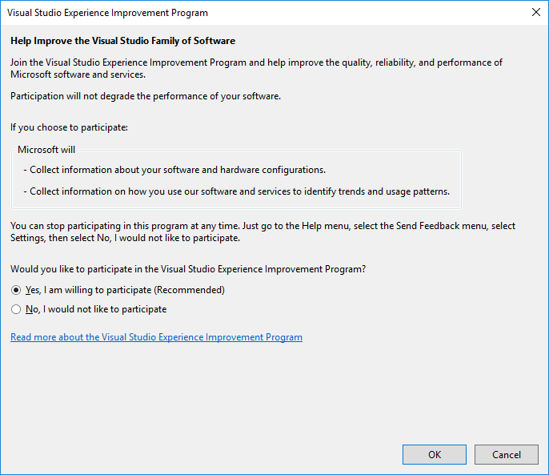

# Visual Studio Customer Experience Improvement Program

The Visual Studio Customer Experience Improvement Program (VSCEIP) is a program designed to help Microsoft improve Visual Studio over time. This program collects information about computer hardware and how people use Visual Studio, without interrupting users in their tasks at the computer. The information that's collected helps Microsoft identify which features to improve. This document covers how to opt in or out of the VSCEIP.

## Opt in or out

The VSCEIP is turned on by default. You can turn it off, or back on again, by following these instructions:

1. Start Visual Studio.

1. From the **Help** menu, point to **Send Feedback**, and then select **Settings**.

   The **Visual Studio Experience Improvement Program** dialog box opens.

1. To opt out, select **No, I would not like to participate**, and then select **OK**.
   To opt in, select **Yes, I am willing to participate**, and then select **OK**.

   

### Registry settings

If you install the [Build Tools for Visual Studio](https://www.visualstudio.com/downloads/#build-tools-for-visual-studio-2017), you must update the registry to configure the VSCEIP. Enterprise customers can construct a group policy to opt in or out of the VSCEIP by setting a registry-based policy. The relevant registry subkey and settings are as follows:

Subkey = **HKEY_CURRENT_USER\SOFTWARE\Microsoft\VSCommon\15.0\SQM**
Entry = OptIn
Value = (DWORD)
- **0** is opted out (turn off the VSCEIP)
- **1** is opted in (turn on the VSCEIP)

> [!CAUTION]
> Incorrectly editing the registry may severely damage your system. Before making changes to the registry, you should back up any valued data on the computer. You can also use the **Last Known Good Configuration** startup option if you encounter problems after manual changes have been applied.

For more information about the information collected, processed, or transmitted by the VSCEIP, see the [Microsoft Privacy Statement](https://privacy.microsoft.com/privacystatement).

[!INCLUDE [gdpr-hybrid-note](../misc/includes/gdpr-hybrid-note.md)]

## See also

* [Talk to us](../ide/talk-to-us.md)
* [How to report a problem with Visual Studio](../ide/how-to-report-a-problem-with-visual-studio-2017.md)
* [Visual Studio Developer Community](https://developercommunity.visualstudio.com/)
* [Microsoft Privacy Statement](https://privacy.microsoft.com/privacystatement)