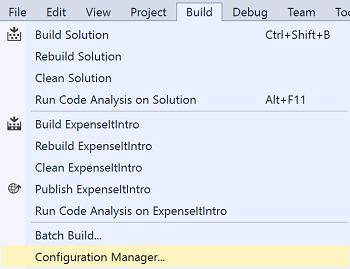
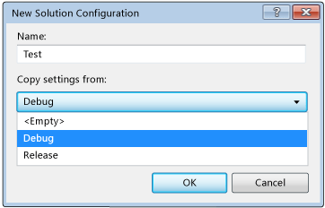
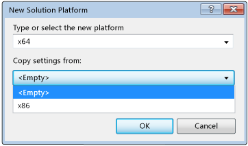
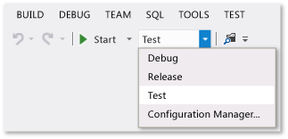
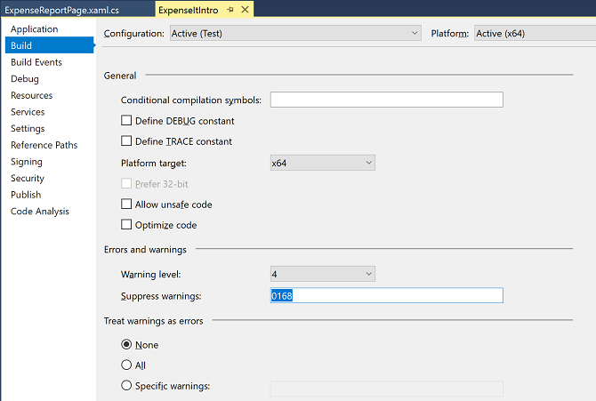
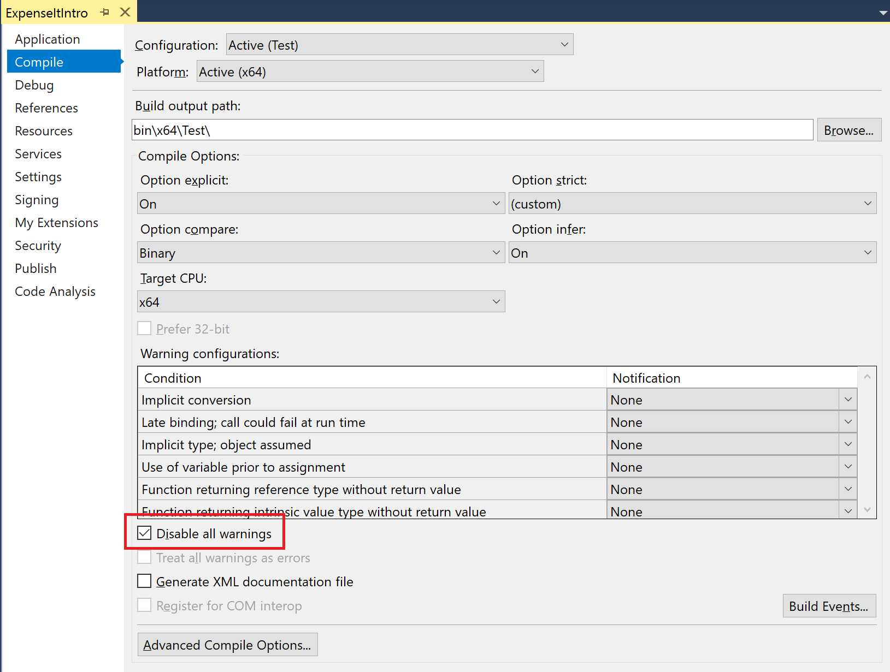

# Walkthrough: Build an application

By completing this walkthrough, you'll become more familiar with several options that you can configure when you build applications with Visual Studio. You'll create a custom build configuration, hide certain warning messages, and increase build output information for a sample application.

## Install the sample application

Download the [Introduction to building WPF applications](https://code.msdn.microsoft.com/Introduction-to-Building-b8d16419) sample. Choose either C# or Visual Basic. After the *.zip* file has downloaded, extract it and open the *ExpenseItIntro.sln* file using Visual Studio.

## Create a custom build configuration

When you create a solution, debug and release build configurations and their default platform targets are defined for the solution automatically. You can then customize these configurations or create your own. Build configurations specify the build type. Build platforms specify the operating system that an application targets for that configuration. For more information, see [Understand build configurations](../ide/understanding-build-configurations.md), [Understand build platforms](../ide/understanding-build-platforms.md), and [How to: Set debug and release configurations](../debugger/how-to-set-debug-and-release-configurations.md).

You can change or create configurations and platform settings by using the **Configuration Manager** dialog box. In this procedure, you'll create a build configuration for testing.

### Create a build configuration

1. Open the **Configuration Manager** dialog box.

   

1. In the **Active solution configuration** list, choose **\<New...\>**.

1. In the **New Solution Configuration** dialog box, name the new configuration `Test`, copy settings from the existing **Debug** configuration, and then choose the **OK** button.

   

1. In the **Active solution platform** list, choose **\<New...\>**.

1. In the **New Solution Platform** dialog box, choose **x64**, and don't copy settings from the x86 platform.

   

1. Choose the **OK** button.

   The active solution configuration has been changed to **Test** with the active solution platform set to x64.

   

1. Choose **Close**.

You can quickly verify or change the active solution configuration by using the **Solution Configurations** list on the **Standard** toolbar.

## Build the application

Next, you'll build the solution with the custom build configuration.

### Build the solution

-   On the menu bar, choose **Build** > **Build Solution**.

    The **Output** window displays the results of the build. The build succeeded.

## Hide compiler warnings

Next we'll introduce some code that causes a warning to be generated by the compiler.

1. In the C# project, open the *ExpenseReportPage.xaml.cs* file. In the **ExpenseReportPage** method, add the following code: `int i;`.

    OR

    In the Visual Basic project, open the *ExpenseReportPage.xaml.vb* file. In the custom constructor **Public Sub New...**, add the following code: `Dim i`.

1. Build the solution.

The **Output** window displays the results of the build. The build succeeded, but warnings were generated:

You can temporarily hide certain warning messages during a build rather than have them clutter up the build output.

### Hide a specific C# warning

1. In **Solution Explorer**, choose the top-level project node.

1. On the menu bar, choose **View** > **Property Pages**.

     The **Project Designer** opens.

1. Choose the **Build** page and then, in the **Suppress warnings** box, specify the warning number **0168**.

     

     For more information, see [Build Page, Project Designer (C#)](../ide/reference/build-page-project-designer-csharp.md).

1. Build the solution.

     The **Output** window displays only summary information for the build.

     

### Suppress all Visual Basic build warnings

1. In **Solution Explorer**, choose the top-level project node.

2. On the menu bar, choose **View** > **Property Pages**.

     The **Project Designer** opens.

3. On the **Compile** page, select the **Disable all warnings** check box.

     

     For more information, see [Configure warnings in Visual Basic](../ide/configuring-warnings-in-visual-basic.md).

4. Build the solution.

   The **Output** window displays only summary information for the build.

   

   For more information, see [How to: Suppress compiler warnings](../ide/how-to-suppress-compiler-warnings.md).

## Display additional build details in the Output window

You can change how much information about the build process appears in the **Output** window. Build verbosity is usually set to **Minimal**, which means that the **Output** window displays only a summary of the build process along with any high priority warnings or errors. You can display more information about the build by using the [Options dialog box, Projects and Solutions, Build and Run](../ide/reference/options-dialog-box-projects-and-solutions-build-and-run.md).

> [!IMPORTANT]
> If you display more information, the build will take longer to complete.

### Change the amount of information in the Output window

1. Open the **Options** dialog box.

     

1. Choose the **Projects and Solutions** category, and then choose the **Build and Run** page.

1. In the **MSBuild project build output verbosity** list, choose **Normal**, and then choose the **OK** button.

1. On the menu bar, choose **Build** > **Clean Solution**.

1. Build the solution, and then review the information in the **Output** window.

     The build information includes the time that the build started (located at the beginning) and the order in which files were processed. This information also includes the actual compiler syntax that Visual Studio runs during the build.

     For example, in the C# build, the [/nowarn](/dotnet/visual-basic/reference/command-line-compiler/nowarn) option lists the warning code, **1762**, that you specified earlier in this topic, along with three other warnings.

     In the Visual Basic build, [/nowarn](/dotnet/visual-basic/reference/command-line-compiler/nowarn) doesn't include specific warnings to exclude, so no warnings appear.

    > [!TIP]
    > You can search the contents of the **Output** window if you display the **Find** dialog box by choosing the **Ctrl**+**F** keys.

For more information, see [How to: View, save, and configure build log files](../ide/how-to-view-save-and-configure-build-log-files.md).

## Create a Release Build

You can build a version of the sample application that's optimized for shipping it. For the release build, you'll specify that the executable is copied to a network share before the build is kicked off.

For more information, see [How to: Change the build output directory](../ide/how-to-change-the-build-output-directory.md) and [Build and clean projects and solutions in Visual Studio](../ide/building-and-cleaning-projects-and-solutions-in-visual-studio.md).

### Specify a release build for Visual Basic

1. Open the **Project Designer**.

     

1. Choose the **Compile** page.

1. In the **Configuration** list, choose **Release**.

1. In the **Platform** list, choose **x86**.

1. In the **Build output path** box, specify a network path.

     For example, you can specify `\\myserver\builds`.

    > [!IMPORTANT]
    > A message box might appear, warning you that the network share that you've specified might not be a trusted location. If you trust the location that you've specified, choose the **OK** button in the message box.

1. Build the application.

     

### Specify a release build for C# #

1. Open the **Project Designer**.

     

1. Choose the **Build** page.

1. In the **Configuration** list, choose **Release**.

1. In the **Platform** list, choose **x86**.

1. In the **Output path** box, specify a network path.

     For example, you could specify `\\myserver\builds`.

    > [!IMPORTANT]
    > A message box might appear, warning you that the network share that you've specified might not be a trusted location. If you trust the location that you've specified, choose the **OK** button in the message box.

1. On the **Standard toolbar**, set the Solution Configurations to **Release** and the Solution Platforms to **x86**.

1. Build the application.

     

   The executable file is copied to the network path that you specified. Its path would be `\\myserver\builds\\FileName.exe`.

Congratulations! You've successfully completed this walkthrough.

## See also

- [Walkthrough: Build a project (C++)](/cpp/ide/walkthrough-building-a-project-cpp)
- [ASP.NET web application project precompilation overview](/previous-versions/aspnet/aa983464\(v\=vs.110\))
- [Walkthrough: Use MSBuild](../msbuild/walkthrough-using-msbuild.md)