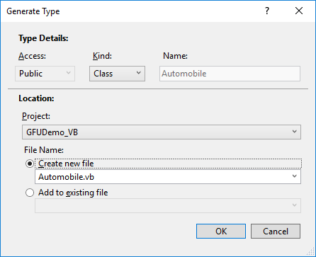
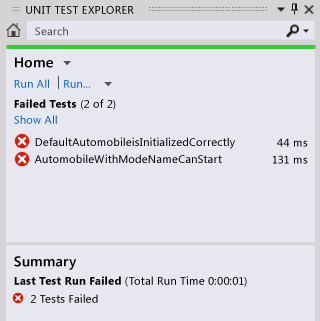

# Walkthrough: test-first development with the Generate From Usage feature
This topic demonstrates how to use the [Generate From Usage](../ide/visual-csharp-intellisense.md#generate-from-usage) feature, which supports test-first development.  
  
 *Test-first development* is an approach to software design in which you first write unit tests based on product specifications, and then write the source code that is required to make the tests succeed. Visual Studio supports test-first development by generating new types and members in the source code when you first reference them in your test cases, before they are defined.  
  
 Visual Studio generates the new types and members with minimal interruption to your workflow. You can create stubs for types, methods, properties, fields, or constructors without leaving your current location in code. When you open a dialog box to specify options for type generation, the focus returns immediately to the current open file when the dialog box closes.  
  
 The Generate From Usage feature can be used with test frameworks that integrate with Visual Studio. In this topic, the Microsoft Unit Testing Framework is demonstrated.  
  
 [!INCLUDE[note_settings_general](../data-tools/includes/note_settings_general_md.md)]  
  
### To create a Windows Class Library project and a Test project  
  
1.  In [!INCLUDE[csprcs](../data-tools/includes/csprcs_md.md)] or [!INCLUDE[vbprvb](../code-quality/includes/vbprvb_md.md)], create a new **Windows Class Library** project. Name it `GFUDemo_VB` or `GFUDemo_CS`, depending on which language you are using.  
  
2.  In **Solution Explorer**, right-click the solution icon at the top, choose **Add**, and then choose **New Project**. In the left pane of the **New Project** dialog box, choose **Test**.  
  
3.  In the middle pane, choose **Unit Test Project** and accept the default name of UnitTestProject1. The following illustration shows the dialog box when it appears in [!INCLUDE[csprcs](../data-tools/includes/csprcs_md.md)]. In [!INCLUDE[vbprvb](../code-quality/includes/vbprvb_md.md)], the dialog box looks similar.  
  
       
  
4.  Choose **OK** to close the **New Project** dialog box.  

### To add a reference to the Class Library project

1.  In your unit test project, in **Solution Explorer**, right-click the **References** entry and choose **Add Reference**.

2.  In the **Reference Manager** dialog box, select **Projects** and then select the class library project.

3.  Choose **OK** to close the **Reference Manager** dialog box.  
    
4.  Save your solution. You are now ready to begin writing tests.  
  
### To generate a new class from a unit test  
  
1.  The test project contains a file that is named UnitTest1. Double-click this file in **Solution Explorer** to open it in the code editor. A test class and test method have been generated.  
  
2.  Locate the declaration for class `UnitTest1` and rename it to `AutomobileTest`.  
  
> [!NOTE]
>  IntelliSense now provides two alternatives for IntelliSense statement completion: *completion mode* and *suggestion mode*. Use suggestion mode for situations in which classes and members are used before they are defined. When an IntelliSense window is open, you can press **Ctrl+Alt+SPACEBAR** to toggle between completion mode and suggestion mode. See [Using IntelliSense](../ide/using-intellisense.md) for more information. Suggestion mode will help when you are typing `Automobile` in the next step.  
  
3.  Locate the `TestMethod1()` method and rename it to `DefaultAutomobileIsInitializedCorrectly()`. Inside this method, create a new instance of a class named `Automobile`, as shown in the following screenshots. A wavy underline appears, which indicates a compile-time error, and a Quick Actions light bulb appears in the left margin (C# only), or directly below the squiggle if you hover over it.  
  
       

       
  
4.  Choose or click the Quick Actions light bulb. You'll see an error message that states that the type `Automobile` is not defined. You are also presented with some solutions.  
  
5. Click **Generate new type...** to open the **Generate Type** dialog box. This dialog box provides options that include generating the type in a different project.  

6. In the **Project** list, click **GFUDemo\_VB** or **GFUDemo_CS** to instruct Visual Studio to add the file to the class library project instead of the test project. If it's not already selected, choose **Create new file** and name it **Automobile.cs** or **Automobile.vb**.  
  
       
  
6.  Click **OK** to close the dialog box and create the new file.  
  
7.  In **Solution Explorer**, look under the GFUDemo_VB or GFUDemo_CS project node to verify that the new Automobile.vb or Automobile.cs file is there. In the code editor, the focus is still in `AutomobileTest.DefaultAutomobileIsInitializedCorrectly`, which enables you to continue to write your test with a minimum of interruption.  
  
### To generate a property stub  
Assume that the product specification states that the `Automobile` class has two public properties named `Model` and `TopSpeed`. These properties must be initialized with default values of `"Not specified"` and `-1` by the default constructor. The following unit test will verify that the default constructor sets the properties to their correct default values.  
  
1. Add the following line of code to the `DefaultAutomobileIsInitializedCorrectly` test method.  
  
     [!code-csharp[VbTDDWalkthrough#1](../ide/codesnippet/CSharp/walkthrough-test-first-support-with-the-generate-from-usage-feature_1.cs)]
     [!code-vb[VbTDDWalkthrough#1](../ide/codesnippet/VisualBasic/walkthrough-test-first-support-with-the-generate-from-usage-feature_1.vb)]  
  
2. Because the code references two undefined properties on `Automobile`, a wavy underline appears under `Model` and `TopSpeed`. Hover over `Model` and choose the Quick Actions light bulb, then choose **Generate property 'Automobile.Model'**.  

3. Generate a property stub for the `TopSpeed` property in the same way.  
  
     In the `Automobile` class, the types of the new properties are correctly inferred from the context.  
  
### To generate a stub for a new constructor  
Now we'll create a test method that will generate a constructor stub to initialize the `Model` and `TopSpeed` properties. Later, you'll add more code to complete the test.  

1. Add the following additional test method to your `AutomobileTest` class.  
  
     [!code-csharp[VbTDDWalkthrough#2](../ide/codesnippet/CSharp/walkthrough-test-first-support-with-the-generate-from-usage-feature_2.cs)]
     [!code-vb[VbTDDWalkthrough#2](../ide/codesnippet/VisualBasic/walkthrough-test-first-support-with-the-generate-from-usage-feature_2.vb)]  
  
2.  Click the Quick Actions light bulb under the red squiggle, and then click **Generate constructor in 'Automobile'**.  

     In the `Automobile` class file, notice that the new constructor has examined the names of the local variables that are used in the constructor call, found properties that have the same names in the `Automobile` class, and supplied code in the constructor body to store the argument values in the `Model` and `TopSpeed` properties.
  

3.  After you generate the new constructor, a wavy underline appears under the call to the default constructor in `DefaultAutomobileIsInitializedCorrectly`. The error message states that the `Automobile` class has no constructor that takes zero arguments. To generate an explicit default constructor that does not have parameters, click the Quick Actions light bulb, and then click **Generate constructor in 'Automobile'**.  
  
### To generate a stub for a method  
Assume that the specification states that a new `Automobile` can be put into a Running state if its `Model` and `TopSpeed` properties are set to something other than the default values.  

1. Add the following lines to the `AutomobileWithModelNameCanStart` method.
  
     [!code-csharp[VbTDDWalkthrough#3](../ide/codesnippet/CSharp/walkthrough-test-first-support-with-the-generate-from-usage-feature_3.cs)]
     [!code-vb[VbTDDWalkthrough#3](../ide/codesnippet/VisualBasic/walkthrough-test-first-support-with-the-generate-from-usage-feature_3.vb)]  
  
2.  Click the Quick Actions light bulb for the `myAuto.Start` method call and then click **Generate method 'Automobile.Start'**.  
  
3.  Click the Quick Actions light bulb for the `IsRunning` property and then click **Generate property 'Automobile.IsRunning'**.  

     The `Automobile` class now contains a method named `Start()` and a property named `IsRunning`.  
  
### To run the tests  
  
1.  On the **Test** menu, choose **Run**, **All Tests**.  

     The **Run**, **All Tests** command runs all the tests in any test frameworks that are written for the current solution. In this case, there are two tests, and they both fail, as expected. The `DefaultAutomobileIsInitializedCorrectly` test fails because the `Assert.IsTrue` condition returns `False`. The `AutomobileWithModelNameCanStart` test fails because the `Start` method in the `Automobile` class throws an exception.  
  
     The **Test Results** window is shown in the following illustration.  
  
       
  
2.  In the **Test Results** window, double-click on each test result row to go to the location of each test.  
  
### To implement the source code  
  
1.  Add the following code to the default constructor so that the `Model`, `TopSpeed` and `IsRunning` properties are all initialized to their correct default values of `"Not specified"`, `-1`, and `False` (or `false` for C#).  
  
     [!code-csharp[VbTDDWalkthrough#5](../ide/codesnippet/CSharp/walkthrough-test-first-support-with-the-generate-from-usage-feature_5.cs)]
     [!code-vb[VbTDDWalkthrough#5](../ide/codesnippet/VisualBasic/walkthrough-test-first-support-with-the-generate-from-usage-feature_5.vb)]  
  
2.  When the `Start` method is called, it should set the `IsRunning` flag to true only if the `Model` or `TopSpeed` properties are set to something other than their default value. Remove the `NotImplementedException` from the method body and add the following code.  
  
     [!code-csharp[VbTDDWalkthrough#6](../ide/codesnippet/CSharp/walkthrough-test-first-support-with-the-generate-from-usage-feature_6.cs)]
     [!code-vb[VbTDDWalkthrough#6](../ide/codesnippet/VisualBasic/walkthrough-test-first-support-with-the-generate-from-usage-feature_6.vb)]  
  
### To run the tests again  
  
- On the **Test** menu, point to **Run**, and then click **All Tests**.  

     This time the tests pass. The **Test Results** window is shown in the following illustration.  
  
     
  
## See Also  
 [Generate From Usage](../ide/visual-csharp-intellisense.md#generate-from-usage)   
 [Writing Code](../ide/writing-code-in-the-code-and-text-editor.md)   
 [Using IntelliSense](../ide/using-intellisense.md)   
 [Unit Test Your Code](../test/unit-test-your-code.md)