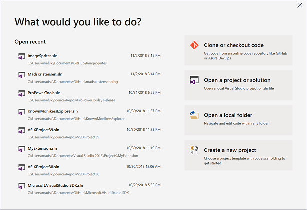

# What&#39;s new in Visual Studio 2019

**Updated for the [16.0 Preview 1 release](/visualstudio/releasenotes/vs2019-relnotes?context=visualstudio/default&contextView=vs-2017)**

Visual Studio 2019 contains general improvements and also new features that optimize developer productivity and team collaboration. Whether you are using Visual Studio for the first time or have been using it for years, you'll be able to take advantage of its features for all aspects of the development lifecycle&mdash;from simplified project creation, code health management, to team- and open-source collaborative workflows.

Here's a high-level recap of the changes that were made since the previous version, Visual Studio 2017:

* **[Individual productivity](#individual-productivity)**. Get to code quickly with the new start window, and search both the IDE and online for what you need.
* **[Team productivity](#team-productivity)**. Add text here.
* **[Discoverability](#discoverability)**. Add text here.

> [!NOTE]
> For a complete list of new features and functionality in Visual Studio 2019, see the [Preview release notes](/visualstudio/releasenotes/vs2019-preview-relnotes?context=visualstudio/default&contextView=vs-2017).

There are no breaking changes when it comes to the format of solution and projects files, so you should be able to open your existing code as expected. In fact, compatibility with the previous version of Visual Studio has been a top priority for Microsoft. This makes it perhaps the easiest upgrade for any major version of Visual Studio to date.

Given the focus on compatibility with previous versions, the extensibility APIs in Visual Studio is relatively unchanged. So, any extension that currently supports Visual Studio 2017 can be updated with minimal effort to support Visual Studio 2019. Many extensions are also available to users in Preview 1, to include Productivity Power Tools, Web Essentials, VsVim, and more.

Here's more detailed information about some of the most notable improvements and new features in Visual Studio 2019.

## Individual productivity

### New start window

The first thing you'll notice when you open Visual Studio 2019 is its new start window.

   

This new start window presents you with options to clone or checkout code, open a project or solution, open a local folder, or create a new project. Having these options presented in a simple dialog helps both beginners and advanced Visual Studio users get to their code fast and with confidence.

### New search feature

The search feature, formerly known as Quick Launch, has been completely rewritten to make it faster to find what you need in the IDE. It will even make it easy to search online in case you want to dive deeper&mdash;or search further if no results were found.

   

Whether you are looking for commands, settings, documentation, or other useful things, the new search feature makes it easier than ever to find what you're looking for. And, keyboard shortcuts are displayed next to search results for commands, so they can more easily be memorized for future use.

### Code clean-up enhancements

Add text here.

### Debugger improvements

Add text here.

## Team productivity

### Live Share

[Live Share](https://visualstudio.microsoft.com/services/live-share/)** is a new tool that allows you to share a codebase and its context with a teammate and get instant bi-directional collaboration directly from within Visual Studio. With Live Share, a teammate can read, navigate, edit, and debug a project that you've shared with them, and do so seamlessly and securely.

For more information, see the [Live Share FAQ](/visualstudio/liveshare/faq).

## Discoverability

### Improved DPI scaling

Add text here.

## Give us feedback

Why send feedback to the Visual Studio team? Because we take customer feedback seriously. It drives much of what we do.

* If you want to make a suggestion about how we can improve Visual Studio, see the [Suggest a feature](../ide/talk-to-us.md) page.

* If you experience a hang, crash, or other performance issue, you can easily share repro steps and supporting files with us by using the [**Report a Problem**](how-to-report-a-problem-with-visual-studio-2017.md) tool.

## See also

* [Visual Studio 2019 release notes](/visualstudio/releasenotes/vs2017-relnotes?context=visualstudio/default&contextView=vs-2017)
* [What's new in Visual C++](/cpp/top/what-s-new-for-visual-cpp-in-visual-studio)
* [What's new in C#](/dotnet/csharp/whats-new)
* [What's new for Team Foundation Server](/tfs/server/whats-new?view=vsts)
* [What's new in Visual Studio for Mac](https://visualstudio.microsoft.com/vs/visual-studio-mac/)
