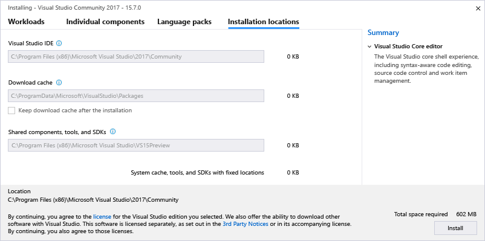

# Change the installation locations in Visual Studio 2017

**New in 15.7**: You can reduce the installation footprint on your system drive by moving download cache, shared components, SDKs, and tools to different drives.

Here's how.

1. When you install Visual Studio, choose the **Installation options** tab.

  

  > [!IMPORTANT]
  > If you pause the installation and later resume it, Visual Studio picks up where it left off. In other words, its installation progress applies to what's left to be downloaded and installed, and does not start from the previous count.

2. In the **Visual Studio** section, accept the default. This installs the core product and includes files that are specific to this version of Visual Studio.

 > [!IMPORTANT]
 > If your system drive is a solid-state drive (SSD), here's why we recommend that you accept the default location on your system drive: When you develop with Visual Studio, you read from and write to a lot of files, which increases the disk I/O activity.  It's best to choose your fastest drive to handle the load.

2. In the **Download cache** section, decide if you want to keep the download cache, and then check or uncheck the **Keep download cache** accordingly.   If you decide not to keep the download cache, the location is used only temporarily. As well, this action will not affect or delete files from previous installations. (To clean all installation packages, you must modify your previous installations separately.)

3. In the **Download cache** section, specify the drive where you want to store installation files and manifests.   For example, if you select the **Desktop development with C++** workload, the temporarily required size is 1.58 GB on your system drive, which is then freed as soon as the installation completes.

 > [!NOTE]
 > The files are first downloaded to a temp folder on your system drive and later deleted after Visual Studio verifies and then moves them to the download cache folder. If you select to keep your download cache to a different drive, Visual Studio still needs disk space that is equivalent to the size of the download cache on your system drive.
 > [!IMPORTANT]
 > The location is set with your first installation and cannot be changed later from the installer UI. Instead, you must [use command-line parameters](use-command-line-parameters-to-install-visual-studio.md) to move the download cache

4. In the **Shared components, SDKs, and tools** section, specify the drive where you want to store files that are shared by side-by-side Visual Studio installations. SDKs and tools that let the Visual Studio installer change its install location also stored in this directory.

 > [!NOTE]
 > There are some tools and SDKs that have different rules on where they can be are installed. These tools and SDKs will still be installed on your system drive even if you choose another location.)

## Get support

Sometimes, things can go wrong. If your Visual Studio installation fails, see the [Troubleshooting Visual Studio 2017 installation and upgrade issues](troubleshooting-installation-issues.md) page for help. You can also contact us for installation help by [live chat](https://www.visualstudio.com/vs/support/#talktous) (English only); for more information, see the [Visual Studio "Contact Us"  page](https://www.visualstudio.com/vs/support/#talktous).

Here are a few more support options:

* You can report product issues to us via the [Report a Problem](../ide/how-to-report-a-problem-with-visual-studio-2017.md) tool that appears both in the Visual Studio Installer and in the Visual Studio IDE.
* You can share a product suggestion with us on [UserVoice](https://visualstudio.uservoice.com/forums/121579).
* You can track product issues and find answers in the [Visual Studio Developer Community](https://developercommunity.visualstudio.com/).
* You can also engage with us and other Visual Studio developers through the [Visual Studio conversation in the Gitter community](https://gitter.im/Microsoft/VisualStudio). (This option requires a [GitHub](https://github.com/) account.)

## See also

* [Install Visual Studio 2017](install-visual-studio.md)
* [Update Visual Studio 2017](update-visual-studio.md)
* [Modify Visual Studio 2027](update-visual-studio.md)
* [Uninstall Visual Studio 2017](uninstall-visual-studio.md)
