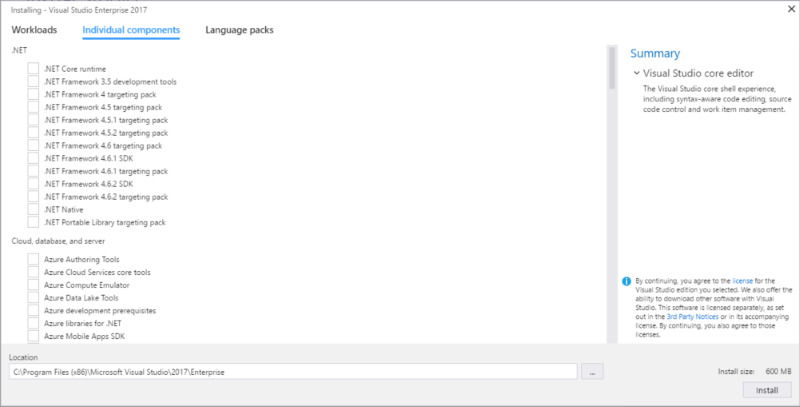

# Install Visual Studio 2017
Welcome to a new way to install Visual Studio! In our newest version, we've made it easier for you to select and install just the features you need. We've also reduced the minimum footprint of Visual Studio so that it installs more quickly and with less system impact than ever before.

Want to know more about what else is new? See our [release notes](https://www.visualstudio.com/news/releasenotes/vs2017-relnotes). And for more in-depth info about how we've redesigned the installation experience, see our blog posts, "[Faster and leaner Visual Studio installer](https://blogs.msdn.microsoft.com/visualstudio/2016/04/01/faster-leaner-visual-studio-installer/)" and "[Anatomy of a low-impact Visual Studio installation](https://blogs.msdn.microsoft.com/visualstudio/2016/04/25/anatomy-of-a-low-impact-visual-studio-install/)."  

Ready to install? We'll walk you through it, step-by-step.

## Check system requirements
Before you begin, check the [system requirements](https://www.visualstudio.com/productinfo/vs2017-system-requirements-vs) to make sure that your computer is ready to install Visual Studio 2017.

## Download Visual Studio
Next, download the Visual Studio bootstrapper file. To do so, click the following button, select the edition of Visual Studio 2017 that you want, click **Save**, and then click **Open folder**.

 > [!div class="button"]
 > [Download Visual Studio 2017](https://aka.ms/vsdownload?utm_source=mscom&utm_campaign=msdocs)

## Install the installer  
Next, run the bootstrapper file to install the Visual Studio Installer. This new lightweight installer includes everything you need to both install and customize Visual Studio 2017.

1.  From your **Downloads** folder, double-click the bootstrapper that matches or is similar to one of the following files:

  * **vs_enterprise.exe** for Visual Studio Enterprise
  * **vs_professional.exe** for Visual Studio Professional
  * **vs_community.exe** for Visual Studio Community    

  If you receive a User Account Control notice, click **Yes**.  

2.  We'll ask you to acknowledge the Microsoft [License Terms](https://www.visualstudio.com/license-terms/) and the Microsoft [Privacy Statement](https://go.microsoft.com/fwlink/?LinkID=824704). Click **Continue**.  

     

For a demo of how to download the Visual Studio bootstrapper file and then install the Visual Studio Installer, see the following video:   

<iframe style="position: absolute;top: 0;left: 0;right: 0;bottom: 0;" width="100%" height="100%" src="https://mva.microsoft.com/en-US/training-courses-embed/getting-started-with-visual-studio-2017-17798/Download-the-Visual-Studio-Installer-GgrESHD6D_3311787171" frameborder="0" allowfullscreen></iframe>

## Install workloads  
 After the installer is installed, you can use it to customize your installation by picking the feature sets—or workloads—that you want. Here's how.

1.  Find the workload you want in the **Installing Visual Studio** screen.

  

     For example, choose the .NET desktop development workload. It comes with the default core editor, which includes basic code editing support for over 20 languages, the ability to open and edit code from any folder without requiring a project, and integrated source code control.  

2.  After you select the workload(s) you want, click **Install**.  

    Next, status screens appear that show the progress of your Visual Studio installation.

3.  After the new workloads and components are installed, click **Launch**.

For a demo of how to install workloads in Visual Studio, see the following video:   

<iframe style="position: absolute;top: 0;left: 0;right: 0;bottom: 0;" width="100%" height="100%" src="https://mva.microsoft.com/en-US/training-courses-embed/getting-started-with-visual-studio-2017-17798/Install-Workloads-in-Visual-Studio-2017-jHE19HD6D_1611787171" frameborder="0" allowfullscreen></iframe>

## Install individual components

If you don't want to use the handy Workloads feature to customize your Visual Studio installation, you can do so by installing individual components instead. To do so, click the **Individual components** option from the Visual Studio Installer, select what you want, and then follow the prompts.

  

For a demo of how to install components in Visual Studio, see the following video:   

<iframe style="position: absolute;top: 0;left: 0;right: 0;bottom: 0;" width="100%" height="100%" src="https://mva.microsoft.com/en-US/training-courses-embed/getting-started-with-visual-studio-2017-17798/Install-Components-in-Visual-Studio-2017-ZMfaVID6D_7411787171" frameborder="0" allowfullscreen></iframe>

## Install language packs

By default, the installer program tries to match the language of the operating system when it runs for the first time. To install Visual Studio 2017 in a language of your choosing, click the **Language packs** option from the Visual Studio Installer, and follow the prompts.

  

For a demo of how to install language packs in Visual Studio, see the following video:     

<iframe style="position: absolute;top: 0;left: 0;right: 0;bottom: 0;" width="100%" height="100%" src="https://mva.microsoft.com/en-US/training-courses-embed/getting-started-with-visual-studio-2017-17798/Install-Language-Packs-in-Visual-Studio-2017-ByT7yID6D_9011787171" frameborder="0" allowfullscreen></iframe>

### Change the installer language from the command line

Another way that you can change the default language is by running the installer from the command line. For example, you can force the installer to run in English by using the following command: `vs_installer.exe --locale en-US`. The installer will remember this setting when it is run the next time. The installer supports the following language tokens: zh-cn, zh-tw, cs-cz, en-us, es-es, fr-fr, de-de, it-it, ja-jp, ko-kr, pl-pl, pt-br, ru-ru, and tr-tr.

## Get support
Sometimes, things can go wrong. If your Visual Studio installation fails, see the [Troubleshooting Visual Studio 2017 installation and upgrade issues](troubleshooting-installation-issues.md) page for troubleshooting tips.

## See also  
* [Modify Visual Studio 2017](modify-visual-studio.md)
* [Update Visual Studio 2017](update-visual-studio.md)
* [Uninstall Visual Studio 2017](uninstall-visual-studio.md)
* [Visual Studio 2017 administrator guide](visual-studio-administrator-guide.md)
* [How to report a problem with Visual Studio 2017](../ide/how-to-report-a-problem-with-visual-studio-2017.md)
