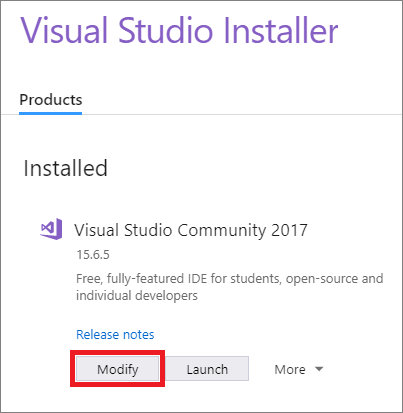
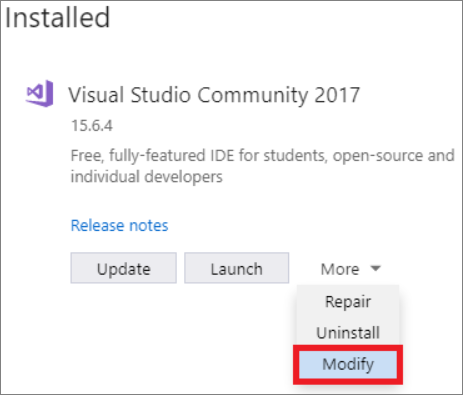
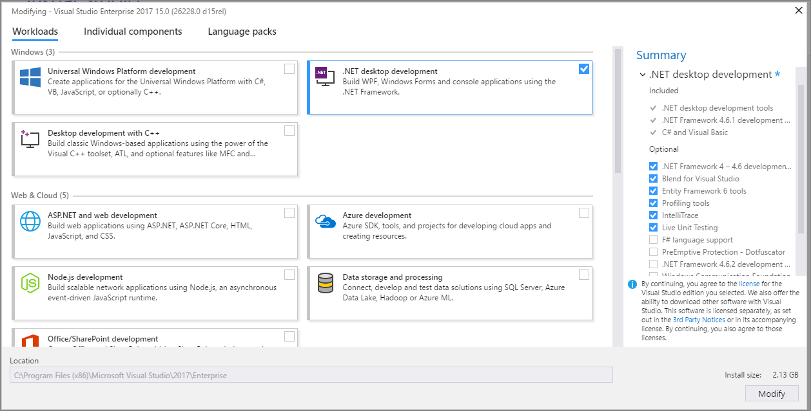

# Modify Visual Studio 2017 by adding or removing workloads and components

Not only have we made is easier for you to personalize Visual Studio to match the tasks you want to accomplish, we've also made it easier to customize Visual Studio, too. To do so, start the new Visual Studio Installer and make the changes you want.

Here's how.

## Modify workloads

 Workloads contain the features you need for the programming language or platform that you are using. Use workloads to modify Visual Studio so that it supports the work you want to do, when you want to do it.

>[!IMPORTANT]
>To install, update, or modify Visual Studio, you must log on with an account that has administrative permissions. For more information, see [User Permissions and Visual Studio](../ide/user-permissions-and-visual-studio.md).

1. Find the Visual Studio Installer on your computer.  

     For example, on a computer running Windows 10, select **Start**, and then scroll to the letter **V**, where it's listed as **Visual Studio Installer**.  

     

     >[!NOTE]
     On some computers, the Visual Studio Installer might be listed under the letter **"M"** as the **Microsoft Visual Studio Installer**.   Alternatively, you can find the Visual Studio Installer in the following location: `C:\Program Files (x86)\Microsoft Visual Studio\Installer\vs_installer.exe`

2. Click or tap to start the installer, and then choose **Modify**.  

     

     If you have an update pending, then the Modify button is in a different place. Click **More**, and then choose **Modify**.   

     

3. From the **Workloads** screen, select or deselect the workloads that you want to install or uninstall.

    

4. Choose **Modify** again.  

5. After the new workloads and components are installed, choose **Launch**.

## Modify individual components

If you don't want to use the handy Workloads feature to customize your Visual Studio installation, choose the **Individual Components** option from the Visual Studio Installer, select what you want and then follow the prompts.

## Get support

Sometimes, things can go wrong. If your Visual Studio installation fails, see the [Troubleshooting Visual Studio 2017 installation and upgrade issues](troubleshooting-installation-issues.md) page for help. You can also contact us for installation help by [live chat](https://www.visualstudio.com/vs/support/#talktous) (English only); for more information, see the [Visual Studio "Contact Us"  page](https://www.visualstudio.com/vs/support/#talktous).

Here are a few more support options:

* You can report product issues to us via the [Report a Problem](../ide/how-to-report-a-problem-with-visual-studio-2017.md) tool that appears both in the Visual Studio Installer and in the Visual Studio IDE.
* You can share a product suggestion with us on [UserVoice](https://visualstudio.uservoice.com/forums/121579).
* You can track product issues and find answers in the [Visual Studio Developer Community](https://developercommunity.visualstudio.com/).
* You can also engage with us and other Visual Studio developers through the [Visual Studio conversation in the Gitter community](https://gitter.im/Microsoft/VisualStudio). (This option requires a [GitHub](https://github.com/) account.)

## See also

* [Install Visual Studio 2017](install-visual-studio.md)
* [Update Visual Studio 2017](update-visual-studio.md)
* [Uninstall Visual Studio 2017](uninstall-visual-studio.md)
