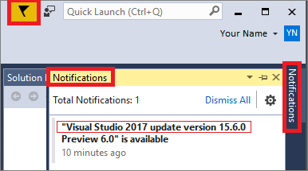
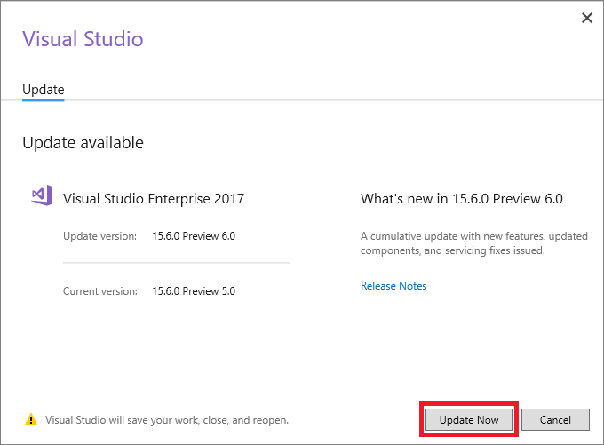
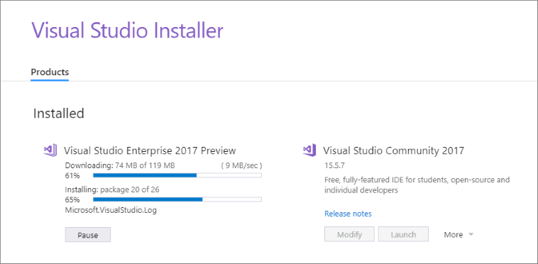
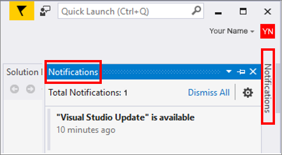

# Update Visual Studio 2017 to the most recent release

We encourage you to update most [recent version](/visualstudio/releasenotes/vs2017-relnotes) of Visual Studio 2017 so that you always get the latest features, fixes, and improvements.

And if you'd like to try anything out before we release it, consider downloading the [preview release](/visualstudio/releasenotes/vs2017-preview-relnotes) of the next version, too.

>[!IMPORTANT]
>To install, update, or modify Visual Studio, you must log on with an account that has administrative permissions. For more information, see [User Permissions and Visual Studio](../ide/user-permissions-and-visual-studio.md).

## Update Visual Studio 2017 version 15.6 or later

New with version 15.6: We've streamlined the installation and update experience to make it easier to use directly from within the IDE. Here's how.

### Use the Notifications hub

1. When there are updates, there's a corresponding notification flag in Visual Studio. Choose the notification flag to open the **Notifications** hub, and then choose the update that you want to install.

  

2. When the **Update** dialog box opens, choose **Update Now**.

    

     If a User Access Control dialog box opens, choose **Yes**. Next, a "Please wait" dialog might open for a moment, and then the Visual Studio Installer opens to start the update.

     

     Your update continues. Then, when it's complete, Visual Studio restarts.

### Use the IDE

1. From the menu bar in Visual Studio, choose **Help** > **Check for Updates**.

     

2. When the **Update** dialog box opens, choose **Update Now**. The update proceeds as described in the previous section, and then Visual Studio restarts after the update completes successfully.

## Use the Visual Studio Installer

1. Open the installer. You might need to update the installer before continuing. If this is the case, you are prompted to do so.

  > [!NOTE]
  > On a computer running Windows 10, you can find the installer under the letter **V** as the **Visual Studio Installer**, or under the letter **M** as the **Microsoft Visual Studio Installer**.

2. On the **Product** page in the installer, look for the edition of Visual Studio that you have installed.

3. If an update is available, you see an **Update** button. (It might take a few seconds for the installer to determine whether an update is available.)

  Choose the **Update** button to install the updates.

     

## Update Visual Studio 2017 version 15.5 or earlier

If you are using an earlier version of Visual Studio 2017, here's how to update to the newest version.

### Update by using the Notifications hub

1. When there are updates, there's a corresponding notification flag in Visual Studio.

  

  Choose the notification flag to open the **Notifications** hub.

  

2. Choose **"Visual Studio Update" is available**, which opens the **Extensions and Updates** dialog box.

  

3. In the **Extensions and Updates** dialog box, choose the **Update** button.

  

#### More about Visual Studio notifications

Visual Studio notifies you when an update is available for Visual Studio itself or for any components, and also when certain events occur in the Visual Studio environment.

* When the notification flag is yellow, there is a Visual Studio product update available for you to install.
* When the notification flag is red, there is a problem with your license.
* When the notification flag is black, there are optional or informational messages to review.

Choose the notifications flag to open the **Notifications** hub and then choose the notifications that you want to act on. Or, choose to ignore or dismiss a notification.

 

If you choose to ignore a notification, Visual Studio stops showing it. If you want to reset the list of ignored notifications, choose the **Settings** button in the Notifications hub.

   

### Update by using the Visual Studio Installer

1. Open the installer. You might need to update the installer before continuing. If this is the case, you are prompted to do so.

  > [!NOTE]
  > On a computer running Windows 10, you can find the installer under the letter **V** as the **Visual Studio Installer**, or under the letter **M** as the **Microsoft Visual Studio Installer**.

2. On the **Product** page in the installer, look for the edition of Visual Studio that you have installed.

3. If an update is available, you see an **Update** button. (It might take a few seconds for the installer to determine whether an update is available.)

  Choose the **Update** button to install the updates.

     

## Get support

Sometimes, things can go wrong. If your Visual Studio installation fails, see the [Troubleshooting Visual Studio 2017 installation and upgrade issues](troubleshooting-installation-issues.md) page. If none of the troubleshooting steps help, you can contact us by live chat for installation assistance (English only). For details, see the [Visual Studio support page](https://www.visualstudio.com/vs/support/#talktous).

Here are a few more support options:

* You can report product issues to us via the [Report a Problem](../ide/how-to-report-a-problem-with-visual-studio-2017.md) tool that appears both in the Visual Studio Installer and in the Visual Studio IDE.
* You can share a product suggestion with us on [UserVoice](https://visualstudio.uservoice.com/forums/121579).
* You can track product issues in the [Visual Studio Developer Community](https://developercommunity.visualstudio.com/), and ask questions and find answers.
* You can also engage with us and other Visual Studio developers through our [Visual Studio conversation in the Gitter community](https://gitter.im/Microsoft/VisualStudio). (This option requires a [GitHub](https://github.com/) account.)

## See also

* [Install Visual Studio 2017](install-visual-studio.md)
* [Modify Visual Studio 2017](modify-visual-studio.md)
* [Uninstall Visual Studio 2017](uninstall-visual-studio.md)
* [Visual Studio Administrators Guide](visual-studio-administrator-guide.md)
