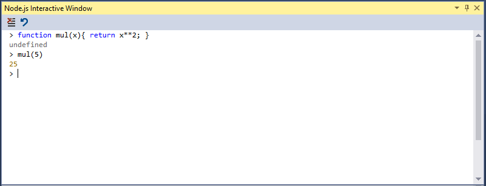

# Work with the Node.js interactive window

Node.js Tools for Visual Studio includes an interactive window for the installed Node.js runtime. This allows you
to enter JavaScript code and see the results immediately, as well as execute npm commands to interact with the current 
project. The interactive window is also known as a REPL (**R**ead/**E**valuate/**P**rint **L**oop).

## Open the interactive window

The default short-cut keys for the Node.js interactive window are [CTRL] + K, N.

You can also open the interactive window by right-clicking the Node.js project node in Solution Explorer and selecting **Open Node.js Interactive Window**.

Or, you can open the window from the toolbar by choosing **View** > **Windows** > **Node.js Interactive Window**.

## Use the REPL

Once opened, you can enter commands.

The interactive window has several built-in commands, which start with a dot prefix to distinguish them from any JavaScript function you declare. The following commands are supported:

### .cls, .clear
Clears the contents of the editor window, leaving history and execution context intact.

### .help
Display help on specified command, or all available commands and key bindings if none specified.

### .info
Show information about the current used Node.js executable.

### .npm
Executes npm command. If solution contains multiple projects, specify target project using `.npm [ProjectName] <npm arguments>`

### .reset
Reset the execution environment to the initial state, keep history.

### .save
 Save the current REPL session to a file.