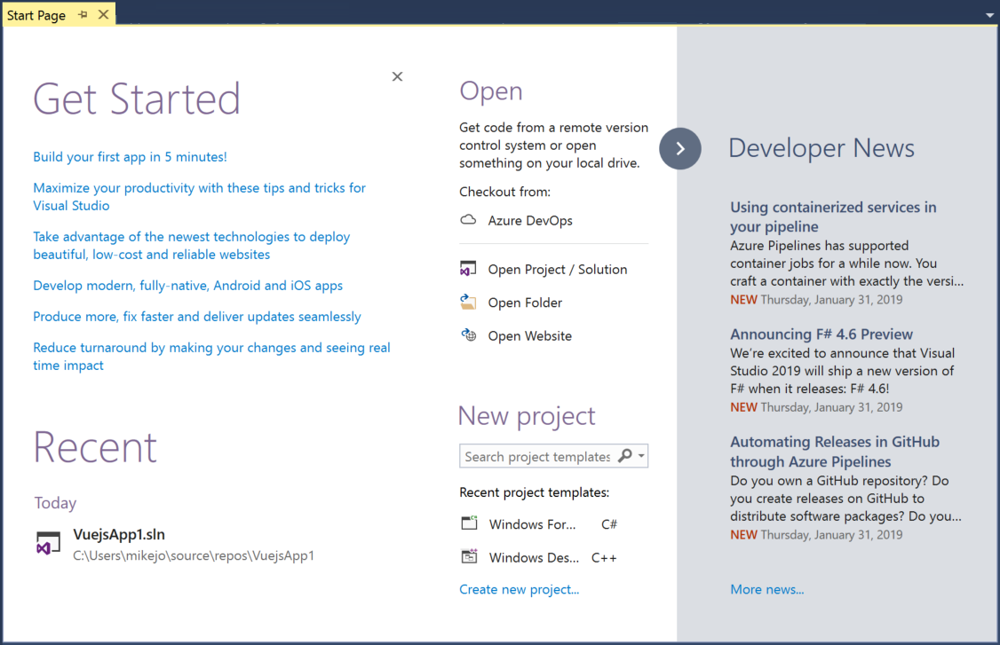
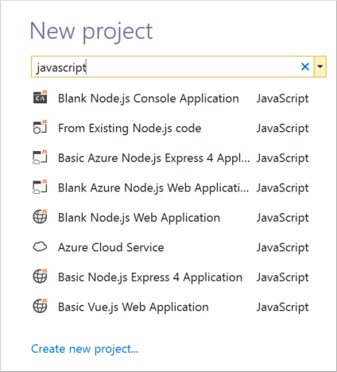
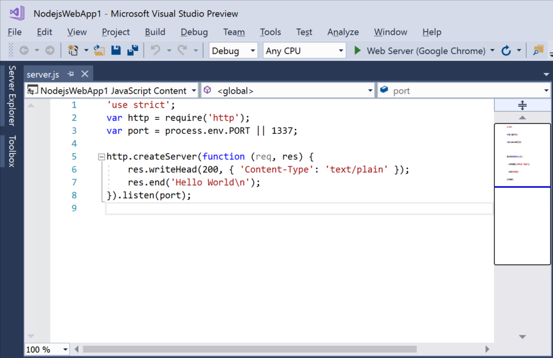

# First look at the Visual Studio IDE

In this 5-10 minute introduction to the Visual Studio integrated development environment (IDE), we'll take a tour of some of the windows, menus, and other UI features.

If you haven't already installed Visual Studio, go to the [Visual Studio downloads](https://visualstudio.microsoft.com/downloads/?utm_medium=microsoft&utm_source=docs.microsoft.com&utm_campaign=inline+link&utm_content=download+vs2017) page to install it for free.

## Start Page

The first thing you'll see after you launch Visual Studio is most likely the **Start Page**. The **Start Page** is designed as a "hub" to help you find the commands and project files you need faster. The **Recent** section displays projects and folders you've worked on recently. Under **New project**, you can click a link to bring up the **New Project** dialog box, or under **Open**, you can open an existing code project or folder. On the right is a feed of the latest developer news.

If you close the **Start Page** and want to see it again, you can reopen it from the **File** menu.

## Create a project

To continue exploring Visual Studio's features, let's create a new project.

1. On the **Start Page**, in the search box under **New project**, type in **javascript** to filter the list of project types to those that contain "javascript" in their name or language type.

   

   Visual Studio provides various kinds of project templates that help you get started coding quickly. Choose a **Blank Node.js Web Application** project template. (Alternatively, if you're a TypeScript developer, feel free to create a project in that language. The UI we'll be looking at is similar for all programming languages.)

1. In the **New Project** dialog box that appears, accept the default project name and choose **OK**.

   The project is created and a file named *server.cs* opens in the **Editor** window. The **Editor** shows the contents of files, and is where you'll do most of your coding work in Visual Studio.

   

## Solution Explorer

**Solution Explorer**, which is typically on the right-hand side of Visual Studio, shows you a graphical representation of the hierarchy of files and folders in your project, solution, or code folder. You can browse the hierarchy and navigate to a file in **Solution Explorer**.

## Menus

The menu bar along the top of Visual Studio groups commands into categories. For example, the **Project** menu contains commands related to the project you're working in. On the **Tools** menu, you can customize how Visual Studio behaves by selecting **Options**, or add features to your installation by selecting **Get Tools and Features**.

Let's open the **Error List** window by choosing the **View** menu, and then **Error List**.

## Error List

The **Error List** shows you errors, warning, and messages regarding the current state of your code. If there are any errors (such as a missing brace or semicolon) in your file, or anywhere in your project, they're listed here.

## Output window

The **Output** window shows you output messages from building your project and from your source control provider.

Let's build the project to see some build output. From the **Build** menu, choose **Build Solution**. The **Output** window automatically obtains focus and display a successful build message.

## Quick Launch

The **Quick Launch** box is a quick and easy way to do pretty much anything in Visual Studio. You can enter some text related to what you want to do, and it'll show you a list of options that pertain to the text. For example, imagine you want to increase the build output's verbosity to display additional details about what exactly build is doing. Here's how you might do that:

1. Type **verbosity** into the **Quick Launch** box. From the displayed results, choose **Projects and Solutions --> Build and Run** under the **Options** category.

   

   The **Options** dialog box opens to the **Build and Run** options page.

1. Under **MSBuild project build output verbosity**, choose **Normal**, and then click **OK**.

1. Build the project again by right-clicking on the **NodejsWebApp1** project in **Solution Explorer** and choosing **Rebuild** from the context menu.

   This time the **Output** window shows more verbose logging from the build process, including which files were copied where.

   

## Send Feedback menu

Should you encounter any problems while you're using Visual Studio, or if you have suggestions for how to improve the product, you can use the **Send Feedback** menu at the top of the Visual Studio window, next to the **Quick Launch** box.

## Next steps

We've looked at just a few of the features of Visual Studio to get acquainted with the user interface. To explore further:

> [!div class="nextstepaction"]
> [Learn about the code editor](write-and-edit-code.md)

> [!div class="nextstepaction"]
> [Learn about projects and solutions](../get-started/tutorial-projects-solutions.md)

## See also

- [Overview of the Visual Studio IDE](../get-started/visual-studio-ide.md)
- [More features of Visual Studio 2017](../ide/advanced-feature-overview.md)
- [Change theme and font colors](../ide/quickstart-personalize-the-ide.md)
