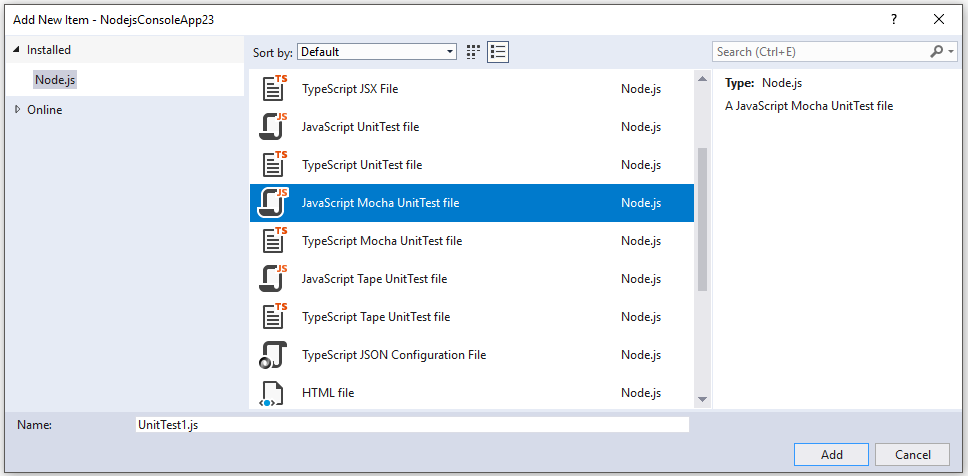
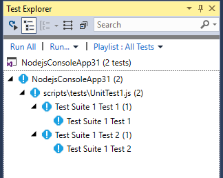

# Unit testing in Node.js

The Node.js Tools For Visual Studio allows you to write and run unit tests using some of the more popular
frameworks without the need to switch to a command prompt.

The supported frameworks are:
* Mocha ([mochajs.org](http://mochajs.org/))
* Jasmine ([Jasmine.github.io](https://jasmine.github.io/))
* Tape ([github.com/substack/tape](https://github.com/substack/tape))
* Export Runner (framework is specific to Node.js Tools for Visual Studio)

> [!Warning]
> An issue in Tape currently prevents Tape tests from running.
> If [this PR](https://github.com/substack/tape/pull/361) is merged, the issue should be resolved.

If your favorite framework is not supported, see [Add support for a unit test framework](#addingFramework) for information on adding support. 

## Write unit tests

Before adding unit tests to your project, make sure the framework you plan to use is installed locally in your project. This is easiest using the [npm install window](npm-package-management.md#npmInstallWindow).

The preferred way to add unit tests to your project is by creating a *tests* folder in
your project, and setting that as the test root in project properties. You also need
to select the test framework you want to use.


You can add simple blank tests to your project, using the Add New Item dialog, both JavaScript and TypeScript are supported in the same project.



For a Mocha unit test, use the following code:

```javascript
var assert = require('assert');

describe('Test Suite 1', function() {
    it('Test 1', function() {
        assert.ok(true, "This shouldn't fail");
    })

    it('Test 2', function() {
        assert.ok(1 === 1, "This shouldn't fail");
        assert.ok(false, "This should fail");
    })
})
```

You must also set the **Test Framework** property to **Mocha**.


After opening Test Explorer (from the **Test** > **Windows** > **Test Explorer** menu), tests are discovered and
displayed. If tests are not showing initially, then rebuild the project to refresh the list.



> [!NOTE]
> Do not use the `outdir` or `outfile` option in *tsconfig.json*, because Test Explorer won't be able to find your unit tests in TypeScript files.

## Run tests

You can run tests in Visual Studio 2017 or from the command line.

### Run tests in Visual Studio 2017

You can run the tests by clicking the **Run All** link in the Test Explorer window. Or, you can run tests by selecting one or more tests or groups, right-clicking, and selecting **Run Selected Tests** from the shorcut menu. Tests run in the background, and Test Explorer automatically updates and shows the results. Further, you can also debug selected tests by selecting **Debug Selected Tests**.

> [!NOTE]
> We don't currently support profiling tests, or code coverage.

### Run tests from the command line

You can run the tests from the Developer Command Prompt for VS 2017 using the following command:

```
vstest.console.exe <path to project file>\NodejsConsoleApp23.njsproj /TestAdapterPath:<VisualStudioFolder>\Common7\IDE\Extensions\Microsoft\NodeJsTools\TestAdapter
```

This should show output similar to:

```
Microsoft (R) Test Execution Command Line Tool Version 15.5.0
Copyright (c) Microsoft Corporation.  All rights reserved.

Starting test execution, please wait...
Processing: NodejsConsoleApp23\NodejsConsoleApp23\UnitTest1.js
  Creating TestCase:NodejsConsoleApp23\NodejsConsoleApp23\UnitTest1.js::Test Suite 1 Test 1::mocha
  Creating TestCase:NodejsConsoleApp23\NodejsConsoleApp23\UnitTest1.js::Test Suite 1 Test 2::mocha
Processing finished for framework of Mocha
Passed   Test Suite 1 Test 1
Standard Output Messages:
 Using default Mocha settings
 1..2
 ok 1 Test Suite 1 Test 1

Failed   Test Suite 1 Test 2
Standard Output Messages:
 not ok 1 Test Suite 1 Test 2
   AssertionError [ERR_ASSERTION]: This should fail
       at Context.<anonymous> (NodejsConsoleApp23\NodejsConsoleApp23\UnitTest1.js:10:16)

Total tests: 2. Passed: 1. Failed: 1. Skipped: 0.
Test Run Failed.
Test execution time: 1.5731 Seconds
```

> [!NOTE]
> If you get an error indicating that *vstest.console.exe* cannot be found, make sure you've opened the Developer Command Prompt and not a regular command prompt. 

## <a name="addingFramework"></a>Add support for a unit test framework

You can extend the support for additional test frameworks by implementing the discovery and execution logic using JavaScript. In the following location:
 
*<VisualStudioFolder>\Common7\IDE\Extensions\Microsoft\NodeJsTools\TestAdapter\TestFrameworks*

You see folders for the supported test frameworks. Under each folder, a JavaScript file named after the folder contains two exported functions:

* `find_tests`
* `run_tests`

For examples of `find_tests` and `run_tests` implementations, see the implementation of Mocha.

The name of the folder must match the name of the *.js* file. Discovery of test frameworks occurs at Visual Studio start. If a framework is added while Visual Studio is running, restart Visual Studio to detect the framework.

Make sure to set the **TestFramework** property on your test file(s) to match the name of the subfolder under TestFrameworks.