# Map dependencies across your solutions
When you want to understand dependencies across your code, visualize them by creating code maps. This helps you see how the code fits together without reading through files and lines of code.  
  
   
  
 **Here are some videos**:  
  
-   [Understand your code dependencies through visualization](http://go.microsoft.com/fwlink/?LinkID=252065)  
  
-   [Visualize the impact of a change](http://go.microsoft.com/fwlink/?LinkID=252068)  
  
-   [Understanding complex code with code maps](http://go.microsoft.com/fwlink/?LinkID=259869)  
  
##   Get started with code maps  
 **To use code maps you'll need either**:  
  
-   Visual Studio Enterprise: Create code maps from the code editor, Solution Explorer, Class View, or Object Browser.  
  
-   Visual Studio Professional: Open code maps, make limited edits, and navigate code.  
  
> [!WARNING]
>  Before you share maps created in Visual Studio Enterprise with others who use Visual Studio Professional, make sure that all the items on the map (such as hidden items, expanded groups, and cross-group links) are made visible.  
  
 **You can map dependencies for code in these languages**:  
  
-   Visual C# .NET or Visual Basic .NET in a solution or assemblies (.dll or .exe)  
  
-   Native or managed C or C++ code in Visual C++ projects, header files (.h or `#include`), or binaries  
  
-   X++ projects and assemblies made from .NET modules for Microsoft Dynamics AX  
  
 **Note:** For projects other than C# or Visual Basic .NET, there are fewer options for starting a code map or adding items to an existing code map. For example, you cannot right-click an object in the text editor of a C++ project and add it to a code map. However, you can drag and drop individual code elements or files from Solution Explorer, Class View, and Object Browser.  
  
#### To see the overall dependencies across your solution  
  
1.  Open the **Architecture** menu.  
  
2.  If you just opened the solution and haven't yet built it, or if your code has changed since the last time you built it, choose **Generate Code Map for Solution**.  
  
3.  If your code hasn't changed since the last time you built it, choose **Generate Code Map for Solution Without Building** to get faster performance when creating the map.  
  
4.  [See overall dependencies](#SeeOverviewSource) to understand how you can use code maps to view the overall dependencies across your solution.  
  
#### To see specific dependencies within your solution  
  
1.  With your solution loaded, open **Solution Explorer**.  
  
2.  Select all the projects, assembly references, folders, files, types, or members that you want to map.  
  
3.  On the **Solution Explorer** toolbar, choose **Show on Code Map**. Or open the shortcut menu and choose **Show on Code Map**. You can also drag items from Class View or Object Browser into a new or an existing code map.  
  
4.  [See specific dependencies](#SeeSpecificSource) to understand how you can use code maps to view specific dependencies within your solution.  
  
###   To add a new empty code map to your solution  
  
1.  In **Solution Explorer**, open the shortcut menu for your top-level solution node. Choose **Add** then choose **New Item**.  
  
2.  Under **Installed**, choose **General**.  
  
3.  In the right pane, choose **Directed Graph Document** and then choose **Add**.  
  
     You now have a blank map, which appears in your solution's **Solution Items** folder.  
  
#### To create a new empty code map without adding it to your solution  
  
1.  Open the **Architecture** menu and choose **New Code Map**.  
  
     \- or -  
  
2.  Open the **File** menu and choose **New** then choose **File**.  
  
3.  Under **Installed**, choose **General**.  
  
4.  In the right pane, choose **Directed Graph Document** and then choose **Open**.  
  
     You now have a blank map, which does not appear in your solution's folders.  
  
##   See overall dependencies  
  
###   See dependencies across your solution  
  
1.  On the **Architecture** menu, choose **Generate Code Map for Solution**.  
  
       
  
     You get a map that shows the top-level assemblies and aggregated links between them. The wider the aggregate link, the more dependencies it represents.  
  
2.  Use the **Legend** button on the code map toolbar to show or hide the list of project type icons (such as Test, Web, and Phone Project), code items (such as Classes, Methods, and Properties), and relation types (such as Inherits From, Implements, and Calls).  
  
     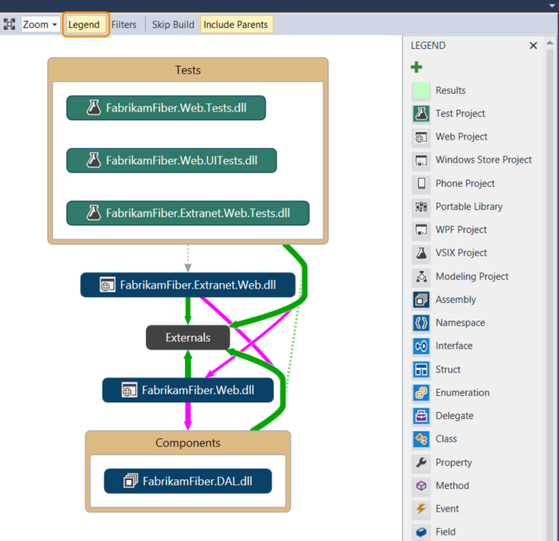  
  
     This example solution contains Solution Folders (**Tests** and **Components**), Test Projects, Web Projects, and assemblies. By default, all containment relationships appear as *groups*, which you can expand and collapse. The **Externals** group contains anything outside your solution, including platform dependencies. External assemblies show only those items that are used. By default, system base types are hidden on the map to reduce clutter.  
  
3.  To drill down into the map, expand the groups that represent projects and assemblies. You can expand everything by pressing **CTRL+A** to select all the nodes and then choosing **Group**, **Expand** from the shortcut menu.  
  
     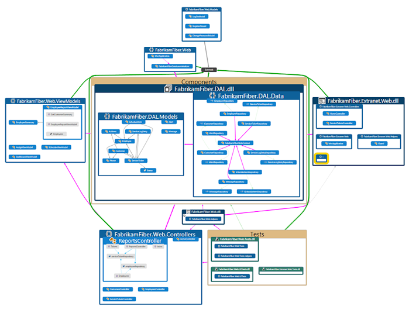  
  
4.  However, this may not be useful for a large solution. In fact, for complex solutions, memory limitations may prevent you from expanding all the groups. Instead, to see inside an individual node, expand it. Move your mouse pointer on top of the node and then click the chevron (down arrow) when it appears.  
  
       
  
     Or use the keyboard by selecting the item then pressing the plus key (**+**). To explore deeper levels of code, do the same for namespaces, types, and members.  
  
    > [!TIP]
    >  For more details of working with code maps using the mouse, keyboard, and touch, see [Browse and rearrange code maps](../modeling/browse-and-rearrange-code-maps.md).  
  
5.  To simplify the map and focus on individual parts, choose **Filters** on the code map toolbar and select just the types of nodes and links you are interested in. For example, you can hide all the Solution Folder and Assembly containers.  
  
     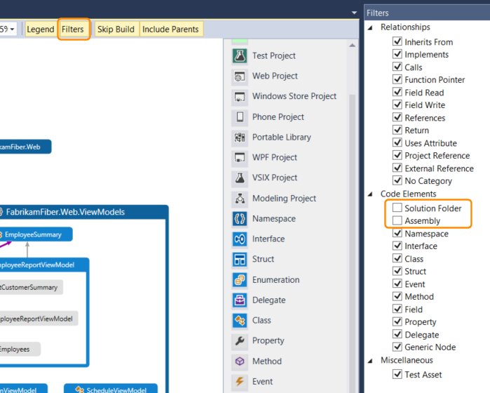  
  
     You can also simplify the map by hiding or removing individual groups and items from the map, without affecting the underlying solution code.  
  
6.  To see the relationships between items, select them in the map. The colors of the links indicate the types of relationship, as shown in the **Legend** pane.  
  
       
  
     In this example, the purple links are calls, the dotted links are references, and the light blue links are field access. Green links can be inheritance, or they may be *aggregate links* that indicate more than one type of relationship (or *category*).  
  
    > [!TIP]
    >  If you see a green link, it might not mean there's just an inheritance relationship. There might also be method calls, but these are hidden by the inheritance relationship. To see specific types of links, use the checkboxes in the **Filters** pane to hide the types you aren't interested in.  
  
7.  To get more information about an item or link, move the pointer on top of it until a tooltip appears. This shows details of a code element or the categories that a link represents.  
  
     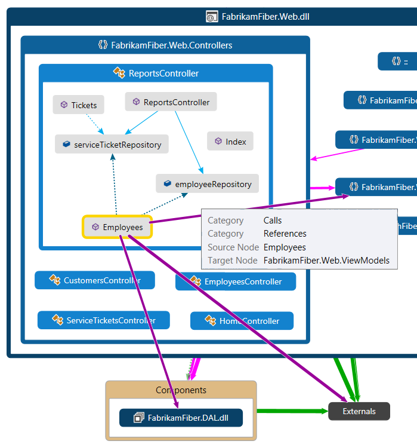  
  
8.  To examine items and dependencies represented by an aggregate link, first select the link and then open its shortcut menu. Choose **Show Contributing Links** (or **Show Contributing Links on New Code Map**). This expands the groups at both ends of the link and shows only those items and dependencies that participate in the link.  
  
9. To focus in on specific parts of the map, you can continue to remove items you aren't interested in. For example, to drill into class and member view, simply filter all the namespace nodes in the **Filters** pane.  
  
     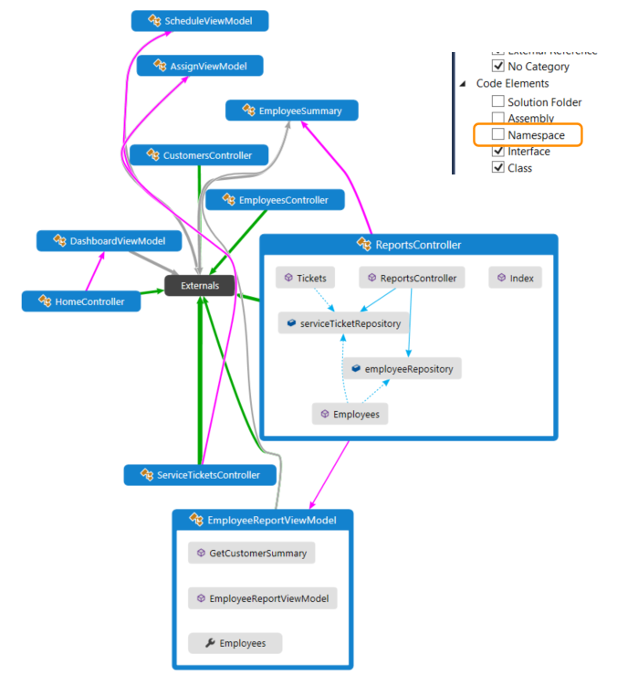  
  
10. Another way to focus in on a complex solution map is to generate a new map containing selected items from an existing map. Hold **CTRL** while selecting the items you want to focus on, open the shortcut menu, and choose **New Graph from Selection**.  
  
       
  
11. The containing context is carried over to the new map. Hide Solution Folders and any other containers you don't want to see using the **Filters** pane.  
  
     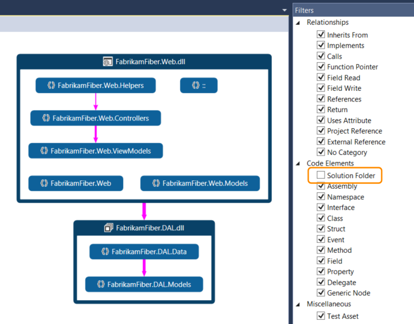  
  
12. Expand the groups and select items in the map to view the relationships.  
  
     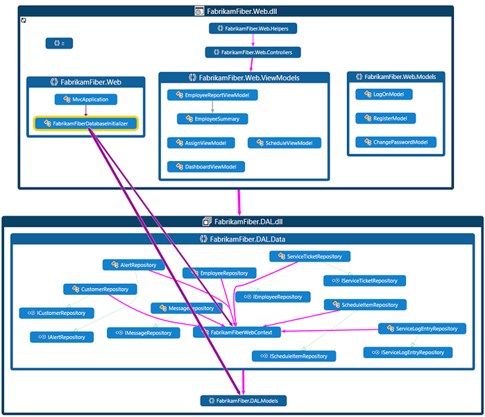  
  
 See also:  
  
-   [Browse and rearrange code maps](../modeling/browse-and-rearrange-code-maps.md)  
  
-   [Customize code maps by editing the DGML files](../modeling/customize-code-maps-by-editing-the-dgml-files.md)  
  
-   Find potential problems in your code by [running an analyzer](../modeling/find-potential-problems-using-code-map-analyzers.md).  
  
###   See dependencies across assemblies or binaries  
  
1.  [Create an empty code map](#GetStarted), or open an existing code map (.dgml file).  
  
2.  Drag the assemblies or binaries you want to map from outside Visual Studio onto the map. For example, drag assemblies or binaries from Windows Explorer or File Explorer.  
  
> [!NOTE]
>  You can drag assemblies or binaries from Windows Explorer or File Explorer only if you are running it and Visual Studio at the same User Access Control (UAC) permissions level. For example, if UAC is turned on and you are running Visual Studio as Administrator, Windows Explorer or File Explorer will block the dragging operation. To work around this, make sure that both are running with the same permission level, or turn UAC off.  
  
##   See specific dependencies  
 For example, suppose you have a code review to perform in some files with pending changes. To see the dependencies in those changes, you can create a code map from those files.  
  
   
  
### See specific dependencies in your solution  
  
1.  Open **Solution Explorer**. Select the projects, assembly references, folders, files, types, and members that interest you. To find items that have dependencies on types or members, open the type or member's shortcut menu from **Solution Explorer**. Choose the dependency type, and then select the results.  
  
2.  Map your items and their members. On the **Solution Explorer** toolbar click **Show on Code Map**.  
  
     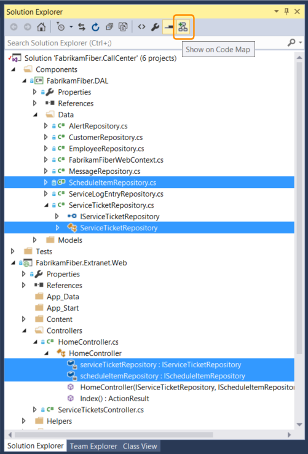  
  
3.  The map shows the selected items within their containing assemblies.  
  
     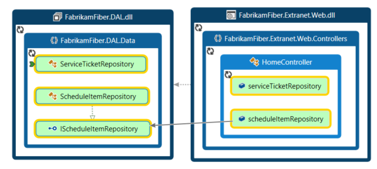  
  
     You can also drag items from Solution Explorer, Class View, or Object Browser to a blank or an existing code map. To create a blank map, see [Create an empty code map](#GetStarted). To include the parent hierarchy for your items, press and hold the **CTRL** key while you drag items, or use the **Include Parents** button on the code map toolbar to specify the default action.  
  
    > [!NOTE]
    >  When you add items from a project that's shared across multiple apps, like Windows Phone or Windows Store, those items appear on the map with the currently active app project. If you change context to another app project and add more items from the shared project, those items now appear with the newly active app project. Operations that you perform with an item on the map apply only to those items that share the same context.  
  
4.  To explore items, expand them. Move the mouse pointer on top of an item, then click the chevron (down arrow) icon when it appears.  
  
       
  
     To expand all items, select them using **CTRL+A**, then open the shortcut menu for the map and choose **Group**, **Expand**. However, this option isn't available if expanding all groups creates an unusable map or memory issues.  
  
5.  Continue to expand items you are interested in, right down to the class and member level if required.  
  
     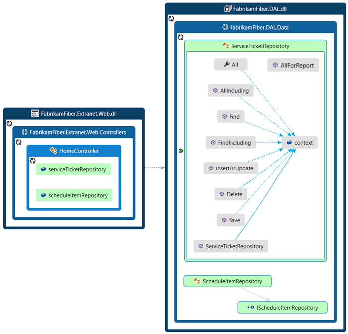  
  
     To see members that are in the code but don't appear on the map, click the **Refetch Children** icon  in the top left corner of a group.  
  
6.  To see more items related to those on the map, select one and choose **Show Related** on the code map toolbar, then select the type of related items to add to the map. Alternatively, select one or more items, open the shortcut menu, and then choose the **Show...** option for the type of related items to add to the map. For example:  
  
     For an **assembly**, choose:  
  
    |||  
    |-|-|  
    |**Show Assemblies This References**|Add assemblies that this assembly references. External assemblies appear in the **Externals** group.|  
    |**Show Assemblies Referencing This**|Add assemblies in the solution that reference this assembly.|  
  
     For a **namespace**, choose **Show Containing Assembly**, if it's not visible.  
  
     For a **class** or **interface**, choose:  
  
    |||  
    |-|-|  
    |**Show Base Types**|For a class, add the base class and the implemented interfaces.   For an interface, add the base interfaces.|  
    |**Show Derived Types**|For a class, add the derived classes.   For an interface, add the derived interfaces and the implementing classes or structs.|  
    |**Show Types This References**|Add all classes and their members that this class uses.|  
    |**Show Types Referencing This**|Add all classes and their members that use this class.|  
    |**Show Containing Namespace**|Add the parent namespace.|  
    |**Show Containing Namespace and Assembly**|Add the parent container hierarchy.|  
    |**Show All Base Types**|Add the base class or interface hierarchy recursively.|  
    |**Show All Derived Types**|For a class, add all the derived classes recursively.   For an interface, add all the derived interfaces and implementing classes or structs recursively.|  
  
     For a **method**, choose:  
  
    |||  
    |-|-|  
    |**Show Methods This Calls**|Add methods that this method calls.|  
    |**Show Fields This References**|Add fields that this method references.|  
    |**Show Containing Type**|Add the parent type.|  
    |**Show Containing Type, Namespace, and Assembly**|Add the parent container hierarchy.|  
    |**Show Overridden Methods**|For a method that overrides other methods or implements an interface's method, add all the abstract or virtual methods in base classes that are overridden and, if any, the interface's method that is implemented.|  
  
     For a **field** or **property**, choose:  
  
    |||  
    |-|-|  
    |**Show Containing Type**|Add the parent type.|  
    |**Show Containing Type, Namespace, and Assembly**|Add the parent container hierarchy.|  
  
     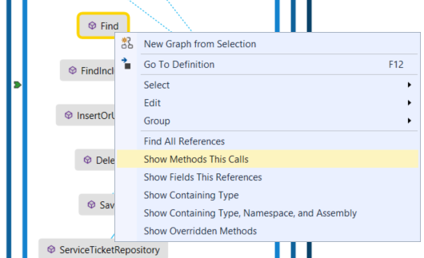  
  
7.  The map shows the relationships. In this example, the methods called by the `Find` method, and their location in the solution or externally.  
  
       
  
8.  To simplify the map and focus on individual parts, choose **Filters** on the code map toolbar and select just the types of nodes and links you are interested in. For example, turn off display of Solution Folders, Assemblies, and Namespaces.  
  
     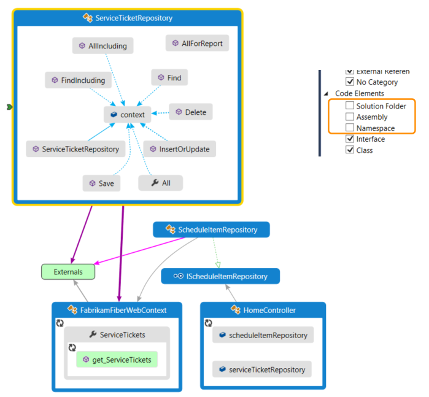  
  
##   See dependencies between C and C++ source files and header files  
 If you want to create more complete maps for C++ projects, set the browse information compiler option (**/FR**) on those projects. Otherwise, a message appears and prompts you to set this option. If you select **OK**, this sets the option for just the current map. You can choose to hide the message for all later maps. If you hide this message, you can make it appear again. Set the following registry key to `0` or delete the key:  
  
 **HKEY_CURRENT_USER\Software\Microsoft\VisualStudio\14.0\NativeProvider : AutoEnableSbr**  
  
 When you open a solution that contains Visual C++ projects, it might take some time to update the IntelliSense database. During this time, you might not be able to create code maps for header (.h or `#include`) files until the IntelliSense database finishes updating. You can monitor the update progress in the Visual Studio status bar. To resolve issues or messages that appear because certain IntelliSense settings are disabled, see [Troubleshoot maps for C and C++ code](#Troubleshooting).  
  
-   To see dependencies between all source files and header files in your solution, on the **Architecture** menu, choose **Generate Graph of Include Files**.  
  
     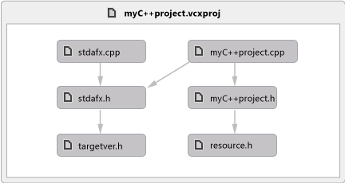  
  
-   To see dependencies between the currently open file and related source files and header files, open either the source file or the header file. Open the file shortcut menu anywhere inside the file. Choose **Generate Graph of Include Files**.  
  
       
  
###   Troubleshoot maps for C and C++ code  
 These items aren't supported for C and C++ code:  
  
-   Base types don't appear on maps that include the parent hierarchy.  
  
-   Most **Show** menu items aren't available for C and C++ code.  
  
 These issues might happen when you create code maps for C and C++ code:  
  
|**Issue**|**Possible cause**|**Resolution**|  
|---------------|------------------------|--------------------|  
|The code map failed to generate.|No projects in the solution were built successfully.|Fix the build errors that occurred and then regenerate the map.|  
|[!INCLUDE[vsprvs](../code-quality/includes/vsprvs_md.md)] becomes unresponsive when you try to generate a code map from the **Architecture** menu.|The program database (.pdb) file might be corrupted.   A .pdb file stores debugging information, such as type, method, and source file information.|Rebuild the solution and then try again.|  
|Certain settings for the IntelliSense browsing database are disabled.|Certain IntelliSense settings might be disabled in the [!INCLUDE[vsprvs](../code-quality/includes/vsprvs_md.md)]**Options** dialog box.|Turn on the settings to enable them.   See [Options, Text Editor, C/C++, Advanced](../ide/reference/options-text-editor-c-cpp-advanced.md).|  
|The message **Unknown Methods** appears on a method node.   This issue occurs because the name of the method cannot be resolved.|The binary file might not have a base relocation table.|Turn on the **/FIXED:NO** option in the linker.|  
||The program database (.pdb) file might not be built.   A .pdb file stores debugging information, such as type, method, and source file information.|Turn on the **/DEBUG** option in the linker.|  
||Cannot open or find the .pdb file in the expected locations.|Make sure that the .pdb file exists in the expected locations.|  
||Debug information has been stripped from the .pdb file.|If the **/PDBSTRIPPED** option was used in the linker, include the complete .pdb file instead.|  
||The caller is not a function and is either a thunk in the binary file or a pointer in the data section.|When the caller is a thunk, try using `_declspec(dllimport)` to avoid the thunk.|  
  
##   Make code maps render more quickly  
 When you generate a map for the first time, Visual Studio indexes all the dependencies that it finds. This process might take some time, especially for large solutions, but will improve performance later. If your code changes, Visual Studio re-indexes just the updated code. To minimize the time taken for the map to finish rendering, consider the following:  
  
-   [Map only the dependencies that interest you.](#SeeSpecificSource)  
  
-   Before you generate the map for an entire solution, reduce the solution scope.  
  
-   Turn off automatic build for the solution with the **Skip Build** button on the code map toolbar.  
  
-   Turn off automatic adding of parent items with the **Include Parents** button on the code map toolbar.  
  
-   Edit the code map file directly to remove nodes and links you don't need. Changing the map doesn't affect the underlying code. See [Customize code maps by editing the DGML files](../modeling/customize-code-maps-by-editing-the-dgml-files.md).  
  
   
  
 Although Visual Studio can run with 1 GB of memory, we recommended that your computer have at least 2 GB of memory to avoid long delays while Visual Studio creates the code index and generates the map.  
  
 It might take more time to create maps or add items to a map from Solution Explorer when a project item's **Copy to Output Directory** property is set to **Copy Always**. This might cause issues with incremental builds and Visual Studio to rebuild the project each time. To increase performance, change this property to **Copy if newer** or `PreserveNewest`. See [Incremental Builds](../msbuild/incremental-builds.md).  
  
 The completed map will show dependencies only for successfully-built code. If build errors occur for certain components, these errors appear on the map. Make sure that a component actually builds and has dependencies on it before you make architectural decisions based on the map.  
  
##   Share code maps  
  
### Share the map with other Visual Studio users  
 Use the **File** menu to save the map.  
  
 -or-  
  
 To save the map as part of specific project, on the map toolbar, choose **Share**, **Move** \<*CodeMapName*>**.dgml into**, and then choose the project where you want to save the map.  
  
 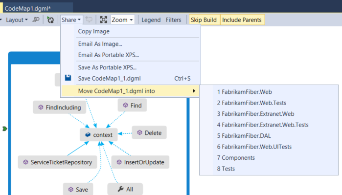  
  
 Visual Studio saves the map as a .dgml file that you can share with other users of Visual Studio Enterprise and Visual Studio Professional.  
  
> [!NOTE]
>  Before you share a map with those who use Visual Studio Professional, make sure to expand any groups, show hidden nodes and cross-group links, and retrieve any deleted nodes that you want others to see on your map. Otherwise, other users won't be able to see these items.  
>   
>  The following error might occur when you save a map that is in a modeling project or was copied from a modeling project to another location:  
>   
>  "Cannot save *fileName* outside the project directory. Linked items are not supported."  
>   
>  Visual Studio shows the error, but creates the saved version anyway. To avoid the error, create the map outside the modeling project. You can then save it to the location that you want. Just copying the file to another location in the solution, and then trying to save it will not work.  
  
### Export the map as an image so you can copy it into other applications, such as Microsoft Word or PowerPoint  
  
1.  On the code map toolbar, choose **Share**, **Email as Image** or **Copy Image**.  
  
2.  Paste the image into another application.  
  
### Export the map as an XPS file so you can see it in XML or XAML viewers like Internet Explorer  
  
1.  On the code map toolbar, choose **Share**, **Email As Portable XPS** or **Save As Portable XPS**.  
  
2.  Browse to where you want to save the file.  
  
3.  Name the code map. Make sure that the **Save as type** box is set to **XPS files (\*.xps)**. Choose **Save**.  
  
## What else can I do?  
  
-   [Use code maps to debug your applications](../modeling/use-code-maps-to-debug-your-applications.md)  
  
-   [Map methods on the call stack while debugging](../debugger/map-methods-on-the-call-stack-while-debugging-in-visual-studio.md)  
  
-   [Find potential problems using code map analyzers](../modeling/find-potential-problems-using-code-map-analyzers.md)  
  
-   [Browse and rearrange code maps](../modeling/browse-and-rearrange-code-maps.md)  
  
-   [Customize code maps by editing the DGML files](../modeling/customize-code-maps-by-editing-the-dgml-files.md)
