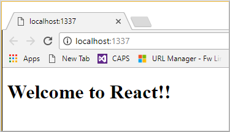
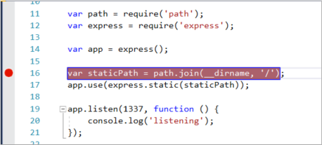
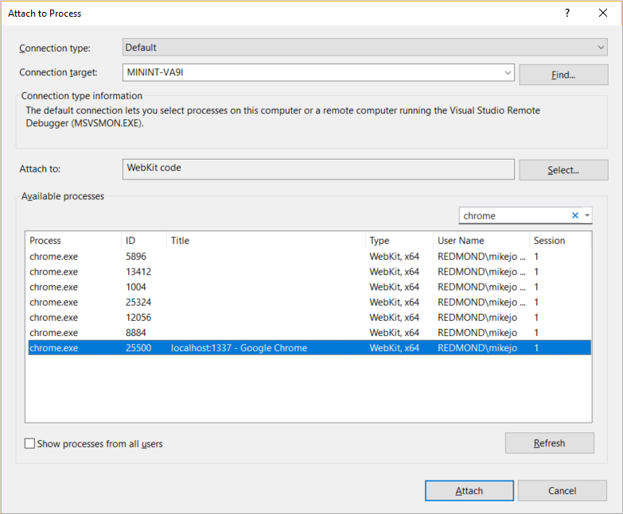

# Tutorial: Create a Node.js and React app in Visual Studio
Visual Studio allows you to easily create a Node.js project and leverage IntelliSense and other built-in features that support Node.js. In this tutorial for Visual Studio, you create a Node.js web application project from a Visual Studio template. Then, you create a simple app using React. 

In this tutorial, you learn how to:
> [!div class="checklist"]
> * Create a Node.js project
> * Add npm packages
> * Add React code to your app
> * Transpile JSX
> * Attach the debugger

## Prerequisites

* You must have Visual Studio installed and the Node.js development workload.

    If you haven't already installed Visual Studio, install it for free [here](http://www.visualstudio.com).

    If you need to install the workload but already have Visual Studio, click the **Open Visual Studio Installer** link in the left pane of the **New Project** dialog box. The Visual Studio Installer launches. Choose the **Node.js development** workload, then choose **Modify**.

* You must have the Node.js runtime installed.

    If you don't have it installed, install the LTS version from the [Node.js](https://nodejs.org/en/download/) website. In general, Visual Studio automatically detects the installed Node.js runtime. If it does not detect an installed runtime, you can configure your project to reference the installed runtime in the properties page (after you create a project, right-click the project node and choose **Properties**).

    This tutorial was tested with version 8.9.4.

## Create a project
First, create a Node.js web application project.

1. Open Visual Studio 2017.  

1. From the top menu bar, choose **File** > **New** > **Project...**.  

1. In the **New Project** dialog box, in the left pane, expand **JavaScript**, then choose **Node.js**. In the middle pane, choose **Blank Node.js Web Application**, type the name **NodejsWebAppBlank**, then choose **OK**.   

     If you don't see the **Blank Node.js Web Application** project template, you must first install the Node.js development workload. 

    Visual Studio creates the new solution and opens your project.

      

    - Highlighted in bold is your project, using the name you gave in the **New Project** dialog box. In the file system, this project is represented by a *.njsproj* file in your project folder.

    - At the top level is a solution, which by default has the same name as your project. A solution, represented by a *.sln* file on disk, is a container for one or more related projects.

    - The npm node shows any installed npm packages. You can right-click the npm node to search for and install npm packages using a dialog box.

    - Project files such as *server.js* show up under the project node. *server.js* is the project startup file (if you want to change the startup file later, right-click the project node and choose **Properties**).

## Add npm packages

This app requires a number of npm modules to run correctly.

* react
* react-dom
* babel-cli
* babel-loader
* babel-preset-react
* express
* path
* webpack
* webpack-cli

1. In Solution Explorer (right pane), right-click the **npm** node in the project and choose **Install New npm Packages**.

    In the **Install New npm Packages** dialog box, you can choose to install the most current package version or specify a version. We recommend you install the current version initially, but if you run into unexpected errors later, you may need to install the exact package versions described later, as described [here](#packagejson).

1. In the **Install New npm Packages** dialog box, search for the react package, and click **Install Package** to install it.

    

    The **Output** window shows progress on installing the package. When installed, the package appears under the **npm** node.

    The project's *package.json* file is updated with the new package information including the package version.

1. Repeat the previous steps for each of the other npm modules.

    Here are the npm modules as they appear in Solution Explorer after they are installed.

     

> [!NOTE]
> If you prefer to install npm packages using the command line, right-click the project node and choose **Open Command Prompt Here**. Use standard Node.js commands to install packages.

## Add project files

In these steps, you add three new files to your project.
* *app.js*
* *webpack-config.js*
* *index.html*

For this simple app, you add the new project files in the project root. (In most apps, you typically add the files to subfolders and adjust relative path references accordingly.)

1. In Solution Explorer, right-click the project **NodejsWebAppBlank** and choose **Add** > **New Item**.

1. In the **Add New Item** dialog box, choose **JavaScript file**, type the name *app.js*, and click **OK**.

1. Repeat these steps to add *webpack-config.js*.

1. Repeat the same steps to add *index.html* to the project. Instead of a JavaScript file, choose **HTML file**.

## Add app code

1. Open *server.js* and replace the code with the following code:

    ```javascript
    'use strict';
    var http = require('http');
    var path = require('path');
    var express = require('express');

    var app = express();

    var staticPath = path.join(__dirname, '/');
    app.use(express.static(staticPath));

    // Allows you to set port in the project properties.
    app.set('port', process.env.PORT || 3000);

    var server = app.listen(app.get('port'), function() {
        console.log('listening');
    });
    ```

   The preceding code uses Express to start Node.js as your web application server. This code sets the port to the port number configured in the project properties (by default, the port is configured to 1337 in the properties). To open the project properties, right-click the project in Solution Explorer and choose **Properties**.

1. Open *app.js* and add the following code:

    ```javascript
    var React = require('react');
    var ReactDOM = require('react-dom');

    class Hello extends React.Component {
        render() {
            return (
                <h1>Welcome to React!!</h1>
            );
        }
    }

    ReactDOM.render(<Hello />, document.getElementById('root'));
    ```

    The preceding code uses JSX syntax and React to display a simple message.

1. Open *index.html* and replace the **body** section with the following code:

    ```html
    <body>
        <div id="root"></div>
        <!-- scripts -->
        <script src="dist/browser-bundle.js"></script>
    </body>
    ```

    This HTML page loads *browser-bundle.js*, which contains the JSX and React code transpiled to plain JavaScript. Currently, *browser-bundle.js* is an empty file. In the next section, you configure options to transpile the code.

## Configure webpack and babel

In the previous steps, you added *webpack-config.js* to the project. Next, you add webpack configuration code. You will add a simple webpack configuration that specifies an input file (*app.js*) and an output file (*browser-bundle.js*) for bundling and transpiling JSX to plain JavaScript. For transpiling, you also configure some babel options to support React. This code is a basic configuration that is intended as an introduction to webpack and babel.

1. In Solution Explorer, open *webpack-config.js* and add the following code.

    ```javascript
    module.exports = {
        devtool: 'source-map',
        entry: "./app.js",
        mode: "development",
        output: {
            filename: "./browser-bundle.js"
        },
        module: {
            rules: [
                {
                    test: /\.js$/,
                    exclude: /(node_modules|bower_components)/,
                    use: {
                        loader: 'babel-loader',
                        options: {
                            presets: ['react']
                        }
                    }
                }
            ]
        }
    }
    ```

    The webpack configuration code instructs babel to use the **babel-preset-react** npm package to transpile the React code.

## Transpile the JSX

1. In Solution Explorer, right-click the project node and choose **Open Command Prompt Here**.

1. In the command prompt, type the following command:

    `node_modules\.bin\webpack app.js --config webpack-config.js`

    The command prompt window shows the result.

     

    If you see any errors instead of the preceding output, you must resolve them before your app will work. If your npm package versions are different than the versions shown in this tutorial, that can be a source of errors. One way to fix errors is to use the exact versions shown in the earlier illustration. For a quick way to do this, see [Use specific versions of npm packages](#packagejson) at the end of this topic.

1. In Solution Explorer, right-click the project node and choose **Add** > **Existing Folder**, then choose the *dist* folder and click **Select Folder**.

    Visual Studio adds the *dist* folder to the project, which contains *browser-bundle.js* and *browser-bundle.js.map*.

1. Open *browser-bundle.js* to see the transpiled JavaScript code.

1. If prompted to reload externally modified files, click **Yes to All**.

     

Each time you make changes to *app.js*, you must rerun the webpack command.

## Run the app

1. Make sure that Chrome is selected as the current debug target.

      

1. To run the app, press **F5** (**Debug** > **Start Debugging**) or the green arrow button.

    A Node.js console window opens that shows the port on which the debugger is listening.

    Visual Studio starts the app by launching the startup file, *server.js*.

     

1. Close the browser window.

1. Close the console window.

## Set a breakpoint and run the app

1. In *server.js*, click in the gutter to the left of the `staticPath` declaration to set a breakpoint:

     

    Breakpoints are the most basic and essential feature of reliable debugging. A breakpoint indicates where Visual Studio should suspend your running code so you can take a look at the values of variables, or the behavior of memory, or whether or not a branch of code is getting run. 

1. To run the app, press **F5** (**Debug** > **Start Debugging**).

    The debugger pauses at the breakpoint you set (the current statement is marked in yellow). Now, you can inspect your app state by hovering over variables that are currently in scope, using debugger windows like the **Locals** and **Watch** windows.

1. Press **F5** to continue the app.

1. If you want to use the Chrome Developer Tools, press **F12**. You can use these tools to examine the DOM and interact with the app using the JavaScript Console.

1. Close the web browser and the console.

## Set and hit a breakpoint in the client-side React code

In the preceding section, you attached the debugger to server-side Node.js code. To attach the debugger from Visual Studio and hit breakpoints in client-side React code, the debugger needs help to identify the correct process. Here is one way to enable this.

1. Close all Chrome windows.

1. Open the **Run** command from the Windows **Start** button (right-click and choose **Run**), and enter the following command:

    `chrome.exe --remote-debugging-port=9222`

    This starts Chrome with debugging enabled.

1. Switch to Visual Studio and set a breakpoint in *browser-bundle.js* code in the `render()` function as shown in the following illustration:

     

1. With Chrome selected as the debug target in Visual Studio, press **Ctrl + F5** (**Debug** > **Start Without Debugging**) to run the app in the browser.

    The app opens in a new browser tab.

1. Choose **Debug** > **Attach to Process**.

1. In the **Attach to Process** dialog box, choose **Webkit code** in the **Attach to** field, type **chrome** in the filter box to filter the search results.

1. Select the Chrome process with the correct host port (1337 in this example), and click **Attach**.

     

    You know the debugger has attached correctly when the DOM Explorer and the JavaScript Console open in Visual Studio. These debugging tools are similar to Chrome Developer Tools and F12 Tools for Edge.

1. Because the code with the breakpoint already executed, refresh your browser page to hit the breakpoint.

    While paused in the debugger, you can examine your app state by hovering over variables and using debugger windows. You can advance the debugger by stepping through code (**F5**, **F10**, and **F11**).

    > [!TIP]
    > Once you attach to the process the first time by following these steps, you can quickly reattach to the same process in Visual Studio 2017 by choosing **Debug** > **Reattach to Process**.

## (Optional) Debug using sourcemaps

You previously generated a sourcemap file by including `devtool: 'source-map'` in the `webpack-config.js file`. Sourcemaps allow you to debug code in the original JavaScript file rather than the transpiled JSX.

> [!CAUTION]
> Hitting breakpoints using sourcemaps with chrome and webpack may not work consistently as described in [Issue 4177](https://github.com/babel/babel/issues/4177). This procedure implements a partial workaround using the `debugger` statement instead of a breakpoint.

To use the sourcemap file for debugging:

1. In *browser-bundle.js*, remove the breakpoint you set previously.

1. In *app.js*, add a `debugger;` statement in the `render()` function just before the `return()` statement.

1. Choose either **Debug** > **Reattach to Process** (if you attached the debugger to client-side React code previously) or follow all the steps in the section **Set and hit a breakpoint in the client-side React code**. (Skip the step on setting a breakpoint in *browser-bundle.js*.)

1. Refresh the app in the browser.

    The debugger pauses on the `debugger` statement in the dynamically generated *app.js* file.

    In debug mode, you can hover over variables, use the **Locals** window, etc.

## <a name="packagejson"></a> (Optional) Install specific versions of npm packages

Because you are using the latest versions for a variety of npm packages, it's possible that a newer package version may require changes to your app that are not described in this article. This can result in unexpected errors. To resolve this, you can use the same versions of the npm packages that we tested for this topic.

1. In Solution Explorer, open *package.json* and replace the `dependencies` section with the following code:

    ```js
    "dependencies": {
      "babel-cli": "6.26.0",
      "babel-loader": "7.1.4",
      "babel-preset-react": "6.24.1",
      "express": "4.16.2",
      "path": "0.12.7",
      "react": "16.2.0",
      "react-dom": "16.2.0",
      "webpack": "4.1.1",
      "webpack-cli": "2.0.11"
    }
    ```
1. Save *package.json*, then right-click the **npm** node in your project and choose **Update npm Packages**.

    The **Output** window shows progress in updating the packages to the specified versions.

1. Repeat steps to transpile the JSX code.

## Next steps 

In this tutorial, you learned how to create a Node.js and React app, transpile JSX, and debug. To learn more about Node.js Tools for Visual Studio, see the documentation.

> [!div class="nextstepaction"]
> [Node.js Tools for Visual Studio](https://github.com/Microsoft/nodejstools)