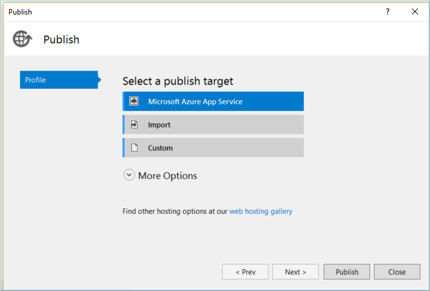
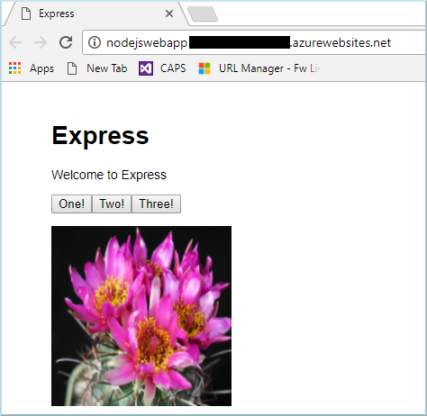

# Getting started with Node.js in Visual Studio
In this tutorial for Node.js development using Visual Studio, you'll create a simple Node.js web application, add some code, explore some features of the IDE, and run the app. If you haven't already installed Visual Studio, install it for free [here](http://www.visualstudio.com).  

## Create a project
First, you'll create an Node.js web application project.

1. Open Visual Studio 2017.  

2. From the top menu bar, choose **File** > **New** > **Project...**.  

3. In the **New Project** dialog box, in the left pane, expand **JavaScript**, then choose **Node.js**. In the middle pane, choose **Basic Azure Node.js Express 4 Application**, then choose **OK**.   

     If you don't see the **Basic Azure Node.js Express 4 Application** project template, click the **Open Visual Studio Installer** link in the left pane of the **New Project** dialog box. The Visual Studio Installer launches. Choose the **Node.js development** workload, then choose **Modify**. 

    Visual Studio creates the new solution and opens your project. The **app.js** project file opens in the editor (left pane). If you are not familiar with Visual Studio solutions and projects, see [Quickstart: Use Visual Studio to create your first Node.js app](../ide/quickstart-nodejs.md).

## Add some code

1. In Solution Explorer (right pane), open the views folder, then open index.pug.

1. Replace the content with the following markup.

    ```js
    extends layout

    block content
      h1= title
      p Welcome to #{title}
      script.
        var f1 = function() { document.getElementById('myImage').src='#{data.item1}' }
      script.
        var f2 = function() { document.getElementById('myImage').src='#{data.item2}' }
      script.
        var f3 = function() { document.getElementById('myImage').src='#{data.item3}' }

      button(onclick='f1()') One!
      button(onclick='f2()') Two!
      button(onclick='f3()') Three!
      p
      a: img(id='myImage' height='200' width='200' src='')
    ```

1. In the routes folder, open index.js.

1. Add the following code before the call to `router.get`:

    ```js
    var getData = function () {
        var data = {
            'item1': 'http://public-domain-photos.com/free-stock-photos-1/flowers/cactus-76.jpg',
            'item2': 'http://public-domain-photos.com/free-stock-photos-1/flowers/cactus-77.jpg',
            'item3': 'http://public-domain-photos.com/free-stock-photos-1/flowers/cactus-78.jpg'
        }
        return data;
    }
    ````

1. Replace the `router.get` function call with the following code:

    ```js
    router.get('/', function (req, res) {
        res.render('index', { title: 'Express', "data" });
    });
    ```

1. After `data`, type `: get` and IntelliSense will show you the getData function. Select `getData`.

     

1. Remove the comma (`,`) before `"data"` and you see green syntax highlighting on the expression. Hover over the syntax highlighting.

     

    The last line of this message tells you that the JavaScript interpreter expected a comma (`,`).

1. Click the **Error List** tab.

    You see the warning and description along with the filename and line number.

    

1. Fix the code by adding the comma (`,`) before `"data"`.

## Set a breakpoint

1. In index.js, click in the left gutter before the following line of code to set a breakpoint:

    `res.render('index', { title: 'Express', "data": getData() });`

    Breakpoints are the most basic and essential feature of reliable debugging. A breakpoint indicates where Visual Studio should suspend your running code so you can take a look at the values of variables, or the behavior of memory, or whether or not a branch of code is getting run. 

     

## Run the application

1. Select the debug target in the Debug toolbar.

     

1. Press **F5** (**Debug** > **Start Debugging**) to run the application.

    The debugger pauses at the breakpoint you set. Now, you can inspect your app state.

1. Hover over `getData` to see its properties in a DataTip

    

1. Press **F5** (**Debug** > **Continue**) to continue.

    The app opens in a browser.

    In the browser window, you will see "Express" as the title and "Welcome to Express" in the first paragraph.

1. Click the buttons to display different images.

      

1. Open the Node.js Interactive Window by selecting **View** > **Other Windows** > **Node.js Interactive Window**.

     

    The interactive window supports everything you can do in code including the use of `require()` statements. The code in the following screenshot defines a variable and displays the location of the Node.js interpreter.

     

1. Close the web browser.  

## (Optional) Publish to Azure App Service

1. In Solution Explorer, right-click the project and choose **Publish**.

     

1. Choose **Microsoft Azure App Service**.

    In the **App Service** dialog box, you can sign into your Azure account and connect to existing Azure subscriptions.

1. Follow the remaining steps to select a subscription, choose or create a resource group, choose or create an app service plane, and then follow the steps when prompted to publish to Azure. For more detailed instructions, see [Publish to Azure Website using Web Deploy](https://github.com/Microsoft/nodejstools/wiki/Publish-to-Azure-Website-using-Web-Deploy).

1. The **Output** window shows progress on deploying to Azure.

    On successful deployment, your app opens in a browser running in Azure App Service. Click a button to display an image.

     

Congratulations on completing this tutorial!

## Next steps 

- Learn more about [Node.js Tools for Visual Studio](https://github.com/Microsoft/nodejstools/wiki)  
- Learn more about the [Visual Studio IDE](../ide/visual-studio-ide.md)  