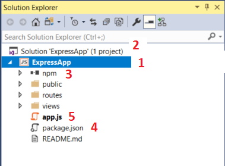
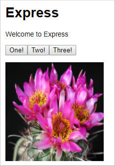

# Tutorial: Create a Node.js and Express app in Visual Studio
In this tutorial for Visual Studio development using Node.js and Express, you create a simple Node.js web application, add some code, explore some features of the IDE, and run the app. If you haven't already installed Visual Studio, install it for free [here](http://visualstudio.microsoft.com).

In this tutorial, you learn how to:
> [!div class="checklist"]
> * Create a Node.js project
> * Add some code
> * Use IntelliSense to edit code
> * Run the app
> * Hit a breakpoint in the debugger

## Before you begin

Here's a quick FAQ to introduce you to some key concepts.

### What is Node.js?

Node.js is a server-side JavaScript runtime environment that executes JavaScript server-side.

### What is npm?

npm is the default package manager for the Node.js. The package manager makes it easier for programmers to publish and share source code of Node.js libraries and is designed to simplify installation, updating, and uninstallation of libraries.

### What is express?

Express is a web application framework, used as a server framework for Node.js to build web applications. Express allows you to use choose different front-end frameworks to create a UI, such as Pug (formerly called Jade). Pug is used in this tutorial.

## Prerequisites

* You must have Visual Studio 2017 installed and the Node.js development workload.

    If you haven't already installed Visual Studio, go to the [Visual Studio downloads](https://visualstudio.microsoft.com/downloads/?utm_medium=microsoft&utm_source=docs.microsoft.com&utm_campaign=button+cta&utm_content=download+vs2017) page to install it for free.

    If you need to install the workload but already have Visual Studio, click the **Open Visual Studio Installer** link in the left pane of the **New Project** dialog box (select **File** > **New** > **Project**). The Visual Studio Installer launches. Choose the **Node.js development** workload, then choose **Modify**.

* You must have the Node.js runtime installed.

    If you don't have it installed, install the LTS version from the [Node.js](https://nodejs.org/en/download/) website. In general, Visual Studio automatically detects the installed Node.js runtime. If it does not detect an installed runtime, you can configure your project to reference the installed runtime in the properties page (after you create a project, right-click the project node and choose **Properties**).

    This tutorial was tested with Node.js 8.10.0.

## Create a new Node.js project

Visual Studio manages files for a single application in a *project*. The project includes source code, resources, and configuration files.

In this tutorial, you begin with a simple project containing code for a Node.js and express app.

1. Open Visual Studio 2017.

1. From the top menu bar, choose **File** > **New** > **Project**.

1. In the **New Project** dialog box, in the left pane, expand **JavaScript**, and then choose **Node.js**. In the middle pane, select **Basic Azure Node.js Express 4 Application** and then choose **OK**.

     If you don't see the **Basic Azure Node.js Express 4 Application** project template, you must install the **Node.js development** workload first (see the Prerequisites for instructions).

    Visual Studio creates the new solution and opens your project in the right pane. The *app.js* project file opens in the editor (left pane).

    

    (1) Highlighted in **bold** is your project, using the name you gave in the **New Project** dialog box. In the file system, this project is represented by a *.njsproj* file in your project folder. You can set properties and environment variables associated with the project by right-clicking the project and choosing **Properties**. You can do round-tripping with other development tools, because the project file does not make custom changes to the Node.js project source.

    (2) At the top level is a solution, which by default has the same name as your project. A solution, represented by a *.sln* file on disk, is a container for one or more related projects.

    (3) The npm node shows any installed npm packages. You can right-click the npm node to search for and install npm packages using a dialog box or install and update packages using the settings in *package.json* and right-click options in the npm node.

    (4) *package.json* is a file used by npm to manage package dependencies and package versions for locally-installed packages.

    (5) Project files such as *app.js* show up under the project node. *app.js* is the project startup file and that is why it shows up in **bold**. You can set the startup file by right-clicking a file in the project and selecting **Set as Node.js startup file**.

1. Open the **npm** node and make sure that all the required npm packages are present.

    If any packages are missing (exclamation point icon), you can right-click the **npm** node and choose **Install Missing npm Packages**.

## Add some code

The application uses Pug for the front-end JavaScript framework. Pug uses simple markup code that compiles to HTML. (Pug is set as the view engine in *app.js*. The code that sets the view engine in *app.js* is `app.set('view engine', 'pug');`.)

1. In Solution Explorer (right pane), open the views folder, then open *index.pug*.

1. Replace the content with the following markup.

    ```js
    extends layout

    block content
      h1= title
      p Welcome to #{title}
      script.
        var f1 = function() { document.getElementById('myImage').src='#{data.item1}' }
      script.
        var f2 = function() { document.getElementById('myImage').src='#{data.item2}' }
      script.
        var f3 = function() { document.getElementById('myImage').src='#{data.item3}' }

      button(onclick='f1()') One!
      button(onclick='f2()') Two!
      button(onclick='f3()') Three!
      p
      a: img(id='myImage' height='200' width='200' src='')
    ```

    The preceding code is used to dynamically generate an HTML page with a title and welcome message. The page also includes code to display an image that changes whenever you press a button.

1. In the routes folder, open *index.js*.

1. Add the following code before the call to `router.get`:

    ```js
    var getData = function () {
        var data = {
            'item1': 'http://public-domain-photos.com/free-stock-photos-1/flowers/cactus-76.jpg',
            'item2': 'http://public-domain-photos.com/free-stock-photos-1/flowers/cactus-77.jpg',
            'item3': 'http://public-domain-photos.com/free-stock-photos-1/flowers/cactus-78.jpg'
        }
        return data;
    }
    ````

    This code creates a data object that we will pass to the dynamically generated HTML page.

1. Replace the `router.get` function call with the following code:

    ```js
    router.get('/', function (req, res) {
        res.render('index', { title: 'Express', "data" });
    });
    ```

    The preceding code sets the current page using the Express router object and renders the page, passing the title and data object to the page. The *index.pug* file is specified here as the page to load when *index.js* runs. *index.js* is configured as the default route in *app.js* code (not shown).

    To demonstrate several features of Visual Studio, we included an error in the line of code containing `res.render`. We need to fix the error before the app can run. We fix the error in the next section.

## Use IntelliSense

IntelliSense is a Visual Studio tool that assists you as you write code.

1. In *index.js*, go to the line of code containing `res.render`.

1. Put your cursor after the `data` string, type `: get` and IntelliSense will show you the `getData` function defined earlier in the code. Select `getData`.

    

1. Remove the comma (`,`) before `"data"` and you see green syntax highlighting on the expression. Hover over the syntax highlighting.

    

    The last line of this message tells you that the JavaScript interpreter expected a comma (`,`).

1. In the lower pane, click the **Error List** tab.

    You see the warning and description along with the filename and line number.

    

1. Fix the code by adding the comma (`,`) before `"data"`.

    When corrected, line of code should look like this: `res.render('index', { title: 'Express', "data": getData() });`

## Set a breakpoint

We are going to run the app with the Visual Studio debugger attached. Before we can do that, we need to set a breakpoint.

1. In *index.js*, click in the left gutter before the following line of code to set a breakpoint:

    `res.render('index', { title: 'Express', "data": getData() });`

    Breakpoints are the most basic and essential feature of reliable debugging. A breakpoint indicates where Visual Studio should suspend your running code so you can take a look at the values of variables, or the behavior of memory, or whether or not a branch of code is getting run.

    

## Run the application

1. Select the debug target in the Debug toolbar.

    

1. Press **F5** (**Debug** > **Start Debugging**) to run the application.

    The debugger pauses at the breakpoint you set. Now, you can inspect your app state.

1. Hover over `getData` to see its properties in a DataTip

    

1. Press **F5** (**Debug** > **Continue**) to continue.

    The app opens in a browser.

    In the browser window, you will see "Express" as the title and "Welcome to Express" in the first paragraph.

1. Click the buttons to display different images.

    

1. Close the web browser.

## (Optional) Publish to Azure App Service

1. In Solution Explorer, right-click the project and choose **Publish**.

   

1. Choose **Microsoft Azure App Service**.

    In the **App Service** dialog box, you can sign into your Azure account and connect to existing Azure subscriptions.

1. Follow the remaining steps to select a subscription, choose or create a resource group, choose or create an app service plane, and then follow the steps when prompted to publish to Azure. For more detailed instructions, see [Publish to Azure website using web deploy](https://github.com/Microsoft/nodejstools/wiki/Publish-to-Azure-Website-using-Web-Deploy).

1. The **Output** window shows progress on deploying to Azure.

    On successful deployment, your app opens in a browser running in Azure App Service. Click a button to display an image.

   

Congratulations on completing this tutorial!

## Next steps

In this tutorial, you learned how to create and run a Node.js app using Express and hit a breakpoint using the debugger.

> [!div class="nextstepaction"]
> [Node.js tools for Visual Studio](https://github.com/Microsoft/nodejstools)