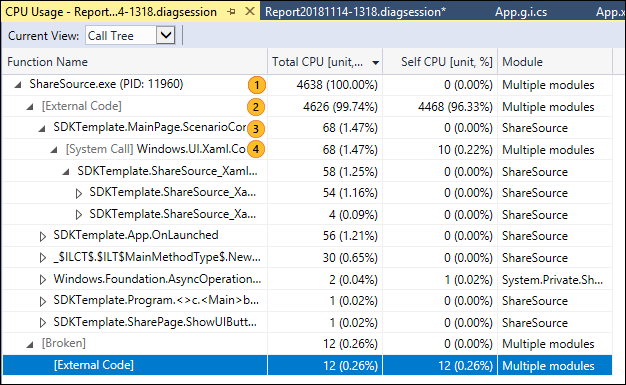
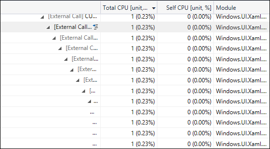
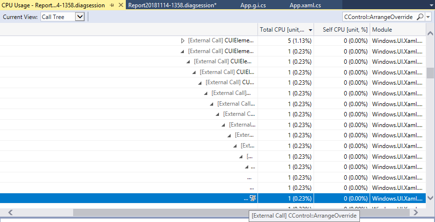

# Analyze CPU usage 

A good way to start investigating performance issues in your app is to understand its CPU usage. The **CPU Usage** performance tool shows the CPU time and percentage spent executing code in C++, C#/Visual Basic, and JavaScript apps. 

The **CPU Usage** tool can run on an open Visual Studio project, on an installed Microsoft Store app, or attached to a running app or process. You can run the tool on local or remote machines, or on a simulator or emulator. For more information, see [Run profiling tools with or without the debugger](../profiling/running-profiling-tools-with-or-without-the-debugger.md). 

You can run the **CPU Usage** tool with or without debugging. In the debugger, you can turn CPU profiling on and off, and see a per-function breakdown of CPU usage. You can view CPU usage results when execution is paused, for example at a breakpoint.  

The following instructions show how to use the **CPU Usage** tool without the debugger, using the Visual Studio **Performance Profiler**. The examples use a Release build on a local machine. Release builds provide the best view of actual app performance. To analyze CPU usage with Debug builds, see [Beginner's guide to performance profiling](../profiling/beginners-guide-to-performance-profiling.md).

Usually, the local machine best replicates installed app execution. For Windows Phone apps, collecting data directly from the device provides the most accurate data. To collect data from a remote device, run the app directly on the device, not over a Remote Desktop Connection. 

>[!NOTE]
>Windows 7 or later is required to use the [Performance Profiler](../profiling/profiling-feature-tour.md).
  
##  Collect CPU usage data  
  
1. In the Visual Studio project, set the solution configuration to **Release** and select **Local Machine** as the deployment target.  
  
      
  
1. Select **Debug** > **Performance Profiler**.  
  
1. Under **Available tools**, select **CPU Usage**, and then select **Start**.  
  
      
  
4. After the app starts, the diagnostic session begins and displays CPU usage data. When you're finished collecting data, select **Stop Collection**.  
  
     
  
   The CPU Usage tool analyzes the data and displays the report.  
  
     
  

## Analyze the CPU Usage report  
  
The diagnostic report is sorted by **Total CPU**, from highest to lowest. Change the sort order or sort column by selecting the column headers. Use the **Filter** dropdown to select or deselect threads to display, and use the **Search** box to search for a specific thread or node. 

###   CPU Usage data columns  

|||  
|-|-|  
|**Total CPU [unit, %]**|   The milliseconds and CPU percentage used by calls to the function, and functions called by the function, in the selected time range. This is different from the **CPU Utilization** timeline graph, which compares the total CPU activity in a time range to the total available CPU.|  
|**Self CPU [unit, %]**|   The milliseconds and CPU percentage used by calls to the function in the selected time range, excluding functions called by the function.|  
|**Module**|The name of the module containing the function.   
  
###   The CPU Usage call tree 

To view the call tree, select the parent node in the report. The **CPU Usage** page opens to the **Caller/Callee** view. In the **Current View** dropdown, select **Call Tree**.  
  
####   Call tree structure  

   
  
|||  
|-|-|  
||The top-level node in CPU Usage call trees is a pseudo-node.|  
||In most apps, when the **Show External Code** option is disabled, the second-level node is an **[External Code]** node. The node contains the system and framework code that starts and stops the app, draws the UI, controls thread scheduling, and provides other low-level services to the app.|  
||The children of the second-level node are the user-code methods and asynchronous routines that are called or created by the second-level system and framework code.|  
||Child nodes of a method have data only for the calls of the parent method. When **Show External Code** is disabled, app methods can also contain an **[External Code]** node.|  
  
####   External code  

 System and framework functions that are executed by your code are called *external code*. External code functions start and stop the app, draw the UI, control threading, and provide other low-level services to the app. In most cases, you aren't interested in external code, so the CPU Usage call tree gathers the external functions of a user method into one **[External Code]** node.  
  
 To view the call paths of external code, on the main diagnostic report page, select **Show External Code** from the **Filter** dropdown, and then select **Apply**. The **Call Tree** view of the **CPU Usage** page then expands the external code calls.  
  
   
  
 Many external code call chains are deeply nested, so the width of the chain can exceed the display width of the **Function Name** column. The function names then appear as **...**.  
  
   
  
 To find a function name you're looking for, use the search box. Hover over the selected line or use the horizontal scroll bar to view the data.  
  
   
  
###   Asynchronous functions in the CPU usage call tree  

 When the compiler encounters an asynchronous method, it creates a hidden class to control the method's execution. Conceptually, the class is a state machine. The class has compiler-generated functions that asynchronously call the original methods, and the callbacks, scheduler, and iterators needed to run them. When a parent method calls the original method, the compiler removes the method from the execution context of the parent, and runs the hidden class methods in the context of the system and framework code that controls app execution. The asynchronous methods are often, but not always, executed on one or more different threads. This code appears in the **CPU Usage** call tree as children of the **[External Code]** node immediately below the top node of the tree.  

In the following example, the first two nodes under **[External Code]** are the compiler-generated methods of the state machine class. The third node is the call to the original method. 
  
  

Expand the generated methods to show what's going on:

  

- `MainPage::GetMaxNumberAsyncButton_Click` just manages a list of the task values, computes the maximum of the results, and displays the output.
  
- `MainPage+<GetMaxNumberAsyncButton_Click>d__3::MoveNext` shows you the activity required to schedule and launch the 48 tasks that wrap the call to `GetNumberAsync`.
  
- `MainPage::<GetNumberAsync>b__b` shows the activity of the tasks that call `GetNumber`.
