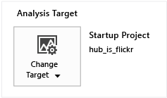
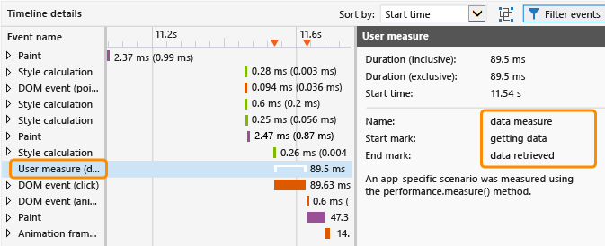
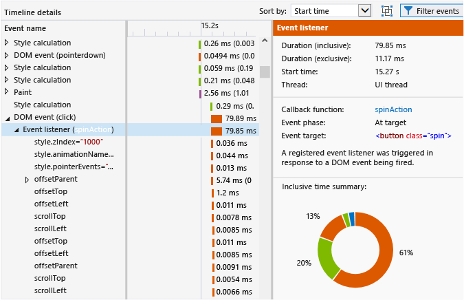
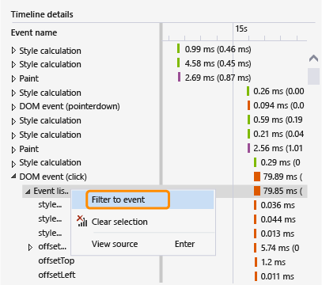
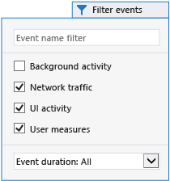

# Analyze HTML UI responsiveness in Universal Windows Apps
This topic describes how to isolate performance problems in your apps using the UI Responsiveness Profiler, a performance tool available for  Universal Windows Apps.  
  
 The UI Responsiveness Profiler can help you isolate problems such as UI responsiveness issues or platform side effects that typically occur with these symptoms:  
  
-   Lack of responsiveness in the UI. The app might be slow to respond if the UI thread is getting blocked. Some things that might block the UI thread include excessive synchronous JavaScript code, excessive CSS layout or CSS calculation work, synchronous XHR requests, garbage collection, excessive paint times, or processor-intensive JavaScript code.  
  
-   Slow loading time for the app or for a page. This is typically caused by excessive time spent loading resources.  
  
-   Visual updates that are less frequent than expected. This occurs if the UI thread is too busy to maintain a smooth frame rate. For example, if the UI thread is busy, frames might be dropped. Some non-UI thread work such as network requests, image decoding, and paints can also limit the frequency of visual updates. (Not all painting is performed on the UI thread.)  
  
##  <a name="RunningProfiler"></a> Run the HTML UI Responsiveness Tool  
 You can use the HTML UI Responsiveness tool when you have a working Windows Universal or Windows Store app open in Visual Studio or installed on a computer running Windows 8 or later.  
  
1.  If you're running the app from Visual Studio, on the **Standard** toolbar, in the **Start Debugging** list, choose a deployment target such as one of the Windows Phone emulators, **Local Machine**, **Simulator**, or **Remote Machine**.  
  
2.  On the **Debug** menu, choose **Performance Profiler...**.  
  
     If you want to change the analysis target for the profiler, choose**Change Target**.  
  
       
  
     The following options are available for the analysis target:  
  
    -   **Startup Project**. Choose this option to analyze the current startup project. If you're running the app on a remote machine or device, you must use this setting, which is the default value.  
  
    -   **Running App**. Choose this option to select a Windows Store app from a list of running apps. You can't use this option when you're running the app on a remote machine or device.  
  
         You can use this option to analyze performance of apps that are running on your computer when you don't have access to source code.  
  
    -   **Installed App**. Choose this option to select an installed app that you want to analyze. You can't use this option when you're running the app on a remote machine or device.  
  
         You can use this option to analyze the performance of apps that you have installed on your computer when you don't have access to source code. This option can also be useful when you just want to analyze the performance of any app outside your own app development.  
  
3.  From **Available Tools**, select **HTML UI Responsiveness**, and then choose **Start**.  
  
4.  When you start the UI Responsiveness Profiler, a User Account Control window might request your permission to run Visual Studio ETW Collector.exe. Choose **Yes**.  
  
     Interact with the app to test the relevant performance scenario. For a detailed workflow, see [Isolate a UI responsiveness problem](#Workflow) and [Isolate a visual throughput problem](#IsolateVisualThroughput).  
  
5.  Switch to Visual Studio by pressing Alt+Tab.  
  
6.  To stop profiling the app and view data that the profiler gathered, choose **Stop collection**.  
  
##  <a name="IsolateAnIssue"></a> Isolate an issue  
 The following section provides suggestions to help you isolate performance problems. For a step-by-step explanation of how to identify and fix performance issues by using a sample performance testing app, see [Walkthrough: Improving UI responsiveness (HTML)](../profiling/walkthrough-improving-ui-responsiveness-html.md).  
  
###  <a name="Workflow"></a> Isolate a UI responsiveness problem  
 These steps provide a suggested workflow that might help you use the UI Responsiveness Profiler more effectively:  
  
1.  Open your app in Visual Studio.  
  
2.  Test your app for UI responsiveness issues. (Press Ctrl+F5 to start your app without debugging.)  
  
     If you find an issue, continue testing to try to narrow the time frame in which the issue occurs, or try to identify triggers that cause the behavior.  
  
3.  Switch to Visual Studio (press Alt+Tab) and stop your app (Shift+F5).  
  
4.  Optionally, add user marks to your code using [Mark code for analysis](#ProfileMark).  
  
    > [!TIP]
    >  User marks can help you identify the responsiveness problem while you're viewing profiler data. For example, you can add a user mark at the beginning and end of a section of code that is causing a responsiveness issue.  
  
5.  Run the UI Responsiveness Profiler by following the instructions in the previous section.  
  
6.  Put the app into the state that results in a UI responsiveness issue.  
  
7.  Switch to Visual Studio (press Alt+Tab) and choose **Stop collection** in the profiler tab of the UI Responsiveness Profiler.  
  
8.  If you have added user marks, they will appear in the [View the diagnostic session timeline](#Ruler) of the profiler. The following illustration shows a single user mark used to specify a particular operation in your code.  
  
       
  
9. Identify an area of interest in the timeline and the profiler graphs by using user marks, app lifecycle events, or data visible in the graphs. Here are some guidelines to help you analyze and use the data in the graphs:  
  
    -   Use the [View the diagnostic session timeline](#Ruler) to view [Mark code for analysis](#ProfileMark), app lifecycle events, and the associated timeline for these events and the timeline for data in the other graphs.  
  
    -   Use the [CPU utilization graph](#CPUutilization) to view general information about CPU activity and the type of work it is handling during a specific period of time. Periods of excessive CPU activity are more likely to result in responsiveness issues and dropped frames.  
  
    -   If you're developing a game or rich media app, use the [View visual throughput (FPS)](#VisualThroughput) to identify periods of time in which the frame rate dropped.  
  
10. Select the area of interest in one of the graphs by clicking a part of the graph and dragging the pointer to make a selection (or by using the Tab key and arrow keys). When you select a time period by making a selection, the timeline details graph in the profiler's lower pane changes to show only the selected time period.  
  
     The following illustration shows the CPU utilization graph with an area of interest highlighted.  
  
       
  
11. Use the [View timeline details](#TimelineDetails) to get detailed information about events that are either running too frequently or taking too much time to complete. For example, look for the following:  
  
    -   Event listeners, timers, and animation frame callbacks. Depending on the specific event, data provided may include the ID of modified DOM elements, the name of modified CSS properties, a link to the source location, and the name of the associated event or callback function.  
  
    -   Layout or scripting events that resulted in rendering elements, such as calls to `window.getComputedStyles`. The associated DOM element for the event is provided.  
  
    -   Pages or URL resources that are loaded by the app, such as script evaluations for HTML parsing events. The file name or resource is provided.  
  
    -   Other events specified in [Profiler event reference](#ProfilerEvents).  
  
    > [!TIP]
    >  Most of the usable information in the profiler appears in the timeline details graph.  
  
12. With an area selected in the CPU utilization or visual throughput (FPS) graph, choose **Zoom in** (either the button or context menu) to get more detailed information. The timeline for the graph changes to show only the selected time period.  
  
13. When zoomed in, select a portion of the CPU utilization or visual throughput graph. When you make a selection, the timeline details graph in the profiler's lower pane changes to show only the selected time period.  
  
###  <a name="IsolateVisualThroughput"></a> Isolate a visual throughput problem  
 Periods of excessive CPU utilization can result in low or inconsistent frame rates. If you develop rich media apps and games, the visual throughput graph may provide more important data than the CPU utilization graph.  
  
 To isolate a visual throughput problem, follow the steps described in the previous section, but use the visual throughput graph as one of the key data points.  
  
###  <a name="ProfileMark"></a> Mark code for analysis  
 To help isolate a section of app code that's associated with data that appears in the graphs, you can add a function call in your app that instructs the profiler to insert a user mark—an inverted triangle—in the timeline at the moment the function gets executed. Any user mark that you add appears in the timeline for the CPU utilization graph, the visual throughput graph, and the timeline details graph.  
  
 To add a user mark, add the following code to your app. This example uses "getting data" as the description of the event.  
  
```javascript  
if (performance && performance.mark) {  
    performance.mark("getting data");  
}  
  
```  
  
 The description of the event appears as a tooltip when you rest the mouse pointer over the user mark. You can add as many user marks as you need.  
  
> [!NOTE]
>  `console.timeStamp`, a Chrome command, also appears as a user mark.  
  
 The following illustration shows the diagnostics ruler with a single user mark and its tooltip.  
  
   
  
 You can also create tool-generated events in the timeline details view to show the duration of time that passes between two user marks. The following code adds a second user mark and a measurement of the time that passes between execution of the two user marks (the preceding code shows the first user mark).  
  
```javascript  
if (performance.mark && performance.measure) {  
    performance.mark("data retrieved");  
    performance.measure("data measure", "getting data", "data retrieved");  
}  
```  
  
 If the second user mark isn't specified, `performance.measure` uses a timestamp as the second user mark. The first user mark is required.  
  
 The duration measurement appears as a **User measure** event in the timeline details view, and shows detailed information when selected.  
  
   
  
##  <a name="AnalyzeData"></a> Analyze data  
 The following sections provide information to help interpret data that appears in the profiler.  
  
###  <a name="Ruler"></a> View the diagnostic session timeline  
 The ruler at the top of the profiler shows the timeline for profiled information. This timeline applies to both the CPU utilization graph and the visual throughput graph.  
  
 Here's what the diagnostic session timeline looks like with a tooltip displayed for several app lifecycle events:  
  
   
  
 The timeline shows when app lifecyle events, like the activation event, occur and it shows user marks (user mark triangles) that you can add to your code. You can select the events to show tooltips with more information. For more info about user marks, see [Mark code for analysis](#ProfileMark) in this topic.  
  
 App lifecycle events appear as diamond symbols. These are DOM events, which include the following:  
  
-   `DOMContentLoaded` and `Load` events, which typically occur in the activated event handler in your code. A tooltip for the event shows the specific event and the URL.  
  
-   A navigation event, which occurs when you navigate to a different page. A tooltip for the event shows the destination page URL.  
  
###  <a name="CPUUtilization"></a> View CPU utilization  
 The CPU utilization graph enables you to identify periods of time in which there is excessive CPU activity. It provides information about the app's average CPU consumption over a period of time. Information is color-coded to represent the following specific categories: **Loading**, **Scripting**, garbage collection (**GC**), **Styling**, **Rendering**, and **Image decoding**. For more info about these categories, see [Profiler event reference](#ProfilerEvents) later in this topic.  
  
 The CPU utilization graph shows the amount of time spent on all app threads, combining CPU utilization values for one or more CPUs into a single percentage value. The CPU utilization value might exceed 100 percent when more than one CPU is in use.  
  
> [!NOTE]
>  GPU utilization does not appear in the graph.  
  
 This example shows what the CPU utilization graph looks like:  
  
   
  
 Use this graph to:  
  
-   Identify general areas of concern.  
  
-   Choose a specific time period to display in the timeline details graph. To choose a time period, select a part of the graph and drag the pointer to make a selection.  
  
-   Get a more detailed view of a selected time period by choosing the **Zoom in** button.  
  
 For more info on using the graph, see [Isolate a UI responsiveness problem](#Workflow) in this topic.  
  
###  <a name="VisualThroughput"></a> View visual throughput (FPS)  
 The visual throughput graph enables you to identify periods of time in which the frame rate dropped. It shows the frames per second (FPS) for the app. This graph is most useful for the development of games and rich media apps.  
  
 The displayed FPS value might differ from the actual frame rate. Keep this information in mind when examining data in this graph:  
  
-   The graph shows the FPS that the app is capable of achieving at any specific time. When the app is idle, the FPS is the same as the monitor refresh rate.  
  
-   The graph shows the actual FPS if the app is doing work that requires visual updates.  
  
-   The graph shows a value of zero if frames are being dropped.  
  
 This example shows what the visual throughput graph looks like:  
  
   
  
 Use the visual throughput graph to:  
  
-   Identify general areas of concern.  
  
-   Choose a specific time period to display in the timeline details graph. To choose a time period, select a part of the graph and drag the pointer to make a selection.  
  
-   Get a more detailed view of a selected time period by choosing the **Zoom in** button.  
  
###  <a name="TimelineDetails"></a> View timeline details  
 The timeline details graph appears in the lower pane of the UI Responsiveness Profiler. It provides sequential and hierarchical information about events that consumed the most CPU time during selected time periods. This graph can help you determine what triggered a particular event and, for some events, how the event maps back to source code. This graph also helps you determine the time required to paint visual updates on the screen.  
  
 The graph shows UI thread work and work on background threads that can contribute to slow visual updates. The graph doesn't show JavaScript JIT work, asynchronous GPU work, work performed outside the host process (such as RuntimeBroker.exe and dwm.exe work), or work for areas of the Windows Runtime that haven't yet been instrumented for profiling (such as disk I/O).  
  
> [!TIP]
>  When an event occurs on a background thread, the thread ID appears in brackets next to the event name.  
  
 This example shows what the timeline details graph looks like when the event listener for a DOM click event is selected:  
  
   
  
 In this illustration, the **spinAction** event handler in the **Event name** column is a link that, when selected, will take you to the event handler in the source code. In the right pane, the **Callback function** property provides the same link to source code. Other properties also provide information about the event, such as the associated DOM element.  
  
 If you select a portion of the timeline for the CPU utilization and visual throughput (FPS) graph, the timeline details graph shows detailed information for the selected time period.  
  
 The events in the timeline details graph are color-coded to represent the same categories of work that are shown in the CPU utilization graph. For more info about the event categories and the specific events, see [Profiler event reference](#ProfilerEvents) in this topic.  
  
 Use the timeline details graph to:  
  
-   View approximate start times, duration, and end times for an event in a timeline and grid view. The timeline details graph can show periods ranging from 30 milliseconds to 30 seconds in the grid view, depending on the zoom state. For duration values:  
  
    -   Inclusive times represent the duration of the event, including the event children. In the grid view, this value appears first.  
  
    -   Exclusive times represent the duration of the event, not including the event children. In the grid view, this value appears in parentheses.  
  
-   Expand an event in the hierarchy to view children of the event. The event children are other events that are raised by the parent event. For example, a DOM event might have event listeners that appear as children. An event listener might have other events that result from it, like a layout event.  
  
-   Sort events by start time (the default) or duration. Use the **Sort by** list to select a sorting method.  
  
-   View details for each event in the details pane (right pane). The properties vary depending on the particular event, as these examples show:  
  
    -   For timers, event listeners (DOM events), and animation frame callbacks,  the **Callback function** property provides a link to the source code location along with the name of the event handler or callback function.  
  
    -   For timers, event listeners (DOM events), layout events, and animation frame callbacks, a color-coded summary of the selected event and all its children appear in the **Inclusive time summary** section (the color-coded ring). Each color-coded slice of the image represents an event type. Tooltips provide the event type name.  
  
    > [!TIP]
    >  The timeline details graph and **Inclusive time summary** can help you identify areas for optimization. If either of these views shows large numbers of small tasks, the event may be a candidate for optimization. For example, an app may be refreshing DOM elements frequently, resulting in large numbers of layout and HTML parsing events. You may be able to optimize performance by batching this work.  
  
###  <a name="FilterTimelineDetails"></a> Filter timeline details  
 You can filter the view in the timeline details to a particular event by selecting **Filter to event** from the context menu for a specific event. When you choose this option, the timeline and grid view are scoped to the selected event. The selection in the CPU utilization graph also scopes to the specific event.  
  
   
  
###  <a name="FilterEvents"></a> Filter events  
 You can filter out some events from the timeline details graph to reduce noise in the data, or to eliminate data that is not interesting for your performance scenario. You can filter by event name or event duration, or by specific filters described here.  
  
 To filter out image decoding, speculative downloading, and GC events, clear the **Background activity** option from the filter icon in the lower pane. Because these events are not very actionable, they are hidden by default.  
  
   
  
 To filter out HTTP request events, clear the **Network traffic** option from the filter icon in the lower pane. By default, these events are shown in the timeline details graph.  
  
 To filter out UI thread activity, clear the **UI activity** option.  
  
> [!TIP]
>  Clear this option and select the Network traffic option to investigate issues related to network latency.  
  
 To filter out user measures, clear the **User measures** option. User measures are top-level events with no children.  
  
###  <a name="GroupFrames"></a> Group events by frame  
 You can group events that appear in the timeline details view to individual frames. These frame events are tool-generated events, and represent top-level event containers for all UI thread work that occurs between paint events. To enable this view, select **Group top level events by frames**.  
  
   
  
 When you group the events by frame, the top-level events in the timeline details view each represent a frame.  
  
   
  
##  <a name="SaveSession"></a> Save a diagnostic session  
 In Visual Studio, you can save a diagnostic session when you close the tab that's associated with the session. Saved sessions can be reopened at a later time.  
  
##  <a name="ProfilerEvents"></a> Profiler event reference  
 Profiler events are categorized and color-coded in the UI Responsiveness Profiler. These are the event categories:  
  
-   **Loading.** Indicates time spent retrieving app resources and parsing HTML and CSS when the app first loads. This can include network requests.  
  
-   **Scripting.** Indicates time spent parsing and running JavaScript. This includes DOM events, timers, script evaluation, and animation frame work. It includes both user code and library code.  
  
-   **GC.** Indicates time spent on garbage collection.  
  
-   **Styling.** Indicates time spent parsing CSS and calculating element presentation and layout.  
  
-   **Rendering.** Indicates time spent painting the screen.  
  
-   **Image decoding.** Indicates time spent decompressing and decoding images.  
  
 For the script and styling categories, the UI Responsiveness Profiler might provide data that you can act on in the timeline details graph. If you identify scripting issues as a problem, you can run the CPU Sampling profiler with the UI Responsiveness Profiler. Alternatively, you could use the Visual Studio function profiler to obtain more detailed data. For more info, see [JavaScript Memory](../profiling/javascript-memory.md).  
  
 For the other event categories, you might be able to identify platform side effects that result from adding features to your app, but in these cases you might not be able to resolve the particular performance issues by using the UI Responsiveness Profiler.  
  
 This table shows the events and their descriptions:  
  
|Event|Event category|Occurs when|  
|-----------|--------------------|-----------------|  
|CSS parsing|Loading|New CSS content was encountered and an attempt was made to parse the CSS content.|  
|HTML parsing|Loading|New HTML content was encountered and an attempt was made to parse the content into nodes and insert the content into the DOM tree.|  
|HTTP request|Loading|A remote resource was found in the DOM, or an XMLHttpRequest was created that resulted in an HTTP request.|  
|Speculative downloading|Loading|The page's HTML content was searched for required resources so that subsequent HTTP requests for the resources could be scheduled quickly.|  
|Animation frame callback function|Scripting|The browser was going to render another frame, and this triggered an app-provided callback function.|  
|DOM event|Scripting|A DOM event occurred and was executed.<br /><br /> The `context` property for the DOM event, such as  `DOMContentLoaded` or `click`, is shown in parentheses.|  
|Event listener|Scripting|An event listener was called and executed.|  
|Media query listener|Scripting|A registered media query was invalidated which resulted in the execution of its associated listener(s).|  
|Mutation observer|Scripting|One or more observed DOM elements were modified, which resulted in the execution of a MutationObserver's associated callback.|  
|Script evaluation|Scripting|A new SCRIPT element was found in the DOM, and an attempt was made to parse and execute the script.|  
|Timer|Scripting|A scheduled timer elapsed, and this resulted in the execution of its associated callback function.|  
|Windows Runtime async callback function|Scripting|An async operation that triggered a `Promise` callback function was completed by a Windows Runtime object.|  
|Windows Runtime event|Scripting|An event that occurred on a Windows Runtime object triggered a registered listener.|  
|Garbage collection|GC|Time was spent collecting memory for objects that were no longer in use.|  
|CSS calculation|Styling|Changes were made to the DOM that required the style properties of all affected elements to be recalculated.|  
|Layout|Styling|Changes were made to the DOM that required the size and/or position of all affected elements to be recalculated.|  
|Paint|Rendering|Visual changes were made to the DOM, and an attempt was made to re-render portions of the page.|  
|Render layer|Rendering|Visual changes were made to an independently rendered fragment of the DOM (called a layer), and the changes required a portion of the page to be rendered.|  
|Image decoding|Image Decoding|An image was included in the DOM, and an attempt was made to decompress and decode the image from its original format into a bitmap.|  
|Frame|N/A|Visual changes were made to the DOM that required all affected portions of the page to be redrawn. This is a tool-generated event used for grouping.|  
|User measure|N/A|An app-specific scenario was measured using the `performance.measure` method. This is a tool-generated event used for analyzing code.|  
  
##  <a name="Tips"></a> Additional information  
  
-   Watch [this video](http://channel9.msdn.com/Events/Build/2013/3-316) from the Build 2013 conference about the UI Responsiveness Profiler.  
  
-   Read performance tips for Windows Store apps built for Windows using JavaScript. For more info, see [Performance best practices for Windows Store apps using JavaScript](http://msdn.microsoft.com/library/windows/apps/hh465194.aspx).  
  
-   For info on the single-threaded code execution model and performance, see [Executing code](http://msdn.microsoft.com/library/windows/apps/hh781217.aspx).  
  
## See Also  
 [Profiling Tools](../profiling/profiling-tools.md)