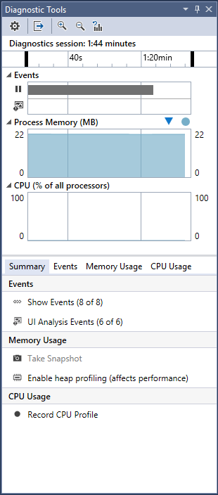
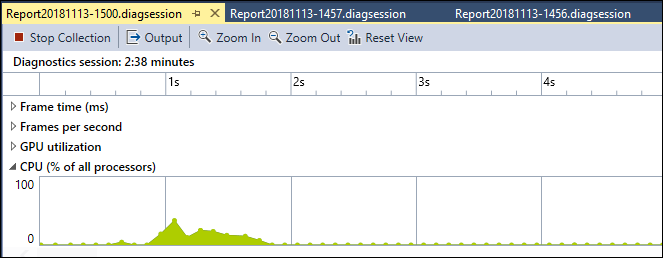
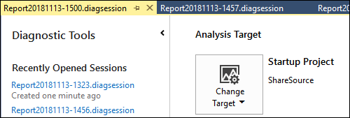
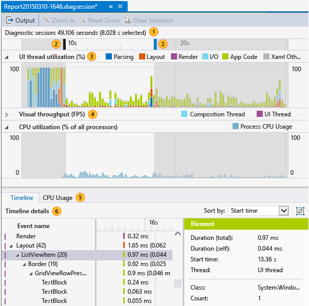
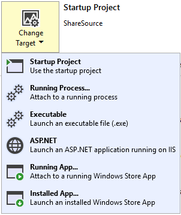
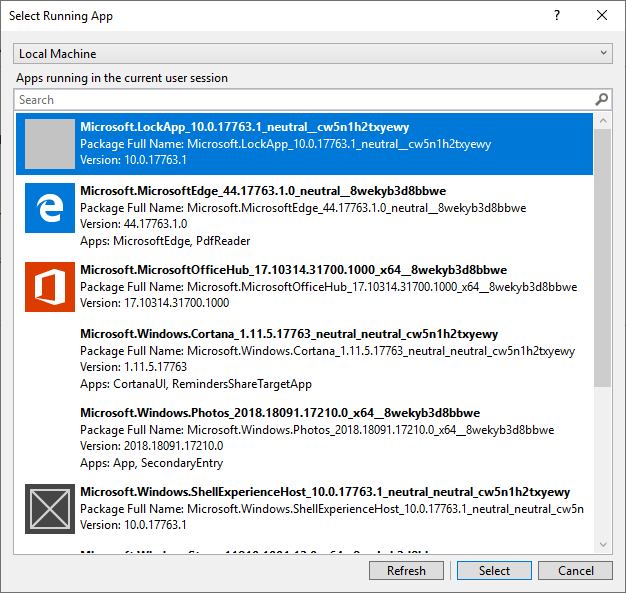

# Run profiling tools with or without the debugger

Visual Studio offers a choice of performance measurement and profiling tools. Some tools, like **CPU Usage** and **Memory Usage**, can run with or without the debugger, and on Release or Debug build configurations. **Performance Profiler** tools like **Application Timeline** can run on Debug or Release builds. Debugger-integrated tools like the **Diagnostic Tools** window and **Events** tab run only during debugging sessions.  

>[!NOTE]
>You can use the non-debugger performance tools with Windows 7 and later. Windows 8 or later is required to run the debugger-integrated profiling tools.

The non-debugger **Performance Profiler** and the debugger-integrated **Diagnostic Tools** provide different information and experiences. Debugger-integrated tools show you breakpoints and variable values. Non-debugger tools give you results closer to the end-user experience. 

To help decide which tools and results to use, consider the following points:

- External performance problems, like file I/O or network responsiveness issues, won't look much different in the debugger or non-debugger tools. 
- For issues caused by CPU-intensive calls, there may be considerable performance differences between Release and Debug builds. Check to see whether the issue exists in Release builds. 
- If the issue occurs only during Debug builds, you probably don't need to run the non-debugger tools. For Release build issues, decide whether the debugger tools will help for further investigation. 
- Release builds provide optimizations like inlining function calls and constants, pruning unused code paths, and storing variables in ways that can't be used by the debugger. Performance numbers in the debugger-integrated tools are less accurate, because Debug builds lack these optimizations. 
- The debugger itself changes performance times as it does necessary debugger operations like intercepting exception and module load events. 
- Release build performance numbers in the **Performance Profiler** tools are the most precise and accurate. Debugger-integrated tool results are most useful to compare with other debugging-related measurements.

##   Collect profiling data while debugging  

When you start debugging in Visual Studio by selecting **Debug** > **Start Debugging** or pressing **F5**, the **Diagnostic Tools** window appears by default. To open it manually, select **Debug** > **Windows** > **Show Diagnostic Tools**. The **Diagnostic Tools** window shows information about events, process memory, and CPU usage.  

  

- Use the **Settings** icon in the toolbar to select whether to view **Memory Usage**, **UI Analysis**, and **CPU Usage**. 
  
- Select **Settings** in the **Settings** dropdown to open the **Diagnostic Tools Property Pages** with more options. 
  
- If you're running Visual Studio Enterprise, you can enable or disable IntelliTrace under Visual Studio **Tools** > **Options** > **IntelliTrace**.  
  
The diagnostic session ends when you stop debugging.  
  
You can also view **Diagnostic Tools** for remote debugging targets. For remote debugging and profiling, the Visual Studio remote debugger must be installed and running on the remote target. 
- For remote debugging and profiling desktop app projects, see [Remote debugging](../debugger/remote-debugging.md). 
- For remote debugging and profiling UWP apps, see [Debug UWP apps on remote machines](../debugger/run-windows-store-apps-on-a-remote-machine.md). 

### The Events tab

During a debugging session, the **Events** tab of the **Diagnostic Tools** window lists the diagnostic events that occur. The category prefixes: **Breakpoint**, **File**, and others, let you quickly scan the list for a category, or skip the categories you don't care about.  
  
Use the **Filter** dropdown to filter events in and out of view by selecting or deselecting specific categories of events. 

  

Use the search box to find a specific string in the event list. Here are the results of a search for the string "name" that matched four events:  

  

For more information, see [Searching and filtering the Events tab of the Diagnostic Tools window](https://blogs.msdn.microsoft.com/devops/2015/11/12/searching-and-filtering-the-events-tab-of-the-diagnostic-tools-window/).  

## Collect profiling data without debugging  

To collect performance data without debugging, you can run the **Performance Profiler** tools. Some of the profiling tools require administrator privileges to run. You can start Visual Studio as an administrator, or you can run the tools as an administrator when you start the diagnostic session.  
   
1. With a project open in Visual Studio, select **Debug** > **Performance Profiler**, or press **Alt**+**F2**.  
   
1. On the diagnostic launch page, select one or more tools to run. Only the tools that are applicable to the project type, operating system, and programming language are displayed. Select **Show all tools** to also see tools that are disabled for this diagnostic session. Here's how your choices might look for a C# UWP app:  
   
     
   
1. To start the diagnostic session, select **Start**.  
   
   While the session is running, some tools display graphs of real-time data on the diagnostic tools page.  
   
      
   
1. To end the diagnostic session, select **Stop Collection**.  
   
   The analyzed data displays on the **Report** page.  
  
You can save the reports, and open them from the **Recently Opened Sessions** list on the diagnostic tools launch page.  

  
  
### The profiling report  
   
  
|||  
|-|-|  
||The timeline shows the length of the profiling session, app lifecycle activation events, and user marks.|  
||You can restrict the report to a part of the timeline by dragging the blue bars to select a region of the timeline.|  
||Each diagnostic tool displays one or more master graphs. If your diagnostic session had more than one tool, all of their master graphs are displayed.|  
||You can collapse and expand each tool's individual graphs.|  
||When the data includes more than one tool, tool details are collected under tabs.|  
||The bottom half of the report shows one or more detail views for each tool. You can filter the view by selecting regions of the timeline.|  
  
## Run diagnostic sessions on installed or running apps 

 Besides starting your app from the Visual Studio project, you can also run diagnostic sessions on alternative targets. For example, you might want to diagnose performance issues on an app that was installed from the Windows App Store.  
  
   
  
 You can start apps that are already installed, or attach the diagnostic tools to apps and processes that are already running. When you select **Running App** or **Installed App**, you select the app from a list that finds the apps on the specified deployment target. This target can be a local or remote machine. 
  
   
  
## See also

The following are blog posts and MSDN articles from the Diagnostics development team:  
 [MSDN Magazine: Analyze Performance While Debugging in Visual Studio 2015](https://msdn.microsoft.com/magazine/dn973013.aspx)
  
 [MSDN Magazine: Use IntelliTrace to Diagnose Issues Faster](https://msdn.microsoft.com/magazine/dn973014.aspx)
  
 [Blog post: Diagnosing Event Handler Leaks with the Memory Usage Tool in Visual Studio 2015](https://blogs.msdn.microsoft.com/devops/2015/04/29/diagnosing-event-handler-leaks-with-the-memory-usage-tool-in-visual-studio-2015/)
  
 [Video: Historical Debugging with IntelliTrace in Microsoft Visual Studio Ultimate 2015](https://channel9.msdn.com/Events/Ignite/2015/BRK3716)
  
 [Video: Debugging Performance Issues Using Visual Studio 2015](https://channel9.msdn.com/Events/Build/2015/3-731)
  
 [PerfTips: Performance Information at-a-glance while Debugging with Visual Studio](https://blogs.msdn.microsoft.com/devops/2014/08/18/perftips-performance-information-at-a-glance-while-debugging-with-visual-studio/)
  
 [Diagnostic Tools debugger window in Visual Studio 2015](https://blogs.msdn.microsoft.com/devops/2015/01/16/diagnostic-tools-debugger-window-in-visual-studio-2015/)
  
 [IntelliTrace in Visual Studio Enterprise 2015](https://blogs.msdn.microsoft.com/devops/2015/01/16/intellitrace-in-visual-studio-ultimate-2015/)
