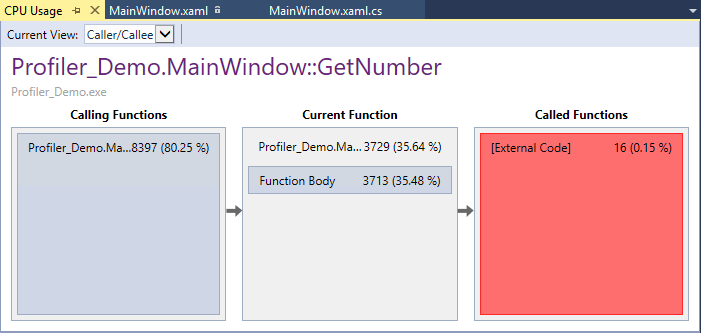

# What's New in Profiling Tools in [!include[vs_dev15](../misc/includes/vs_dev15_md.md)]
The Diagnostics Tools include new visualizations to help you identify issues in your app that need fixing. The Diagnostics Tools now include support for ASP.NET apps.

For additional information, see the [Release Notes for [!include[vs_dev15](../misc/includes/vs_dev15_md.md)]](https://www.visualstudio.com/en-us/news/releasenotes/vs2017-relnotes#debuggingdiag).

A **Summary** tab has been added to the tools that helps you to focus on key areas for your performance analysis. This tab shows how many events have occurred, lets you take snapshots of the heap, and lets you quickly enable CPU usage data collection. This view shows any [Application Insights](https://azure.microsoft.com/en-us/documentation/articles/app-insights-visual-studio/) or [UI Analysis](https://www.visualstudio.com/en-us/news/releasenotes/vs2017-relnotes#UIAnalysis) events. In addition, for Visual Studio Enterprise, this view also shows IntelliTrace events.

The CPU usage tool has [new visualizations](../profiling/Beginners-Guide-to-Performance-Profiling.md) to help you identify the functions that are most likely to be causing performance issues. The new **Caller/Callee** view allows you to investigate costs of function calls made to and from a selected function.

  
## See Also  
 [Profiling in Visual Studio](../profiling/index.md)  
 [Profiling Feature Tour](../profiling/profiling-feature-tour.md)