# Editing Python code

Developers spend much of their time in the code editor, so [Python support in Visual Studio](installation.md) provides functionality to help you be more productive. Features include IntelliSense syntax highlighting, auto-completion, signature help, method overrides, search, and navigation. 

In this topic:

- [IntelliSense](#intellisense) including completions, signature help, quick info, and code coloring.
- [Code snippets](#code-snippets)
- [Navigating your code](#navigating-your-code)

For general documentation on editing code in Visual Studio, see [Writing Code in the Code and Text Editor](../ide/writing-code-in-the-code-and-text-editor.md). Also see [Outlining in Visual Studio](../ide/outlining.md), which helps you stay focused on particular sections of your code. Python support includes using the Visual Studio Object Browser (**View > Other Windows > Object Browser** or Ctrl+W,J) for inspecting classes defined in each module and the functions defined in those classes. 

The editor is also integrated with the interactive window in Visual Studio, making it easy to exchange code between the two. See [Tutorial Step 3: Using the interactive REPL window](vs-tutorial-01-03.md) and [Using the interactive window - Send code to interactive command](interactive-repl.md#send-code-to-interactive-command) for details.

For an introduction to editing Python code, see [Editing Python Code](https://mva.microsoft.com/en-US/training-courses/python-tools-for-visual-studio-2017-18121?l=r2iQH5LWE_4605918567) (Microsoft Virtual Academy, 2m30s):

> [!VIDEO https://mva.microsoft.com/en-US/training-courses-embed/python-tools-for-visual-studio-2017-18121/Video-Editing-Python-Code-r2iQH5LWE_4605918567]

## IntelliSense

IntelliSense provides [completions](#completions), [signature help](#signature-help), [quick info](#quick-info), and [code coloring](#code-coloring). To improve performance, IntelliSense depends on the completion database that's generated for each Python environment in your project. Databases may need refreshing if you add, remove, or update packages. Database status is shown in the **Python Environments** window (a sibling of Solution Explorer) on the **IntelliSense** tab (see [Python Environments](python-environments.md)). 

### Completions

Completions appear as statements, identifiers, and other words that may be appropriately entered at the current location in the editor. What's shown in the list is based on context and is filtered to omit incorrect or distracting options. Completions are often triggered by typing different statements (such as `import`) and operators (including a period), but you can have them appear at anytime by typing Ctrl-J, Space.

When a completion list is open, you can search for the completion you want using the arrow keys, the mouse, or by continuing to type. As you type more letters, the list is further filtered to show likely completions. You can also use shortcuts such as:

- Typing letters that are not at the start of the name, such as 'parse' to find 'argparse'
- Typing only letters that are at the start of words, such as 'abc' to find 'AbstractBaseClass' or 'air' to find 'as_integer_ratio'
- Skipping letters, such as 'b64' to find 'base64'

Some examples:

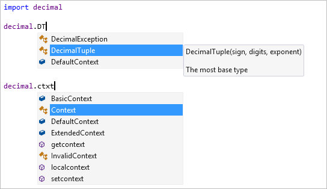

Member completions appear automatically when you type a period after a variable or value, along with the methods and attributes of the potential types. If a variable could be more than one type, the list includes all possibilities from all types, with extra information to indicate which types support each completion. Where a completion is supported by all possible types, it is shown without annotation.

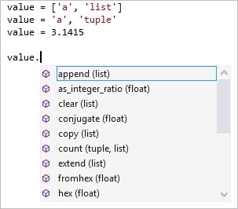

By default, "dunder" members (members beginning and ending with a double underscore) are not shown. In general, such members should not be accessed directly. If you need one, however, typing the leading double underscore adds these completions to the list:

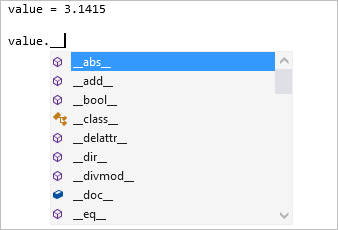

The `import` and `from ... import` statements display a list of modules that can be imported. With `from ... import`, the list includes members that can be imported from the specified module.

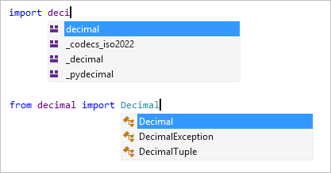

The `raise` and `except` statements display lists of classes likely to be error types. The list may not include all user-defined exceptions, but helps you find suitable built-in exceptions quickly:

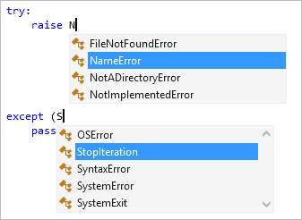

Typing @ starts a decorator and shows potential decorators. Many of these items aren't usable as decorators; check the library documentation to determine which to use.

> [!Tip]
> You can configure the behavior of completions through **Tools > Options > Text Editor > Python > Advanced"**. Among these, **Filter list based on search string**: applies filtering of completion suggestions as you type (default is checked), and **Member completion displays intersection of members** shows only completions that are supported by all possible types (default is unchecked). See [Options - completion results](options.md#completion-results).

### Signature help

When writing code that calls a function, signature help appears when you type the opening `(` and displays available documentation and parameter information. You can also make it appear with Ctrl+Shift+Space inside a function call. The information displayed depends on the documentation strings in the function's source code, but includes any default values.

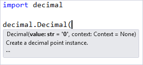

> [!Tip]
> To disable signature help, go to **Tools > Options > Text Editor > Python > General** and clear **Statement completion > Parameter information**.

### Quick info

Hovering the mouse pointer over an identifier displays a Quick Info tooltip. Depending on the identifier, Quick Info may display the potential values or types, any available documentation, return types and, definition locations:

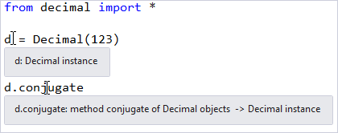

### Code coloring

Code coloring uses information from code analysis to colors variables, statements, and other parts of your code. For example, variables that refer to modules or classes may be shown in a different color than functions or other values, and parameter names appear in a different color than local or global variables. (By default, functions are not shown in bold):

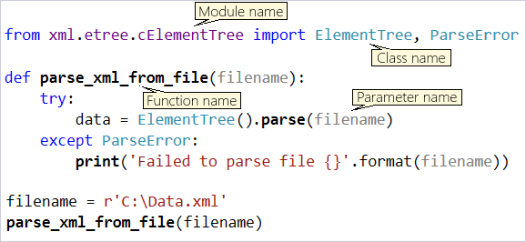

To customize the colors, go to **Tools > Options > Environment > Fonts and Colors** and modify the Python entries in the **Display items** list:

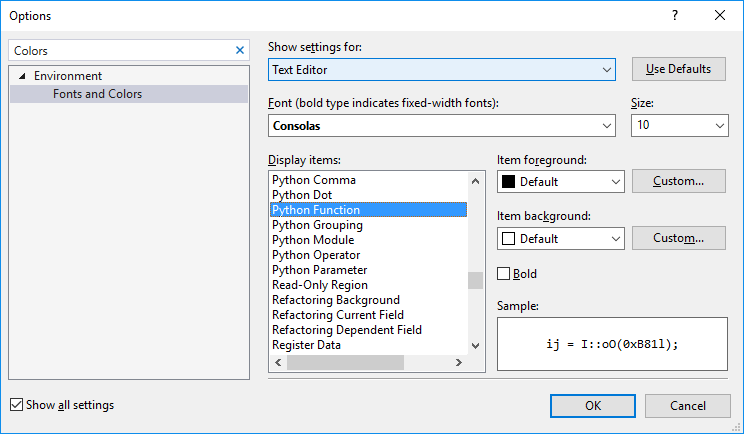

> [!Tip]
> To disable code coloring, go to **Tools > Options > Text Editor > Python > Advanced** and clear **Miscellaneous Options > Color names based on type**. See [Options - Miscellaneous Options](options.md#miscellaneous-options).

## Code snippets

Code snippets are fragments of code that can be inserted into your files by typing a shortcut and pressing Tab, or using the **Edit > IntelliSense > Insert Code Snippet** **Surround With** commands. For example, typing `class` followed by the Tab key generates the rest of the class. You can type over the name and bases list, moving between the highlighted fields with Tab, then press Enter to begin typing the body.

You can see the available code snippets in the Code Snippets Manager (**Tools > Code Snippets Manager**), selecting **Python** as the language:

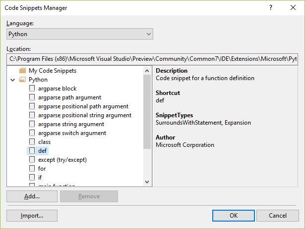

To create your own snippets, see [Walkthrough: Creating a Code Snippet](../ide/walkthrough-creating-a-code-snippet.md). 

If you write a great code snippet that you'd like to share, feel free to post it in a gist and [let us know](https://github.com/Microsoft/PTVS/issues). We may be able to include it in a future release of Visual Studio.

## Navigating your code

Python support in Visual Studio provides several means to quickly navigate within your code, including libraries for which source code is available: the [navigation bar](#navigation-bar), [Go To Definition](#go-to-definition), [Navigate To](#navigate-to), and [Find All References](#find-all-references). You can also use the Visual Studio [Object Browser](../ide/viewing-the-structure-of-code.md#BKMK_ObjectBrowser).

### Navigation bar

The navigation bar is displayed at the top of each editor window and includes a two-level list of definitions. The left drop-down contains top-level class and function definitions in the current file; the right drop-down displays a list of definitions within the scope shown in the left. As you move around in the editor, the lists update to show your current context, and you can also select an entry from these lists to jump directly to in.

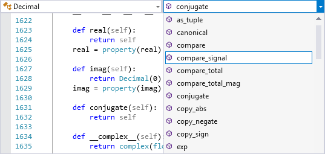

> [!Tip]
> To hide the navigation bar, go to **Tools > Options > Text Editor > Python > General** and clear **Settings > Navigation bar**.

### Go To Definition

**Go To Definition** quickly jumps from the use of an identifier (such as a function name, class, or variable), to the source code where it's defined. You invoke it by right-clicking an identifier and selecting **Go To Definition** or, by placing the caret in the identifier and pressing F12. It works across your code and external libraries provided that source code is available. If library source code is not available, **Go To Definition** jumps to the relevant `import` statement for a module reference, or display an error.

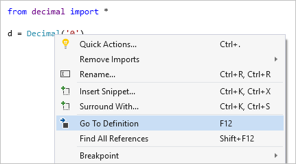

### Navigate To

The **Edit > Navigate To...** command (Ctrl-comma) displays a search box in the editor where you can type any string and see possible matches in your code that defines a function, class, or variable containing that string. This feature provides a similar capability as **Go To Definition** but without having to locate a use of an identifier.

Double-clicking any name, or selecting with arrow keys and Enter, navigates to the definition of that identifier.

### Find All References

**Find All References** is a helpful way of discovering where any given identifier is both defined and used, including imports and assignments. You invoke it by right-clicking an identifier and selecting **Find All References**, or by placing the caret in the identifier and pressing Shift+F12. Double-clicking an item in the list navigates to its location.

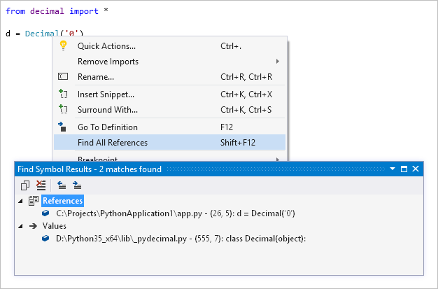