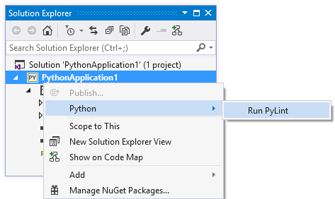
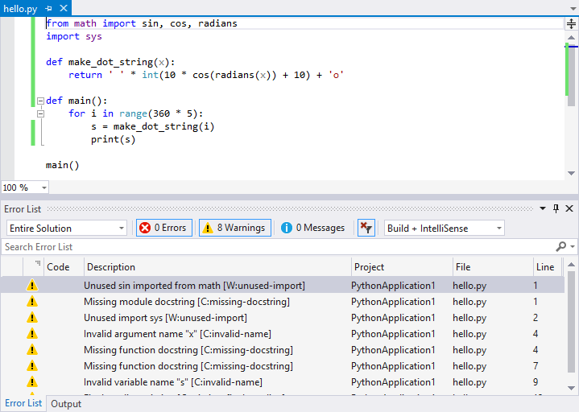

# Using PyLint to check Python code

[PyLint](https://www.pylint.org/), a widely-used tool that checks for errors in Python code and encourages good Python coding patterns,  is integrated into Visual Studio for Python projects.

Just right-click a Python project in Solution Explorer and select **Python > Run PyLint...**:



Using the commands prompt you to install PyLint into your active environment if needed.

PyLint warnings and errors appear in the Error List window:



Double-clicking an error takes you to directly to the source code that generated the issue.

> [!Tip]
> See the [PyLint features reference](https://pylint.readthedocs.io/en/latest/reference_guide/features.html) for a detailed list of all the PyLint output messages.

## Setting PyLint command-line options

The [command line options](https://pylint.readthedocs.io/en/latest/user_guide/run.html#command-line-options) section of the PyLint documentation describes how to control PyLint's behavior through a `.pylintrc` configuration file. Such a file can be placed in the root of a Python project in Visual Studio, or elsewhere depending on how widely you want those settings applied.

For example, to suppress the "missing docstring" warnings shown in the previous image with a `.pylintrc` file in a project, do the following:

1. On the command line, navigate to your project root (where you'll find your `.pyproj` file) and run the following command to generate a commented configuration file:

    ```bash
        pylint --generate-rcfile > .pylintrc
    ```

1. In Visual Studio Solution Explorer, right-click your project, select **Add > Exiting Item...**, navigate to and select the new `.pylintrc` file, and select **Add**.

1. Open the file for editing, and you'll see a variety of settings you can work with. To disable a warning, locate the `[MESSAGES CONTROL]` section, then locate the `disable` setting below that. You'll see a long string of specific messages, to which you can append whichever warnings you want. In the example here, append `,missing-docstring` (including the delineating comma).

1. Save the `.pylintrc` file and re-run PyLint to see that the warnings are now suppressed.